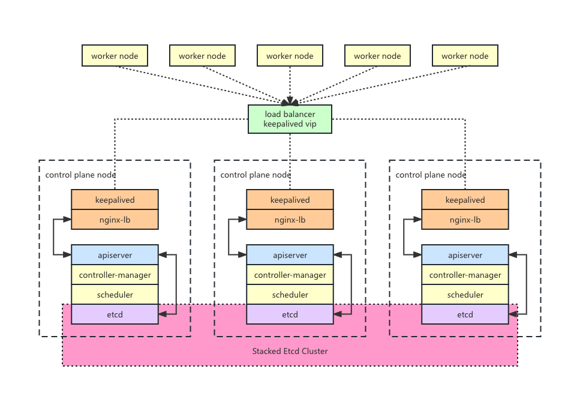
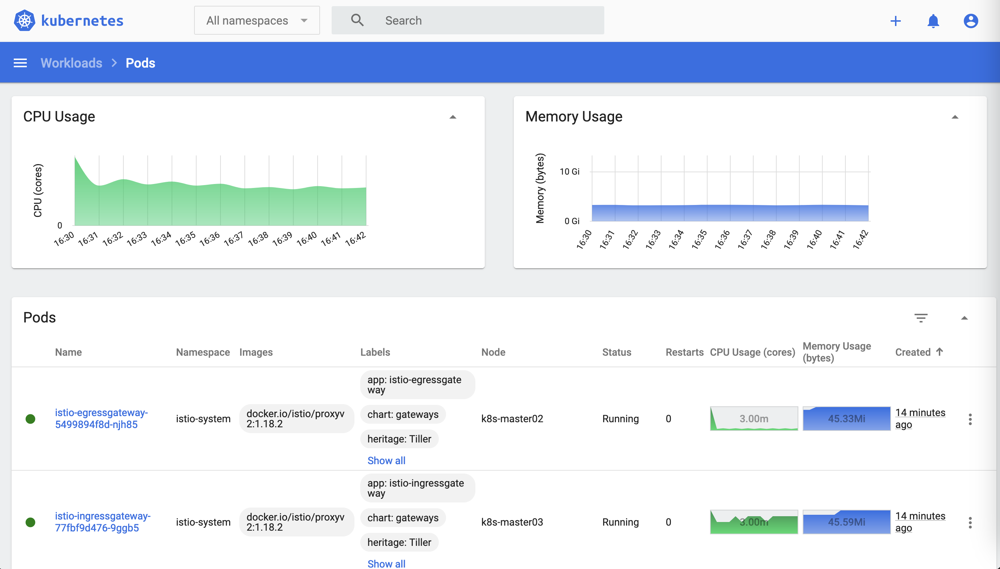
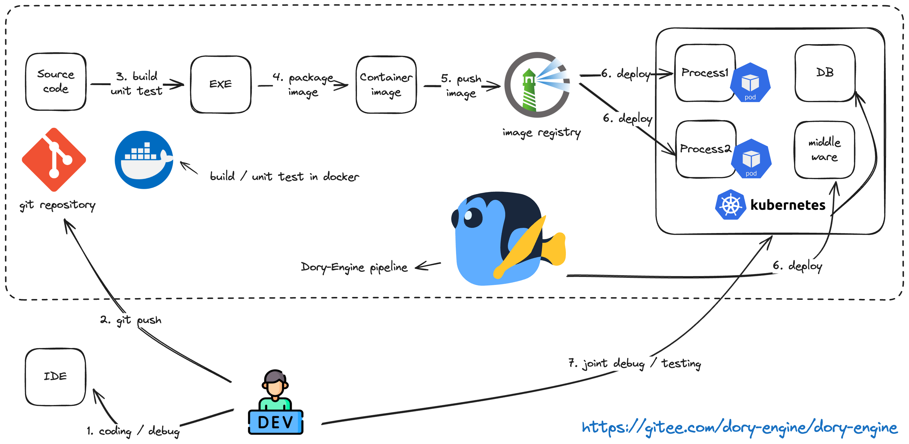

# Install kubernetes high availability cluster through kubeadm (Support docker and containerd as container runtime for kubernetes)

- container runtime using docker
- Applicable kubernetes version: v1.24.x and above

- [中文 容器运行时docker](README.md)
- [English container runtime docker](README-EN.md)

- [中文 容器运行时containerd](README-containerd.md)
- [English container runtime containerd](README-containerd-EN.md)

## Deployment node information

hostname | ip address | comment
:--- | :--- | :---
k8s-master01 | 192.168.0.101 | kubernetes control plane host master01
k8s-master02 | 192.168.0.102 | kubernetes control plane host master02
k8s-master03 | 192.168.0.103 | kubernetes control plane host master03
k8s-vip | 192.168.0.100 | kubernetes floating IP, created by keepalived, if you use public cloud, please pre-apply for this floating IP

```bash
# Please add host name explanation for each node
cat << EOF >> /etc/hosts
192.168.0.100 k8s-vip
192.168.0.101 k8s-master01
192.168.0.102 k8s-master02
192.168.0.103 k8s-master03
EOF
```

## Architecture description



- Demo needs, only deploy 3 highly available master nodes
- Use keepalived and nginx as a highly available load balancer, generate the configuration of the load balancer through the dorycli command line tool, and deploy the load balancer through docker-compose
- Docker is kubernetes container runtime

## Version Information

```bash
# OS version: Debian 11
$ lsb_release -a
No LSB modules are available.
Distributor ID: Debian
Description: Debian GNU/Linux 11 (bullseye)
Release: 11
Codename: bullseye

# docker version: 24.0.5
$ docker version
Client: Docker Engine - Community
  Version: 24.0.5
  API version: 1.43
  Go version: go1.20.6
  Git commit: ced0996
  Built: Fri Jul 21 20:35:45 2023
  OS/Arch: linux/amd64
  Context: default

Server: Docker Engine - Community
  Engine:
   Version: 24.0.5
   API version: 1.43 (minimum version 1.12)
   Go version: go1.20.6
   Git commit: a61e2b4
   Built: Fri Jul 21 20:35:45 2023
   OS/Arch: linux/amd64
   Experimental: false
  containerd:
   Version: 1.6.22
   GitCommit: 8165feabfdfe38c65b599c4993d227328c231fca
  runc:
   Version: 1.1.8
   GitCommit: v1.1.8-0-g82f18fe
  docker-init:
   Version: 0.19.0
   GitCommit: de40ad0

# cri-dockerd version: 0.3.4
$ cri-dockerd --version
cri-dockerd 0.3.4 (e88b1605)

# dorycli version: v1.6.1
$ dorycli version
dorycli version: v1.6.1
install dory-engine version: v2.6.1
install dory-console version: v2.6.1

# kubeadm version: v1.28.0
$ kubeadm version
kubeadm version: &version.Info{Major: "1", Minor: "28", GitVersion: "v1.28.0", GitCommit: "855e7c48de7388eb330da0f8d9d2394ee818fb8d", GitTreeState: "clean", BuildDate: "2023-08-15T1 0:20: 15Z", GoVersion: "go1.20.7", Compiler: "gc", Platform: "linux/amd64"}

# kubernetes version: v1.28.0
$ kubectl get nodes
NAME STATUS ROLES AGE VERSION
k8s-master01 Ready control-plane 35m v1.28.0
k8s-master02 Ready control-plane 31m v1.28.0
k8s-master03 Ready control-plane 30m v1.28.0
```

## install docker

- Install docker service on all nodes

```bash
# install basic software
apt-get update
apt-get install -y sudo wget ca-certificates curl gnupg htop git jq tree

# install docker
install -m 0755 -d /etc/apt/keyrings
curl -fsSL https://download.docker.com/linux/debian/gpg | gpg --dearmor -o /etc/apt/keyrings/docker.gpg
chmod a+r /etc/apt/keyrings/docker.gpg
echo "deb [arch="$(dpkg --print-architecture)" signed-by=/etc/apt/keyrings/docker.gpg] https://download.docker.com/linux/debian \
   "$(. /etc/os-release && echo "$VERSION_CODENAME")" stable" | tee /etc/apt/sources.list.d/docker.list > /dev/null
apt-get update
apt-get install -y docker-ce docker-ce-cli containerd.io docker-buildx-plugin docker-compose-plugin docker-compose

# check docker version
docker version

# modify docker config
cat << EOF > /etc/docker/daemon.json
{
     "exec-opts": ["native.cgroupdriver=systemd"],
     "log-driver": "json-file",
     "log-opts": {
         "max-size": "100m"
     },
     "storage-driver": "overlay2"
}
EOF

# restart the docker service
systemctl restart docker
systemctl status docker

# verify that the docker service is normal
docker images
docker pull busybox
docker run --rm busybox uname -m
```

## install kubernetes

- Install kubernetes related software on all nodes

```bash
# Install kubernetes related components
curl https://mirrors.aliyun.com/kubernetes/apt/doc/apt-key.gpg | apt-key add -
cat <<EOF >/etc/apt/sources.list.d/kubernetes.list
deb https://mirrors.aliyun.com/kubernetes/apt/ kubernetes-xenial main
EOF
apt-get update
apt-get install -y kubelet kubeadm kubectl
kubeadm version

# Obtain the image required by kubernetes
kubeadm config images list --image-repository registry.cn-hangzhou.aliyuncs.com/google_containers
export PAUSE_IMAGE=$(kubeadm config images list --image-repository registry.cn-hangzhou.aliyuncs.com/google_containers | grep pause)

# Note that the pause image is used to configure the startup parameters of cri-dockerd
# Should be output registry.cn-hangzhou.aliyuncs.com/google_containers/pause:3.9
echo $PAUSE_IMAGE

# Install cri-dockerd for connecting kubernetes and docker
wget https://github.com/Mirantis/cri-dockerd/releases/download/v0.3.4/cri-dockerd-0.3.4.amd64.tgz
tar zxvf cri-dockerd-0.3.4.amd64.tgz
cd cri-dockerd/
mkdir -p /usr/local/bin
install -o root -g root -m 0755 cri-dockerd /usr/local/bin/cri-dockerd

# Create cri-docker.socket startup file
cat << EOF > /etc/systemd/system/cri-docker.socket
[Unit]
Description=CRI Docker Socket for the API
PartOf=cri-docker.service

[Socket]
ListenStream=%t/cri-dockerd.sock
SocketMode=0660
SocketUser=root
SocketGroup=docker

[Install]
WantedBy=sockets.target
EOF

# Create cri-docker.service startup file
# Pay attention to setting the pause container image information --pod-infra-container-image=$PAUSE_IMAGE
cat << EOF > /etc/systemd/system/cri-docker.service
[Unit]
Description=CRI Interface for Docker Application Container Engine
Documentation=https://docs.mirantis.com
After=network-online.target firewalld.service docker.service
Wants=network-online.target
Requires=cri-docker.socket

[Service]
Type=notify
ExecStart=/usr/local/bin/cri-dockerd --container-runtime-endpoint fd:// --pod-infra-container-image=$PAUSE_IMAGE
ExecReload=/bin/kill -s HUP \$MAINPID
TimeoutSec=0
RestartSec=2
Restart=always

# Note that StartLimit* options were moved from "Service" to "Unit" in systemd 229.
# Both the old, and new location are accepted by systemd 229 and up, so using the old location
# to make them work for either version of systemd.
StartLimitBurst=3

# Note that StartLimitInterval was renamed to StartLimitIntervalSec in systemd 230.
# Both the old, and new name are accepted by systemd 230 and up, so using the old name to make
# this option work for either version of systemd.
StartLimitInterval=60s

# Having non-zero Limit*s causes performance problems due to accounting overhead
# in the kernel. We recommend using cgroups to do container-local accounting.
LimitNOFILE=infinity
LimitNPROC=infinity
LimitCORE=infinity

# Comment TasksMax if your systemd version does not support it.
# Only systemd 226 and above support this option.
TasksMax=infinity
Delegate=yes
KillMode=process

[Install]
WantedBy=multi-user.target
EOF

# start cri-dockerd
systemctl daemon-reload
systemctl enable --now cri-docker.socket
systemctl restart cri-docker
systemctl status cri-docker

# Pre-fetch the required container image through kubeadm
kubeadm config images pull --image-repository registry.cn-hangzhou.aliyuncs.com/google_containers --cri-socket unix:///var/run/cri-dockerd.sock
docker images
```

- Create and start a high-availability load balancer through dorycli on the k8s-master01 node: keepalived, nginx-lb
- dorycli project address: [https://github.com/dory-engine/dorycli](https://github.com/dory-engine/dorycli)

```bash
# install dorycli
cd /root
wget https://github.com/dory-engine/dorycli/releases/download/v1.6.1/dorycli-v1.6.1-linux-amd64.tgz
tar zxvf dorycli-v1.6.1-linux-amd64.tgz
chmod a+x dorycli
mv dorycli /usr/bin/

# Set the auto-completion of dorycli, which can automatically complete subcommands and parameters through the keyboard TAB key
dorycli completion bash -h
source <(dorycli completion bash)
dorycli completion bash > /etc/bash_completion.d/dorycli

# Use dorycli to print the high availability load balancer configuration information and save it to kubeadm-ha.yaml
dorycli install ha print --language zh > kubeadm-ha.yaml

# Modify the configuration information of kubeadm-ha.yaml according to the actual situation
# The network card name of each host can be obtained by the following command
ip address

# The configuration of this example is as follows, please modify the configuration according to the actual situation
cat kubeadm-ha.yaml
# The version of kubernetes that needs to be installed
version: "v1.28.0"
# The mirror warehouse setting of kubernetes, if not set, then use the official default mirror warehouse
imageRepository: "registry.cn-hangzhou.aliyuncs.com/google_containers"
# The floating ip address of the highly available kubernetes cluster created using keepalived
virtualIp: 192.168.0.100
# Use the apiserver mapping port of the highly available kubernetes cluster mapped by nginx
virtualPort: 16443
# The host name of the floating ip address mapping, please set the host name mapping in the /etc/hosts configuration file
virtualHostname: k8s-vip
# kubernetes container runtime socket
# In case of docker: unix:///var/run/cri-dockerd.sock
# In case of containerd: unix:///var/run/containerd/containerd.sock
# In case of cri-o: unix:///var/run/crio/crio.sock
criSocket: unix:///var/run/cri-dockerd.sock
# The pod subnet address of the kubernetes cluster, if not set, use the default pod subnet address
podSubnet: "10.244.0.0/24"
# The service subnet address of the kubernetes cluster, if not set, use the default service subnet address
serviceSubnet: "10.96.0.0/16"
# The authentication password of keepalived, if not set then use a randomly generated password
keepAlivedAuthPass: ""
# The host configuration of the controlplane control plane of kubernetes, the number of highly available master nodes must be singular and at least 3
masterHosts:
     # The host name of the master node, please set the host name mapping in the /etc/hosts configuration file
   - hostname: k8s-master01
     # The IP address of the master node
     ipAddress: 192.168.0.101
     # The name of the network card used by the master node for mutual access, used for keepalived network card binding
     networkInterface: eth0
     # keepalived election priority, the larger the value, the higher the priority, the priority of each master node cannot be the same
     keepalivedPriority: 120
     # The host name of the master node, please set the host name mapping in the /etc/hosts configuration file
   - hostname: k8s-master02
     # The IP address of the master node
     ipAddress: 192.168.0.102
     # The name of the network card used by the master node for mutual access, used for keepalived network card binding
     networkInterface: eth0
     # keepalived election priority, the larger the value, the higher the priority, the priority of each master node cannot be the same
     keepalivedPriority: 110
     # The host name of the master node, please set the host name mapping in the /etc/hosts configuration file
   - hostname: k8s-master03
     # The IP address of the master node
     ipAddress: 192.168.0.103
     # The name of the network card used by the master node for mutual access, used for keepalived network card binding
     networkInterface: eth0
     # keepalived election priority, the larger the value, the higher the priority, the priority of each master node cannot be the same
     keepalivedPriority: 100

# Create available load balancer configuration information through dorycli, and output the generated configuration to the current directory
# After the naming is executed, the generated file description and the startup configuration file description will be output
dorycli install ha script -o . -f kubeadm-ha.yaml --language zh

# View the kubeadm-config.yaml configuration file generated by dorycli, which is used for kubeadm init to initialize the kubernetes cluster
# The configuration generated in this example is as follows:
cat kubeadm-config.yaml
---
apiVersion: kubeadm.k8s.io/v1beta3
kind: ClusterConfiguration
kubernetesVersion: v1.28.0
imageRepository: registry.cn-hangzhou.aliyuncs.com/google_containers
apiServer:
   certSANs:
     - "k8s-vip"
     - "192.168.0.100"
     - "k8s-master01"
     - "192.168.0.101"
     - "k8s-master02"
     - "192.168.0.102"
     - "k8s-master03"
     - "192.168.0.103"
controlPlaneEndpoint: "192.168.0.100:16443"
networking:
   podSubnet: "10.244.0.0/24"
   serviceSubnet: "10.96.0.0/16"
---
apiVersion: kubeadm.k8s.io/v1beta3
kind:InitConfiguration
nodeRegistration:
   criSocket: unix:///var/run/cri-dockerd.sock

# Set the file path of the kubernetes high availability load balancer of the master node
export LB_DIR=/data/k8s-lb

# Copy the file of the high availability load balancer to k8s-master01
ssh k8s-master01 mkdir -p ${LB_DIR}
scp -r k8s-master01/nginx-lb k8s-master01/keepalived root@k8s-master01:${LB_DIR}

# Start the high availability load balancer on the k8s-master01 node
ssh k8s-master01 "cd ${LB_DIR}/keepalived/ && docker-compose stop && docker-compose rm -f && docker-compose up -d"
ssh k8s-master01 "cd ${LB_DIR}/nginx-lb/ && docker-compose stop && docker-compose rm -f && docker-compose up -d"

# Copy the file of the high availability load balancer to k8s-master02
ssh k8s-master02 mkdir -p ${LB_DIR}
scp -r k8s-master02/nginx-lb k8s-master02/keepalived root@k8s-master02:${LB_DIR}

# Start the high availability load balancer on the k8s-master02 node
ssh k8s-master02 "cd ${LB_DIR}/keepalived/ && docker-compose stop && docker-compose rm -f && docker-compose up -d"
ssh k8s-master02 "cd ${LB_DIR}/nginx-lb/ && docker-compose stop && docker-compose rm -f && docker-compose up -d"

# Copy the file of the high availability load balancer to k8s-master03
ssh k8s-master03 mkdir -p ${LB_DIR}
scp -r k8s-master03/nginx-lb k8s-master03/keepalived root@k8s-master03:${LB_DIR}

# Start the high availability load balancer on the k8s-master03 node
ssh k8s-master03 "cd ${LB_DIR}/keepalived/ && docker-compose stop && docker-compose rm -f && docker-compose up -d"
ssh k8s-master03 "cd ${LB_DIR}/nginx-lb/ && docker-compose stop && docker-compose rm -f && docker-compose up -d"

# Check whether the floating IP has been created on each master node. Normally, the floating IP is bound to k8s-master01
ip address
```

- Initialize a highly available kubernetes cluster

```bash
# Initialize a high availability cluster using the kubeadm-config.yaml configuration file on k8s-master01
kubeadm init --config=kubeadm-config.yaml --upload-certs
# The kubeadm init command will output the following prompt, use this prompt to perform join operations on other master nodes
You can now join any number of the control-plane node running the following command on each as root:

   kubeadm join 192.168.0.100:16443 --token tgszyf.c9dicrflqy85juaf \
     --discovery-token-ca-cert-hash sha256:xxx \
     --control-plane --certificate-key xxx

Please note that the certificate-key gives access to cluster sensitive data, keep it secret!
As a safeguard, uploaded-certs will be deleted in two hours; If necessary, you can use
"kubeadm init phase upload-certs --upload-certs" to reload certs afterwards.

Then you can join any number of worker nodes by running the following on each as root:

kubeadm join 192.168.0.100:16443 --token tgszyf.c9dicrflqy85juaf \
     --discovery-token-ca-cert-hash sha256:xxx


   kubeadm join 192.168.0.100:16443 --token tgszyf.c9dicrflqy85juaf \
     --discovery-token-ca-cert-hash sha256:xxx \
     --control-plane --certificate-key xxx

# Execute the following commands on the k8s-master02 and k8s-master03 nodes to add k8s-master02 and k8s-master03 to the high-availability kubernetes cluster
# Remember that the kubeadm join command needs to be set --cri-socket unix:///var/run/cri-dockerd.sock
kubeadm join 192.168.0.100:16443 --token tgszyf.c9dicrflqy85juaf \
         --discovery-token-ca-cert-hash sha256:xxx \
         --control-plane --certificate-key xxx --cri-socket unix:///var/run/cri-dockerd.sock

# Set up kubectl on all master nodes to access the kubernetes cluster
mkdir -p $HOME/.kube
cp -i /etc/kubernetes/admin.conf $HOME/.kube/config
chown $(id -u):$(id -g) $HOME/.kube/config

# Set kubectl auto-completion on all master nodes, you can automatically complete subcommands and parameters through the keyboard TAB key
kubectl completion -h
kubectl completion bash > ~/.kube/completion.bash.inc
printf "
# Kubectl shell completion
source '$HOME/.kube/completion.bash.inc'
" >> $HOME/.bash_profile
source $HOME/.bash_profile

# Install cilium network components on the k8s-master01 node
wget https://github.com/cilium/cilium-cli/releases/download/v0.15.6/cilium-linux-amd64.tar.gz
tar zxvf cilium-linux-amd64.tar.gz
mv cilium /usr/local/bin/
cilium install --version 1.14.0 --set cni.chainingMode=portmap

# Set all masters to allow pod scheduling
kubectl taint nodes --all node-role.kubernetes.io/control-plane-

# Check if all pod status is normal
kubectl get pods -A -o wide
NAMESPACE              NAME                                         READY   STATUS    RESTARTS      AGE     IP              NODE           NOMINATED NODE   READINESS GATES
kube-system            cilium-mwvsr                                 1/1     Running   0             21m     192.168.0.102   k8s-master02   <none>           <none>
kube-system            cilium-operator-b4dfbf784-zgr7v              1/1     Running   0             21m     192.168.0.102   k8s-master02   <none>           <none>
kube-system            cilium-v27l2                                 1/1     Running   0             21m     192.168.0.103   k8s-master03   <none>           <none>
kube-system            cilium-zbcdj                                 1/1     Running   0             21m     192.168.0.101   k8s-master01   <none>           <none>
kube-system            coredns-6554b8b87f-kp7tn                     1/1     Running   0             30m     10.0.2.231      k8s-master03   <none>           <none>
kube-system            coredns-6554b8b87f-zlhgx                     1/1     Running   0             30m     10.0.2.197      k8s-master03   <none>           <none>
kube-system            etcd-k8s-master01                            1/1     Running   0             30m     192.168.0.101   k8s-master01   <none>           <none>
kube-system            etcd-k8s-master02                            1/1     Running   0             26m     192.168.0.102   k8s-master02   <none>           <none>
kube-system            etcd-k8s-master03                            1/1     Running   0             25m     192.168.0.103   k8s-master03   <none>           <none>
kube-system            kube-apiserver-k8s-master01                  1/1     Running   0             30m     192.168.0.101   k8s-master01   <none>           <none>
kube-system            kube-apiserver-k8s-master02                  1/1     Running   0             26m     192.168.0.102   k8s-master02   <none>           <none>
kube-system            kube-apiserver-k8s-master03                  1/1     Running   1 (25m ago)   25m     192.168.0.103   k8s-master03   <none>           <none>
kube-system            kube-controller-manager-k8s-master01         1/1     Running   1 (26m ago)   30m     192.168.0.101   k8s-master01   <none>           <none>
kube-system            kube-controller-manager-k8s-master02         1/1     Running   0             26m     192.168.0.102   k8s-master02   <none>           <none>
kube-system            kube-controller-manager-k8s-master03         1/1     Running   0             24m     192.168.0.103   k8s-master03   <none>           <none>
kube-system            kube-proxy-gr2pt                             1/1     Running   0             26m     192.168.0.102   k8s-master02   <none>           <none>
kube-system            kube-proxy-rkb9b                             1/1     Running   0             30m     192.168.0.101   k8s-master01   <none>           <none>
kube-system            kube-proxy-rvmv4                             1/1     Running   0             25m     192.168.0.103   k8s-master03   <none>           <none>
kube-system            kube-scheduler-k8s-master01                  1/1     Running   1 (26m ago)   30m     192.168.0.101   k8s-master01   <none>           <none>
kube-system            kube-scheduler-k8s-master02                  1/1     Running   0             26m     192.168.0.102   k8s-master02   <none>           <none>
kube-system            kube-scheduler-k8s-master03                  1/1     Running   0             23m     192.168.0.103   k8s-master03   <none>           <none>

# Check if all nodes are in normal state
kubectl get nodes
NAME STATUS ROLES AGE VERSION
k8s-master01 Ready control-plane 31m v1.28.0
k8s-master02 Ready control-plane 27m v1.28.0
k8s-master03 Ready control-plane 26m v1.28.0

# Test deployment application to kubernetes cluster
# Deploy an nginx application and expose it to nodePort31000
kubectl run nginx --image=nginx:1.23.1-alpine --image-pull-policy=IfNotPresent --port=80 -l=app=nginx
kubectl create service nodeport nginx --tcp=80:80 --node-port=31000
curl k8s-vip:31000
```

## [Optional] Install the management interface kubernetes-dashboard

- In order to manage applications deployed in kubernetes, it is recommended to use `kubernetes-dashboard`
- To learn more, please read the official code warehouse README.md document: [kubernetes-dashboard](https://github.com/kubernetes/dashboard)

- Install:
```shell script
# install kubernetes-dashboard
kubectl apply -f https://raw.githubusercontent.com/kubernetes/dashboard/v2.5.1/aio/deploy/recommended.yaml

# Adjust the kubernetes-dashboard service to use nodePort to expose the port
cat << EOF | kubectl apply -f -
apiVersion: v1
kind: Service
metadata:
   labels:
     k8s-app: kubernetes-dashboard
   name: kubernetes-dashboard
   namespace: kubernetes-dashboard
spec:
   ports:
   - port: 443
     protocol: TCP
     targetPort: 8443
     nodePort: 30000
   selector:
     k8s-app: kubernetes-dashboard
   type: NodePort
EOF

# create admin serviceaccount
kubectl create serviceaccount -n kube-system admin-user --dry-run=client -o yaml | kubectl apply -f -

# create administrator clusterrolebinding
kubectl create clusterrolebinding admin-user --clusterrole=cluster-admin --serviceaccount=kube-system:admin-user --dry-run=client -o yaml | kubectl apply -f -

# Manually create the secret of serviceaccount
cat << EOF | kubectl apply -f -
apiVersion: v1
kind: Secret
metadata:
   name: admin-user-secret
   namespace: kube-system
   annotations:
     kubernetes.io/service-account.name: admin-user
type: kubernetes.io/service-account-token
EOF

# Get the kubernetes management token
kubectl -n kube-system get secret admin-user-secret -o jsonpath='{ .data.token }' | base64 -d

# Use a browser to access kubernetes-dashboard: https://k8s-vip:30000
# Use kubernetes management token to log in to kubernetes-dashboard
```

## [Optional] Install ingress controller traefik

- To use the [ingress](https://kubernetes.io/docs/concepts/services-networking/ingress/) function of kubernetes, an ingress controller must be installed, and `traefik` is recommended
- To learn more, please read the official website documentation: [traefik](https://doc.traefik.io/traefik/)

- Deploy traefik on all master nodes of kubernetes:
```shell script
# Pull the traefik helm repo
helm repo add traefik https://helm.traefik.io/traefik
helm fetch traefik/traefik --untar

# Deploy traefik in daemonset mode
cat << EOF > traefik.yaml
deployment:
   kind: DaemonSet
image:
   name: traefik
   tag: v2.6.3
pilot:
   enabled: true
experimental:
   plugins:
     enabled: true
ports:
   web:
     hostPort: 80
   websecure:
     hostPort: 443
service:
   type: ClusterIP
EOF

# install traefik
kubectl create namespace traefik --dry-run=client -o yaml | kubectl apply -f -
helm install -n traefik traefik traefik/ -f traefik.yaml

# Check the installation status
helm -n traefik list
kubectl -n traefik get pods -o wide
kubectl -n traefik get services -o wide

# Check whether the traefik installation is successful, if the output is 404 page not found, it means success
curl k8s-vip
curl -k https://k8s-vip
```

## [Optional] Install the performance data collection tool metrics-server

- In order to use kubernetes' horizontal scaling function [horizontal pod autoscale](https://kubernetes.io/docs/tasks/run-application/horizontal-pod-autoscale/), `metrics-server` must be installed
- To learn more, please read the official code repository README.md document: [metrics-server](https://github.com/kubernetes-sigs/metrics-server)

```shell script
# pull image
docker pull registry.aliyuncs.com/google_containers/metrics-server:v0.6.1
docker tag registry.aliyuncs.com/google_containers/metrics-server:v0.6.1 k8s.gcr.io/metrics-server/metrics-server:v0.6.1

# Get metrics-server install yaml
curl -O -L https://github.com/kubernetes-sigs/metrics-server/releases/download/v0.6.1/components.yaml
# Add --kubelet-insecure-tls parameter
sed -i 's/- args:/- args:\n - --kubelet-insecure-tls/g' components.yaml
# install metrics-server
kubectl apply -f components.yaml

# Wait for the metrics-server to be normal
kubectl -n kube-system get pods -l=k8s-app=metrics-server

# View the metrics of the node
kubectl top nodes
NAME CPU(cores) CPU% MEMORY(bytes) MEMORY%
k8s-master01 146m 7% 2284Mi 59%
k8s-master02 123m 6% 2283Mi 59%
k8s-master03 114m 5% 2180Mi 57%
```

- After installing metrics-server, kubernetes-dashboard can also display performance data



## [Optional] Install service mesh istio

- To use the hybrid grayscale publishing capability of the service grid, you need to deploy the istio service grid
- To learn more, please read the istio official website documentation: [istio.io](https://istio.io/latest/docs/)

```shell script
# Install istioctl, client download address https://github.com/istio/istio/releases/tag/1.18.2

# Download and install istioctl
wget https://github.com/istio/istio/releases/download/1.18.2/istioctl-1.18.2-linux-amd64.tar.gz
tar zxvf istioctl-1.18.2-linux-amd64.tar.gz
mv istioctl /usr/bin/

# Confirm istioctl version
istioctl version

# Use istioctl to deploy istio to kubernetes
istioctl install --set profile=demo\
--set values.gateways.istio-ingressgateway.type=ClusterIP \
--set values.global.imagePullPolicy=IfNotPresent \
--set values.global.proxy_init.resources.limits.cpu=100m \
--set values.global.proxy_init.resources.limits.memory=100Mi \
--set values.global.proxy.resources.limits.cpu=100m \
--set values.global.proxy.resources.limits.memory=100Mi

# Check istio deployment
kubectl -n istio-system get pods,svc
```

## [Optional] Apply cloud engine Dory-Engine

[🚀🚀🚀 Dory-Engine Platform Engineering Best Practices (https://www.bilibili.com/video/BV1oM4y117Pj/)](https://www.bilibili.com/video/BV1oM4y117Pj/)



- `Dory-Engine` is a very simple application cloud engine. Developers can compile, package, and deploy their own programs from source code to various k8s environments or hosts without learning, writing, or configuring. Environment.

1. No need to learn: No need to learn how to write complex cloud scripts and how to deploy applications to k8s, all configurations can be understood at a glance
2. No need to write: You don’t need to write complex cloud scripts for building, packaging, and deploying, nor do you need to write complex k8s application deployment files. You only need a few simple configurations to set up your own cloud pipeline
3. No need to configure: It is not necessary to configure how each DevOps toolchain and k8s environment cooperate with each other to complete the cloud application. Once the project is activated, all toolchains and environments are automatically configured.

- Refer to the installation guide: [https://github.com/dory-engine/dorycli](https://github.com/dory-engine/dorycli)

[🚀🚀🚀 Use dorycli to install and deploy Dory-Engine (https://www.bilibili.com/video/BV1aG411D7Sj/)](https://www.bilibili.com/video/BV1aG411D7Sj/)
