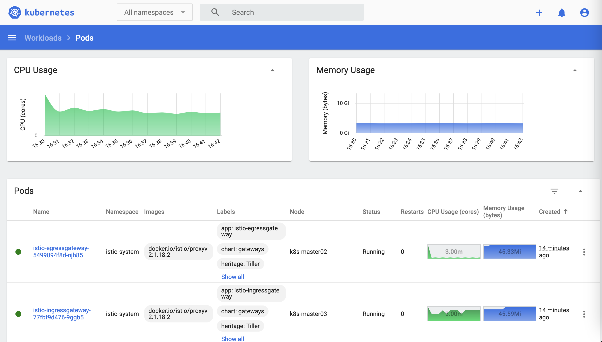

# 通过kubeadm安装kubernetes高可用集群(支持docker和containerd作为kubernetes的容器运行时)

- 容器运行时使用containerd
- 适用kubernetes版本: v1.24.x以上版本

- [中文 容器运行时docker](README.md)
- [English container runtime docker](README-EN.md)

- [中文 容器运行时containerd](README-containerd.md)
- [English container runtime containerd](README-containerd-EN.md)

## 部署节点信息

hostname     | ip address      | comment   
:---         | :---            | :---      
k8s-master01 | 192.168.0.101   | kubernetes 控制平面主机 master01
k8s-master02 | 192.168.0.102   | kubernetes 控制平面主机 master02
k8s-master03 | 192.168.0.103   | kubernetes 控制平面主机 master03
k8s-vip      | 192.168.0.100   | kubernetes 浮动IP，通过keepalived创建，如果使用公有云请预先申请该浮动IP

```bash
# 各节点请添加主机名解释
cat << EOF >> /etc/hosts
192.168.0.100    k8s-vip
192.168.0.101    k8s-master01
192.168.0.102    k8s-master02
192.168.0.103    k8s-master03
EOF
```

## 架构说明


- 演示需要，只部署3个高可用的master节点
- 使用keepalived和nginx作为高可用的负载均衡器，通过dorycli命令行工具生成负载均衡器的配置，并通过nerdctl部署负载均衡器
- 容器运行时使用containerd

## 版本信息

```bash
# 操作系统版本: Debian 11
$ lsb_release -a
No LSB modules are available.
Distributor ID:     Debian
Description:        Debian GNU/Linux 11 (bullseye)
Release:            11
Codename:           bullseye

# containerd版本: 1.6.24
$ containerd --version
containerd containerd.io 1.6.24 61f9fd88f79f081d64d6fa3bb1a0dc71ec870523

# nerdctl版本: 1.7.0
nerdctl --version
nerdctl version 1.7.0

# buildkitd版本: v0.12.3
$ buildkitd --version
buildkitd github.com/moby/buildkit v0.12.3 438f47256f0decd64cc96084e22d3357da494c27

# cni-plugins版本: v1.3.0

# dorycli版本: v1.6.6
$ dorycli version
dorycli version: v1.6.6
install dory-engine version: v2.6.6
install dory-console version: v2.6.6

# kubeadm版本: v1.28.0
$ kubeadm version
kubeadm version: &version.Info{Major:"1", Minor:"28", GitVersion:"v1.28.0", GitCommit:"855e7c48de7388eb330da0f8d9d2394ee818fb8d", GitTreeState:"clean", BuildDate:"2023-08-15T10:20:15Z", GoVersion:"go1.20.7", Compiler:"gc", Platform:"linux/amd64"}

# kubernetes版本: v1.28.0
$ kubectl get nodes
NAME           STATUS   ROLES           AGE   VERSION
k8s-master01   Ready    control-plane   35m   v1.28.0
k8s-master02   Ready    control-plane   31m   v1.28.0
k8s-master03   Ready    control-plane   30m   v1.28.0
```

## 安装containerd

- 在所有节点安装containerd服务

```bash
# 安装基础软件
apt-get -y update
apt-get -y upgrade
apt-get install -y sudo ca-certificates curl gnupg htop git jq tree

# 安装containerd
apt-get install apt-transport-https software-properties-common ca-certificates curl gnupg lsb-release
curl -fsSL https://mirrors.aliyun.com/docker-ce/linux/debian/gpg | apt-key add -
add-apt-repository "deb [arch=amd64] https://mirrors.tuna.tsinghua.edu.cn/docker-ce/linux/debian $(lsb_release -cs) stable"

apt-get -y update
apt-get install -y containerd.io

systemctl status containerd

# 安装kubeadm
curl https://mirrors.aliyun.com/kubernetes/apt/doc/apt-key.gpg | apt-key add -
cat <<EOF >/etc/apt/sources.list.d/kubernetes.list
deb https://mirrors.aliyun.com/kubernetes/apt/ kubernetes-xenial main
EOF
apt-get -y update
apt-get install -y kubelet kubeadm kubectl
kubeadm version

# 获取pause镜像信息
PAUSE_IMAGE=$(kubeadm config images list --image-repository registry.cn-hangzhou.aliyuncs.com/google_containers | grep pause)
echo ${PAUSE_IMAGE}

# 修改containerd配置
containerd config default > /etc/containerd/config.toml

# 设置containerd配置，查找并修改SystemdCgroup = true
vi /etc/containerd/config.toml
[plugins."io.containerd.grpc.v1.cri".containerd.runtimes.runc]
  ...
  [plugins."io.containerd.grpc.v1.cri".containerd.runtimes.runc.options]
    SystemdCgroup = true

# 设置containerd配置，查找并修改sandbox_image配置，注意该项配置为之前获取的pause镜像信息，对应${PAUSE_IMAGE}
vi /etc/containerd/config.toml
sandbox_image = "registry.cn-hangzhou.aliyuncs.com/google_containers/pause:3.9"

# 重启containerd
systemctl restart containerd

# 安装cni
wget https://github.com/containernetworking/plugins/releases/download/v1.3.0/cni-plugins-linux-amd64-v1.3.0.tgz
mkdir -p /opt/cni/bin
tar Cxzvf /opt/cni/bin cni-plugins-linux-amd64-v1.3.0.tgz

# 安装nerdctl
wget https://github.com/containerd/nerdctl/releases/download/v1.7.0/nerdctl-1.7.0-linux-amd64.tar.gz
tar Cxzvf /usr/local/bin nerdctl-1.7.0-linux-amd64.tar.gz

# nerdctl自动完成
nerdctl completion bash > /etc/bash_completion.d/nerdctl

# 安装buildkit
wget https://github.com/moby/buildkit/releases/download/v0.12.3/buildkit-v0.12.3.linux-amd64.tar.gz
tar Cxzvf /usr/local/ buildkit-v0.12.3.linux-amd64.tar.gz

# 设置并启动buildkit
cat << EOF > /etc/systemd/system/buildkit.service
[Unit]
Description=BuildKit
Requires=buildkit.socket
After=buildkit.socket
Documentation=https://github.com/moby/buildkit

[Service]
Type=notify
ExecStart=/usr/local/bin/buildkitd --addr fd://

[Install]
WantedBy=multi-user.target
EOF

cat << EOF > /etc/systemd/system/buildkit.socket
[Unit]
Description=BuildKit
Documentation=https://github.com/moby/buildkit

[Socket]
ListenStream=%t/buildkit/buildkitd.sock
SocketMode=0660

[Install]
WantedBy=sockets.target
EOF

systemctl daemon-reload
systemctl enable buildkit --now

# 验证nerdctl是否可以正常管理containerd
nerdctl images
nerdctl pull busybox
nerdctl run --rm busybox uname -m

# 验证nerdctl是否可以使用buildkit构建镜像
cat << EOF > Dockerfile
FROM alpine
EOF
nerdctl build -t xxx .
nerdctl rmi xxx
rm -f Dockerfile
```

## 安装kubernetes

- 在所有节点安装kubernetes相关软件

```bash
# 通过kubeadm预先拉取所需的容器镜像
kubeadm config images pull --image-repository registry.cn-hangzhou.aliyuncs.com/google_containers --cri-socket unix:///var/run/containerd/containerd.sock
nerdctl -n k8s.io images
```

- 在k8s-master01节点通过dorycli创建并启动高可用负载均衡器: keepalived, nginx-lb
- dorycli项目地址: [https://github.com/dory-engine/dorycli](https://github.com/dory-engine/dorycli)

```bash
# 安装dorycli
cd /root
wget https://github.com/dory-engine/dorycli/releases/download/v1.6.6/dorycli-v1.6.6-linux-amd64.tgz
tar zxvf dorycli-v1.6.6-linux-amd64.tgz
chmod a+x dorycli
mv dorycli /usr/bin/

# 设置dorycli的自动完成，可以通过键盘TAB键自动补全子命令和参数
dorycli completion bash -h
source <(dorycli completion bash)
dorycli completion bash > /etc/bash_completion.d/dorycli

# 使用dorycli打印高可用负载均衡器配置信息，并保存到kubeadm-ha.yaml
dorycli install ha print --language zh > kubeadm-ha.yaml

# 根据实际情况修改kubeadm-ha.yaml的配置信息
# 可以通过以下命令获取各个主机的网卡名字
ip address

# 本例子的配置如下，请根据实际情况修改配置
cat kubeadm-ha.yaml
# 需要安装的kubernetes的版本
version: "v1.28.0"
# kubernetes的镜像仓库设置，如果不设置，那么使用官方的默认镜像仓库
imageRepository: "registry.cn-hangzhou.aliyuncs.com/google_containers"
# keepalived镜像
keepalivedImage: "osixia/keepalived:release-2.1.5-dev"
# nginx-lb镜像
nginxlbImage: "nginx:1.27.0-alpine"
# 使用keepalived创建的高可用kubernetes集群的浮动ip地址
virtualIp: 192.168.0.100
# 使用nginx映射的高可用kubernetes集群的apiserver映射端口
virtualPort: 16443
# 浮动ip地址映射的主机名，请在/etc/hosts配置文件中进行主机名映射设置
virtualHostname: k8s-vip
# kubernetes的容器运行时socket
# docker情况下: unix:///var/run/cri-dockerd.sock
# containerd情况下: unix:///var/run/containerd/containerd.sock
# cri-o情况下: unix:///var/run/crio/crio.sock
criSocket: unix:///var/run/cri-dockerd.sock
# kubernetes集群的pod子网地址，如果不设置，使用默认的pod子网地址
podSubnet: "10.244.0.0/24"
# kubernetes集群的service子网地址，如果不设置，使用默认的service子网地址
serviceSubnet: "10.96.0.0/16"
# keepalived的鉴权密码，如果不设置那么使用随机生成的密码
keepAlivedAuthPass: "input_your_password"
# keepalived的virtual_router_id设置
keepAlivedVirtualRouterId: 101
# kubernetes的controlplane控制平面的主机配置，高可用master节点数量必须为单数并且至少3台
masterHosts:
    # master节点的主机名，请在/etc/hosts配置文件中进行主机名映射设置
  - hostname: k8s-master01
    # master节点的IP地址
    ipAddress: 192.168.0.101
    # master节点互访使用的网卡名字，用于keepalived网卡绑定
    networkInterface: eth0
    # keepalived选举优先级，数值越大优先级越高，各个master节点的优先级不能一样
    keepalivedPriority: 120
    # master节点的主机名，请在/etc/hosts配置文件中进行主机名映射设置
  - hostname: k8s-master02
    # master节点的IP地址
    ipAddress: 192.168.0.102
    # master节点互访使用的网卡名字，用于keepalived网卡绑定
    networkInterface: eth0
    # keepalived选举优先级，数值越大优先级越高，各个master节点的优先级不能一样
    keepalivedPriority: 110
    # master节点的主机名，请在/etc/hosts配置文件中进行主机名映射设置
  - hostname: k8s-master03
    # master节点的IP地址
    ipAddress: 192.168.0.103
    # master节点互访使用的网卡名字，用于keepalived网卡绑定
    networkInterface: eth0
    # keepalived选举优先级，数值越大优先级越高，各个master节点的优先级不能一样
    keepalivedPriority: 100

# 通过dorycli创建可用负载均衡器配置信息，并且把生成的配置输出到当前目录
# 执行命名后，会输出生成的文件说明，以及启动配置文件说明
dorycli install ha script -o . -f kubeadm-ha.yaml --language zh

# 查看dorycli生成的kubeadm-config.yaml配置文件，该配置文件用于kubeadm init初始化kubernetes集群用途
# 本例子生成的配置如下:
cat kubeadm-config.yaml
---
apiVersion: kubeadm.k8s.io/v1beta3
kind: ClusterConfiguration
kubernetesVersion: v1.28.0
imageRepository: registry.cn-hangzhou.aliyuncs.com/google_containers
apiServer:
  certSANs:
    - "k8s-vip"
    - "192.168.0.100"
    - "k8s-master01"
    - "192.168.0.101"
    - "k8s-master02"
    - "192.168.0.102"
    - "k8s-master03"
    - "192.168.0.103"
controlPlaneEndpoint: "192.168.0.100:16443"
networking:
  podSubnet: "10.244.0.0/24"
  serviceSubnet: "10.96.0.0/16"
---
apiVersion: kubeadm.k8s.io/v1beta3
kind: InitConfiguration
nodeRegistration:
  criSocket: unix:///var/run/containerd/containerd.sock

# 设置master节点的kubernetes高可用负载均衡器的文件路径
export LB_DIR=/data/k8s-lb

# 把高可用负载均衡器的文件复制到k8s-master01
ssh k8s-master01 mkdir -p ${LB_DIR}
scp -r k8s-master01/nginx-lb k8s-master01/keepalived root@k8s-master01:${LB_DIR}

# 在 k8s-master01 节点上启动高可用负载均衡器
ssh k8s-master01 "cd ${LB_DIR}/keepalived/ && nerdctl compose stop && nerdctl compose rm -f && nerdctl compose up -d"
ssh k8s-master01 "cd ${LB_DIR}/nginx-lb/ && nerdctl compose stop && nerdctl compose rm -f && nerdctl compose up -d"

# 把高可用负载均衡器的文件复制到k8s-master02
ssh k8s-master02 mkdir -p ${LB_DIR}
scp -r k8s-master02/nginx-lb k8s-master02/keepalived root@k8s-master02:${LB_DIR}

# 在 k8s-master02 节点上启动高可用负载均衡器
ssh k8s-master02 "cd ${LB_DIR}/keepalived/ && nerdctl compose stop && nerdctl compose rm -f && nerdctl compose up -d"
ssh k8s-master02 "cd ${LB_DIR}/nginx-lb/ && nerdctl compose stop && nerdctl compose rm -f && nerdctl compose up -d"

# 把高可用负载均衡器的文件复制到k8s-master03
ssh k8s-master03 mkdir -p ${LB_DIR}
scp -r k8s-master03/nginx-lb k8s-master03/keepalived root@k8s-master03:${LB_DIR}

# 在 k8s-master03 节点上启动高可用负载均衡器
ssh k8s-master03 "cd ${LB_DIR}/keepalived/ && nerdctl compose stop && nerdctl compose rm -f && nerdctl compose up -d"
ssh k8s-master03 "cd ${LB_DIR}/nginx-lb/ && nerdctl compose stop && nerdctl compose rm -f && nerdctl compose up -d"

# 在各个master节点上检验浮动IP是否已经创建，正常情况下浮动IP绑定在 k8s-master01 上
ip address
```

- 初始化高可用kubernetes集群

```bash
# 在k8s-master01上使用kubeadm-config.yaml配置文件初始化高可用集群
kubeadm init --config=kubeadm-config.yaml --upload-certs
# kubeadm init命令将会输出以下提示，使用该提示在其他master节点执行join操作
You can now join any number of the control-plane node running the following command on each as root:

  kubeadm join 192.168.0.100:16443 --token tgszyf.c9dicrflqy85juaf \
    --discovery-token-ca-cert-hash sha256:xxx \
    --control-plane --certificate-key xxx

Please note that the certificate-key gives access to cluster sensitive data, keep it secret!
As a safeguard, uploaded-certs will be deleted in two hours; If necessary, you can use
"kubeadm init phase upload-certs --upload-certs" to reload certs afterward.

Then you can join any number of worker nodes by running the following on each as root:

kubeadm join 192.168.0.100:16443 --token tgszyf.c9dicrflqy85juaf \
    --discovery-token-ca-cert-hash sha256:xxx 


  kubeadm join 192.168.0.100:16443 --token tgszyf.c9dicrflqy85juaf \
    --discovery-token-ca-cert-hash sha256:xxx \
    --control-plane --certificate-key xxx

# 在k8s-master02 和 k8s-master03节点上执行以下命令，把k8s-master02 和 k8s-master03加入到高可用kubernetes集群
# 记住kubeadm join命令需要设置--cri-socket unix:///var/run/containerd/containerd.sock
kubeadm join 192.168.0.100:16443 --token tgszyf.c9dicrflqy85juaf \
        --discovery-token-ca-cert-hash sha256:xxx \
        --control-plane --certificate-key xxx --cri-socket unix:///var/run/containerd/containerd.sock

# 在所有master节点上设置kubectl访问kubernetes集群
mkdir -p $HOME/.kube
cp -i /etc/kubernetes/admin.conf $HOME/.kube/config
chown $(id -u):$(id -g) $HOME/.kube/config

# 在所有master节点上设置kubectl的自动完成，可以通过键盘TAB键自动补全子命令和参数
kubectl completion -h
kubectl completion bash > ~/.kube/completion.bash.inc
printf "
# Kubectl shell completion
source '$HOME/.kube/completion.bash.inc'
" >> $HOME/.bash_profile
source $HOME/.bash_profile

# 在k8s-master01节点上安装cilium网络组件
wget https://github.com/cilium/cilium-cli/releases/download/v0.15.6/cilium-linux-amd64.tar.gz
tar zxvf cilium-linux-amd64.tar.gz 
mv cilium /usr/local/bin/
# 注意，这里要设置cni.exclusive=false，避免cilium自动修改了nerdctl的cni配置
cilium install --version 1.14.0 --set cni.chainingMode=portmap --set cni.exclusive=false

# 设置所有master允许调度pod
kubectl taint nodes --all node-role.kubernetes.io/control-plane-

# 检查所有pod状态是否正常
kubectl get pods -A -o wide
NAMESPACE              NAME                                         READY   STATUS    RESTARTS      AGE     IP              NODE           NOMINATED NODE   READINESS GATES
kube-system            cilium-mwvsr                                 1/1     Running   0             21m     192.168.0.102   k8s-master02   <none>           <none>
kube-system            cilium-operator-b4dfbf784-zgr7v              1/1     Running   0             21m     192.168.0.102   k8s-master02   <none>           <none>
kube-system            cilium-v27l2                                 1/1     Running   0             21m     192.168.0.103   k8s-master03   <none>           <none>
kube-system            cilium-zbcdj                                 1/1     Running   0             21m     192.168.0.101   k8s-master01   <none>           <none>
kube-system            coredns-6554b8b87f-kp7tn                     1/1     Running   0             30m     10.0.2.231      k8s-master03   <none>           <none>
kube-system            coredns-6554b8b87f-zlhgx                     1/1     Running   0             30m     10.0.2.197      k8s-master03   <none>           <none>
kube-system            etcd-k8s-master01                            1/1     Running   0             30m     192.168.0.101   k8s-master01   <none>           <none>
kube-system            etcd-k8s-master02                            1/1     Running   0             26m     192.168.0.102   k8s-master02   <none>           <none>
kube-system            etcd-k8s-master03                            1/1     Running   0             25m     192.168.0.103   k8s-master03   <none>           <none>
kube-system            kube-apiserver-k8s-master01                  1/1     Running   0             30m     192.168.0.101   k8s-master01   <none>           <none>
kube-system            kube-apiserver-k8s-master02                  1/1     Running   0             26m     192.168.0.102   k8s-master02   <none>           <none>
kube-system            kube-apiserver-k8s-master03                  1/1     Running   1 (25m ago)   25m     192.168.0.103   k8s-master03   <none>           <none>
kube-system            kube-controller-manager-k8s-master01         1/1     Running   1 (26m ago)   30m     192.168.0.101   k8s-master01   <none>           <none>
kube-system            kube-controller-manager-k8s-master02         1/1     Running   0             26m     192.168.0.102   k8s-master02   <none>           <none>
kube-system            kube-controller-manager-k8s-master03         1/1     Running   0             24m     192.168.0.103   k8s-master03   <none>           <none>
kube-system            kube-proxy-gr2pt                             1/1     Running   0             26m     192.168.0.102   k8s-master02   <none>           <none>
kube-system            kube-proxy-rkb9b                             1/1     Running   0             30m     192.168.0.101   k8s-master01   <none>           <none>
kube-system            kube-proxy-rvmv4                             1/1     Running   0             25m     192.168.0.103   k8s-master03   <none>           <none>
kube-system            kube-scheduler-k8s-master01                  1/1     Running   1 (26m ago)   30m     192.168.0.101   k8s-master01   <none>           <none>
kube-system            kube-scheduler-k8s-master02                  1/1     Running   0             26m     192.168.0.102   k8s-master02   <none>           <none>
kube-system            kube-scheduler-k8s-master03                  1/1     Running   0             23m     192.168.0.103   k8s-master03   <none>           <none>

# 检查所有节点状态是否正常
kubectl get nodes
NAME           STATUS   ROLES           AGE   VERSION
k8s-master01   Ready    control-plane   31m   v1.28.0
k8s-master02   Ready    control-plane   27m   v1.28.0
k8s-master03   Ready    control-plane   26m   v1.28.0

# 测试部署应用到kubernetes集群
# 部署一个nginx应用，并暴露到nodePort31000
kubectl run nginx --image=nginx:1.23.1-alpine --image-pull-policy=IfNotPresent --port=80 -l=app=nginx
kubectl create service nodeport nginx --tcp=80:80 --node-port=31000
curl k8s-vip:31000
```

## [可选] 安装管理界面 kubernetes-dashboard

- 为了管理kubernetes中部署的应用，推荐使用`kubernetes-dashboard`
- 要了解更多，请阅读官方代码仓库README.md文档: [kubernetes-dashboard](https://github.com/kubernetes/dashboard)

- 安装:
```shell script
# 安装 kubernetes-dashboard
kubectl apply -f https://raw.githubusercontent.com/kubernetes/dashboard/v2.5.1/aio/deploy/recommended.yaml

# 调整kubernetes-dashboard服务使用nodePort暴露端口
cat << EOF | kubectl apply -f -
apiVersion: v1
kind: Service
metadata:
  labels:
    k8s-app: kubernetes-dashboard
  name: kubernetes-dashboard
  namespace: kubernetes-dashboard
spec:
  ports:
  - port: 443
    protocol: TCP
    targetPort: 8443
    nodePort: 30000
  selector:
    k8s-app: kubernetes-dashboard
  type: NodePort
EOF

# 创建管理员serviceaccount
kubectl create serviceaccount -n kube-system admin-user --dry-run=client -o yaml | kubectl apply -f -

# 创建管理员clusterrolebinding
kubectl create clusterrolebinding admin-user --clusterrole=cluster-admin --serviceaccount=kube-system:admin-user --dry-run=client -o yaml | kubectl apply -f -

# 手动创建serviceaccount的secret
cat << EOF | kubectl apply -f -
apiVersion: v1
kind: Secret
metadata:
  name: admin-user-secret
  namespace: kube-system
  annotations:
    kubernetes.io/service-account.name: admin-user
type: kubernetes.io/service-account-token
EOF

# 获取kubernetes管理token
kubectl -n kube-system get secret admin-user-secret -o jsonpath='{ .data.token }' | base64 -d

# 使用浏览器访问kubernetes-dashboard: https://k8s-vip:30000
# 使用kubernetes管理token登录kubernetes-dashboard
```

## [可选] 安装ingress控制器 traefik

- 要使用kubernetes的[ingress](https://kubernetes.io/docs/concepts/services-networking/ingress/)功能，必须安装ingress controller，推荐使用`traefik`
- 要了解更多，请阅读官方网站文档: [traefik](https://doc.traefik.io/traefik/)

- 在kubernetes所有master节点部署traefik: 
```shell script
# 拉取 traefik helm repo
helm repo add traefik https://traefik.github.io/charts
helm fetch traefik/traefik --untar

# 以daemonset方式部署traefik
cat << EOF > traefik.yaml
deployment:
  kind: DaemonSet
image:
  name: traefik
  tag: v2.6.6
ports:
  web:
    hostPort: 80
  websecure:
    hostPort: 443
service:
  type: ClusterIP
EOF

# 安装traefik
kubectl create namespace traefik --dry-run=client -o yaml | kubectl apply -f -
helm install -n traefik traefik traefik/ -f traefik.yaml

# 检查安装情况
helm -n traefik list
kubectl -n traefik get pods -o wide
kubectl -n traefik get services -o wide

# 检验traefik安装是否成功，如果输出 404 page not found 表示成功
curl k8s-vip
curl -k https://k8s-vip
```

## [可选] 安装性能数据采集工具 metrics-server

- 为了使用kubernetes的水平扩展缩容功能[horizontal pod autoscale](https://kubernetes.io/docs/tasks/run-application/horizontal-pod-autoscale/)，必须安装`metrics-server`
- 要了解更多，请阅读官方代码仓库README.md文档: [metrics-server](https://github.com/kubernetes-sigs/metrics-server)

```shell script
# 拉取镜像
docker pull registry.aliyuncs.com/google_containers/metrics-server:v0.6.1
docker tag registry.aliyuncs.com/google_containers/metrics-server:v0.6.1 k8s.gcr.io/metrics-server/metrics-server:v0.6.1

# 获取metrics-server安装yaml
curl -O -L https://github.com/kubernetes-sigs/metrics-server/releases/download/v0.6.1/components.yaml
# 添加--kubelet-insecure-tls参数
sed -i 's/- args:/- args:\n        - --kubelet-insecure-tls/g' components.yaml
# 安装metrics-server
kubectl apply -f components.yaml

# 等待metrics-server正常
kubectl -n kube-system get pods -l=k8s-app=metrics-server

# 查看节点的metrics
kubectl top nodes
NAME           CPU(cores)   CPU%   MEMORY(bytes)   MEMORY%   
k8s-master01   146m         7%     2284Mi          59%       
k8s-master02   123m         6%     2283Mi          59%       
k8s-master03   114m         5%     2180Mi          57%       
```

- 安装metrics-server后kubernetes-dashboard也可以显示性能数据



## [可选] 安装服务网格 istio

- 要使用服务网格的混合灰度发布能力，需要部署istio服务网格
- 要了解更多，请阅读istio官网文档: [istio.io](https://istio.io/latest/docs/)

```shell script
# 安装istioctl，客户端下载地址 https://github.com/istio/istio/releases/tag/1.18.2

# 下载并安装istioctl
wget https://github.com/istio/istio/releases/download/1.18.2/istioctl-1.18.2-linux-amd64.tar.gz
tar zxvf istioctl-1.18.2-linux-amd64.tar.gz
mv istioctl /usr/bin/

# 确认istioctl版本
istioctl version

# 使用istioctl部署istio到kubernetes
istioctl install --set profile=demo \
--set values.gateways.istio-ingressgateway.type=ClusterIP \
--set values.global.imagePullPolicy=IfNotPresent \
--set values.global.proxy_init.resources.limits.cpu=100m \
--set values.global.proxy_init.resources.limits.memory=100Mi \
--set values.global.proxy.resources.limits.cpu=100m \
--set values.global.proxy.resources.limits.memory=100Mi

# 检查istio部署情况
kubectl -n istio-system get pods,svc
```

## [可选] 非常简单的开源k8s远程开发环境 Dory-Engine

[🚀🚀🚀 使用k8s快速搭建远程开发环境 (https://www.bilibili.com/video/BV1Zw4m1r7aw/)](https://www.bilibili.com/video/BV1Zw4m1r7aw/)


- `Dory-Engine` 非常简单的开源k8s远程开发环境，开发人员不用学、不用写、不用配就可以自行把自己编写的程序从源代码，编译、打包、部署到各类k8s环境中。

1. 不用学: 不用学习复杂的k8s技术原理，5分钟即可快速上手部署应用
2. 不用配: 不需要配置任何代码仓库、镜像仓库和k8s连接参数
3. 不用写: 不需要编写任何k8s部署清单和流水线脚本

- 安装指引参见: [https://github.com/dory-engine/dory-engine](https://github.com/dory-engine/dory-engine)
