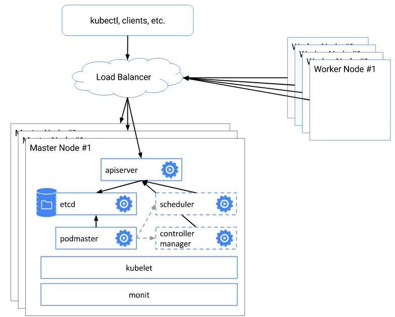

# kubeadm-highavailiability - 基于kubeadmin的kubernetes高可用集群部署


---

- [GitHub项目地址](https://github.com/cookeem/kubeadm-ha/)
- [OSChina项目地址](https://git.oschina.net/cookeem/kubeadm-ha/)

---

### 目录

1. [部署架构](#部署架构)
    1. [概要部署架构](#概要部署架构)
    1. [详细部署架构](#详细部署架构)
    1. [主机节点清单](#主机节点清单)
1. [安装前准备](#安装前准备)
    1. [版本信息](#版本信息)
    1. [所需docker镜像](#所需docker镜像)
    1. [系统设置](#系统设置)
1. [kubernetes安装](#kubernetes安装)
    1. [kubernetes相关服务安装](#kubernetes相关服务安装)
    1. [docker镜像导入](#docker镜像导入)
1. [第一台master初始化](#第一台master初始化)
    1. [独立etcd集群部署](#独立etcd集群部署)
    1. [kubeadm初始化](#kubeadm初始化)
    1. [flannel网络组件安装](#flannel网络组件安装)
    1. [dashboard组件安装](#dashboard组件安装)
    1. [heapster组件安装](#heapster组件安装)
1. [master集群高可用设置](#master集群高可用设置)
    1. [复制配置](#复制配置)
    1. [创建证书](#创建证书)
    1. [修改配置](#修改配置)
    1. [验证高可用安装](#验证高可用安装)
    1. [keepalived安装配置](#keepalived安装配置)
    1. [nginx负载均衡配置](#nginx负载均衡配置)
    1. [验证master集群高可用](#验证master集群高可用)
1. [node节点加入高可用集群设置](#node节点加入高可用集群设置)
    1. [kubeadm加入高可用集群](#kubeadm加入高可用集群)
    1. [部署应用验证集群](#部署应用验证集群)
    

### 部署架构

#### 概要部署架构



* kubernetes高可用的核心架构是master的高可用，kubectl、客户端以及nodes访问load balancer实现高可用。

---
[返回目录](#目录)

#### 详细部署架构


* kubernetes组件说明

> kube-apiserver：集群核心，集群API接口、集群各个组件通信的中枢；集群安全控制；

> etcd：集群的数据中心，用于存放集群的配置以及状态信息，非常重要，如果数据丢失那么集群将无法恢复；因此高可用集群部署首先就是etcd是高可用集群；

> kube-scheduler：集群Pod的调度中心；默认kubeadm安装情况下--leader-elect参数已经设置为true，保证master集群中只有一个kube-scheduler处于活跃状态；

> kube-controller-manager：集群状态管理器，当集群状态与期望不同时，kcm会努力让集群恢复期望状态，比如：当一个pod死掉，kcm会努力新建一个pod来恢复对应replicas set期望的状态；默认kubeadm安装情况下--leader-elect参数已经设置为true，保证master集群中只有一个kube-controller-manager处于活跃状态；

> kubelet: kubernetes node agent，负责与node上的docker engine打交道；

> kube-proxy: 每个node上一个，负责service vip到endpoint pod的流量转发，当前主要通过设置iptables规则实现。

* 负载均衡

> keepalived集群设置一个虚拟ip地址，虚拟ip地址指向k8s-master1、k8s-master2、k8s-master3。

> nginx用于k8s-master1、k8s-master2、k8s-master3的apiserver的负载均衡。外部kubectl以及nodes访问apiserver的时候就可以用过keepalived的虚拟ip(192.168.60.80)以及nginx端口(8443)访问master集群的apiserver。

---
[返回目录](#目录)

#### 主机节点清单

 主机名 | IP地址 | 说明 | 组件 
 :--- | :--- | :--- | :---
 k8s-master1 | 192.168.60.71 | master节点1 | etcd、kubelet、kube-apiserver、kube-scheduler、kube-proxy
 k8s-master2 | 192.168.60.72 | master节点2 | etcd、kubelet、kube-apiserver、kube-scheduler、kube-proxy
 k8s-master3 | 192.168.60.73 | master节点3 | etcd、kubelet、kube-apiserver、kube-scheduler、kube-proxy
 无 | 192.168.60.80 | keepalived虚拟IP | 无
 k8s-node1 ~ 8 | 192.168.60.81 ~ 88 | 8个node节点 | kubelet、kube-proxy

---
[返回目录](#目录)

### 安装前准备

#### 版本信息

* Linux版本：CentOS 7.3.1611

```
cat /etc/redhat-release 
CentOS Linux release 7.3.1611 (Core) 
```

* docker版本：1.12.6

```
$ docker version
Client:
 Version:      1.12.6
 API version:  1.24
 Go version:   go1.6.4
 Git commit:   78d1802
 Built:        Tue Jan 10 20:20:01 2017
 OS/Arch:      linux/amd64

Server:
 Version:      1.12.6
 API version:  1.24
 Go version:   go1.6.4
 Git commit:   78d1802
 Built:        Tue Jan 10 20:20:01 2017
 OS/Arch:      linux/amd64
```

* kubeadm版本：v1.6.4

```
$ kubeadm version
kubeadm version: version.Info{Major:"1", Minor:"6", GitVersion:"v1.6.4", GitCommit:"d6f433224538d4f9ca2f7ae19b252e6fcb66a3ae", GitTreeState:"clean", BuildDate:"2017-05-19T18:33:17Z", GoVersion:"go1.7.5", Compiler:"gc", Platform:"linux/amd64"}
```

* kubelet版本：v1.6.4

```
$ kubelet --version
Kubernetes v1.6.4
```

---

[返回目录](#目录)

#### 所需docker镜像

* 国内可以使用daocloud加速器下载相关镜像，然后通过docker save、docker load把本地下载的镜像放到kubernetes集群的所在机器上，daocloud加速器链接如下：

[https://www.daocloud.io/mirror#accelerator-doc](https://www.daocloud.io/mirror#accelerator-doc)

* 在本机MacOSX上pull相关docker镜像

```
$ docker pull gcr.io/google_containers/kube-apiserver-amd64:v1.6.4
$ docker pull gcr.io/google_containers/kube-proxy-amd64:v1.6.4
$ docker pull gcr.io/google_containers/kube-controller-manager-amd64:v1.6.4
$ docker pull gcr.io/google_containers/kube-scheduler-amd64:v1.6.4
$ docker pull gcr.io/google_containers/kubernetes-dashboard-amd64:v1.6.1
$ docker pull quay.io/coreos/flannel:v0.7.1-amd64
$ docker pull gcr.io/google_containers/heapster-amd64:v1.3.0
$ docker pull gcr.io/google_containers/k8s-dns-sidecar-amd64:1.14.1
$ docker pull gcr.io/google_containers/k8s-dns-kube-dns-amd64:1.14.1
$ docker pull gcr.io/google_containers/k8s-dns-dnsmasq-nanny-amd64:1.14.1
$ docker pull gcr.io/google_containers/etcd-amd64:3.0.17
$ docker pull gcr.io/google_containers/heapster-grafana-amd64:v4.0.2
$ docker pull gcr.io/google_containers/heapster-influxdb-amd64:v1.1.1
$ docker pull nginx:latest
$ docker pull gcr.io/google_containers/pause-amd64:3.0
```

* 在本机MacOSX上获取代码，并进入代码目录
```
$ git clone https://github.com/cookeem/kubeadm-ha
$ cd kubeadm-ha
```

* 在本机MacOSX上把相关docker镜像保存成文件

```
$ mkdir -p images
$ docker save -o images/kube-apiserver-amd64 gcr.io/google_containers/kube-apiserver-amd64:v1.6.4
$ docker save -o images/kube-proxy-amd64 gcr.io/google_containers/kube-proxy-amd64:v1.6.4
$ docker save -o images/kube-controller-manager-amd64 gcr.io/google_containers/kube-controller-manager-amd64:v1.6.4
$ docker save -o images/kube-scheduler-amd64 gcr.io/google_containers/kube-scheduler-amd64:v1.6.4
$ docker save -o images/kubernetes-dashboard-amd64 gcr.io/google_containers/kubernetes-dashboard-amd64:v1.6.1
$ docker save -o images/flannel quay.io/coreos/flannel:v0.7.1-amd64
$ docker save -o images/heapster-amd64 gcr.io/google_containers/heapster-amd64:v1.3.0
$ docker save -o images/k8s-dns-sidecar-amd64 gcr.io/google_containers/k8s-dns-sidecar-amd64:1.14.1
$ docker save -o images/k8s-dns-kube-dns-amd64 gcr.io/google_containers/k8s-dns-kube-dns-amd64:1.14.1
$ docker save -o images/k8s-dns-dnsmasq-nanny-amd64 gcr.io/google_containers/k8s-dns-dnsmasq-nanny-amd64:1.14.1
$ docker save -o images/etcd-amd64 gcr.io/google_containers/etcd-amd64:3.0.17
$ docker save -o images/heapster-grafana-amd64 gcr.io/google_containers/heapster-grafana-amd64:v4.0.2
$ docker save -o images/heapster-influxdb-amd64 gcr.io/google_containers/heapster-influxdb-amd64:v1.1.1
$ docker save -o images/pause-amd64 gcr.io/google_containers/pause-amd64:3.0
$ docker save -o images/nginx nginx:latest
```

* 在本机MacOSX上把代码以及docker镜像复制到所有节点上
```
$ scp -r * root@k8s-master1:/root/kubeadm-ha
$ scp -r * root@k8s-master2:/root/kubeadm-ha
$ scp -r * root@k8s-master3:/root/kubeadm-ha
$ scp -r * root@k8s-node1:/root/kubeadm-ha
$ scp -r * root@k8s-node2:/root/kubeadm-ha
$ scp -r * root@k8s-node3:/root/kubeadm-ha
$ scp -r * root@k8s-node4:/root/kubeadm-ha
$ scp -r * root@k8s-node5:/root/kubeadm-ha
$ scp -r * root@k8s-node6:/root/kubeadm-ha
$ scp -r * root@k8s-node7:/root/kubeadm-ha
$ scp -r * root@k8s-node8:/root/kubeadm-ha
```

---
[返回目录](#目录)

#### 系统设置

* 以下在kubernetes所有节点上都是使用root用户进行操作

* 在kubernetes所有节点上增加kubernetes仓库 
```
$ cat <<EOF > /etc/yum.repos.d/kubernetes.repo
[kubernetes]
name=Kubernetes
baseurl=https://packages.cloud.google.com/yum/repos/kubernetes-el7-x86_64
enabled=1
gpgcheck=1
repo_gpgcheck=1
gpgkey=https://packages.cloud.google.com/yum/doc/yum-key.gpg
        https://packages.cloud.google.com/yum/doc/rpm-package-key.gpg
EOF
```

* 在kubernetes所有节点上进行系统更新
```
$ yum update -y
```

* 在kubernetes所有节点上关闭防火墙
```
$ systemctl disable firewalld && systemctl stop firewalld && systemctl status firewalld
```

* 在kubernetes所有节点上设置SELINUX为permissive模式
```
$ vi /etc/selinux/config
SELINUX=permissive
```

* 在kubernetes所有节点上设置iptables参数，否则kubeadm init会提示错误
```
$ vi /etc/sysctl.d/k8s.conf
net.bridge.bridge-nf-call-iptables = 1
net.bridge.bridge-nf-call-ip6tables = 1
```

* 在kubernetes所有节点上重启主机
```
$ reboot
```

---
[返回目录](#目录)

### kubernetes安装

#### kubernetes相关服务安装

* 在kubernetes所有节点上验证SELINUX模式，必须保证SELINUX为permissive模式，否则kubernetes启动会出现各种异常
```
$ getenforce
Permissive
```

* 在kubernetes所有节点上安装并启动kubernetes 
```
$ yum install -y docker kubelet kubeadm kubernetes-cni
$ systemctl enable docker && systemctl start docker
$ systemctl enable kubelet && systemctl start kubelet
```
---
[返回目录](#目录)

#### docker镜像导入

* 在kubernetes所有节点上导入docker镜像 
```
$ docker load -i /root/kubeadm-ha/images/etcd-amd64
$ docker load -i /root/kubeadm-ha/images/flannel
$ docker load -i /root/kubeadm-ha/images/heapster-amd64
$ docker load -i /root/kubeadm-ha/images/heapster-grafana-amd64
$ docker load -i /root/kubeadm-ha/images/heapster-influxdb-amd64
$ docker load -i /root/kubeadm-ha/images/k8s-dns-dnsmasq-nanny-amd64
$ docker load -i /root/kubeadm-ha/images/k8s-dns-kube-dns-amd64
$ docker load -i /root/kubeadm-ha/images/k8s-dns-sidecar-amd64
$ docker load -i /root/kubeadm-ha/images/kube-apiserver-amd64
$ docker load -i /root/kubeadm-ha/images/kube-controller-manager-amd64
$ docker load -i /root/kubeadm-ha/images/kube-proxy-amd64
$ docker load -i /root/kubeadm-ha/images/kubernetes-dashboard-amd64
$ docker load -i /root/kubeadm-ha/images/kube-scheduler-amd64
$ docker load -i /root/kubeadm-ha/images/pause-amd64
$ docker load -i /root/kubeadm-ha/images/nginx

$ docker images
REPOSITORY                                               TAG                 IMAGE ID            CREATED             SIZE
gcr.io/google_containers/kube-apiserver-amd64            v1.6.4              4e3810a19a64        5 weeks ago         150.6 MB
gcr.io/google_containers/kube-proxy-amd64                v1.6.4              e073a55c288b        5 weeks ago         109.2 MB
gcr.io/google_containers/kube-controller-manager-amd64   v1.6.4              0ea16a85ac34        5 weeks ago         132.8 MB
gcr.io/google_containers/kube-scheduler-amd64            v1.6.4              1fab9be555e1        5 weeks ago         76.75 MB
gcr.io/google_containers/kubernetes-dashboard-amd64      v1.6.1              71dfe833ce74        6 weeks ago         134.4 MB
quay.io/coreos/flannel                                   v0.7.1-amd64        cd4ae0be5e1b        10 weeks ago        77.76 MB
gcr.io/google_containers/heapster-amd64                  v1.3.0              f9d33bedfed3        3 months ago        68.11 MB
gcr.io/google_containers/k8s-dns-sidecar-amd64           1.14.1              fc5e302d8309        4 months ago        44.52 MB
gcr.io/google_containers/k8s-dns-kube-dns-amd64          1.14.1              f8363dbf447b        4 months ago        52.36 MB
gcr.io/google_containers/k8s-dns-dnsmasq-nanny-amd64     1.14.1              1091847716ec        4 months ago        44.84 MB
gcr.io/google_containers/etcd-amd64                      3.0.17              243830dae7dd        4 months ago        168.9 MB
gcr.io/google_containers/heapster-grafana-amd64          v4.0.2              a1956d2a1a16        5 months ago        131.5 MB
gcr.io/google_containers/heapster-influxdb-amd64         v1.1.1              d3fccbedd180        5 months ago        11.59 MB
5000/nginx                                               latest              01f818af747d        6 months ago        181.6 MB
gcr.io/google_containers/pause-amd64                     3.0                 99e59f495ffa        14 months ago       746.9 kB
```

---
[返回目录](#目录)

### 第一台master初始化

#### 独立etcd集群部署

* 在k8s-master1节点上以docker方式启动etcd集群
```
$ docker stop etcd && docker rm etcd
$ rm -rf /var/lib/etcd-cluster
$ mkdir -p /var/lib/etcd-cluster
$ docker run -d \
--restart always \
-v /etc/ssl/certs:/etc/ssl/certs \
-v /var/lib/etcd-cluster:/var/lib/etcd \
-p 4001:4001 \
-p 2380:2380 \
-p 2379:2379 \
--name etcd \
gcr.io/google_containers/etcd-amd64:3.0.17 \
etcd --name=etcd0 \
--advertise-client-urls=http://192.168.60.71:2379,http://192.168.60.71:4001 \
--listen-client-urls=http://0.0.0.0:2379,http://0.0.0.0:4001 \
--initial-advertise-peer-urls=http://192.168.60.71:2380 \
--listen-peer-urls=http://0.0.0.0:2380 \
--initial-cluster-token=9477af68bbee1b9ae037d6fd9e7efefd \
--initial-cluster=etcd0=http://192.168.60.71:2380,etcd1=http://192.168.60.72:2380,etcd2=http://192.168.60.73:2380 \
--initial-cluster-state=new \
--auto-tls \
--peer-auto-tls \
--data-dir=/var/lib/etcd
```

* 在k8s-master2节点上以docker方式启动etcd集群
```
$ docker stop etcd && docker rm etcd
$ rm -rf /var/lib/etcd-cluster
$ mkdir -p /var/lib/etcd-cluster
$ docker run -d \
--restart always \
-v /etc/ssl/certs:/etc/ssl/certs \
-v /var/lib/etcd-cluster:/var/lib/etcd \
-p 4001:4001 \
-p 2380:2380 \
-p 2379:2379 \
--name etcd \
gcr.io/google_containers/etcd-amd64:3.0.17 \
etcd --name=etcd1 \
--advertise-client-urls=http://192.168.60.72:2379,http://192.168.60.72:4001 \
--listen-client-urls=http://0.0.0.0:2379,http://0.0.0.0:4001 \
--initial-advertise-peer-urls=http://192.168.60.72:2380 \
--listen-peer-urls=http://0.0.0.0:2380 \
--initial-cluster-token=9477af68bbee1b9ae037d6fd9e7efefd \
--initial-cluster=etcd0=http://192.168.60.71:2380,etcd1=http://192.168.60.72:2380,etcd2=http://192.168.60.73:2380 \
--initial-cluster-state=new \
--auto-tls \
--peer-auto-tls \
--data-dir=/var/lib/etcd
```

* 在k8s-master3节点上以docker方式启动etcd集群
```
$ docker stop etcd && docker rm etcd
$ rm -rf /var/lib/etcd-cluster
$ mkdir -p /var/lib/etcd-cluster
$ docker run -d \
--restart always \
-v /etc/ssl/certs:/etc/ssl/certs \
-v /var/lib/etcd-cluster:/var/lib/etcd \
-p 4001:4001 \
-p 2380:2380 \
-p 2379:2379 \
--name etcd \
gcr.io/google_containers/etcd-amd64:3.0.17 \
etcd --name=etcd2 \
--advertise-client-urls=http://192.168.60.73:2379,http://192.168.60.73:4001 \
--listen-client-urls=http://0.0.0.0:2379,http://0.0.0.0:4001 \
--initial-advertise-peer-urls=http://192.168.60.73:2380 \
--listen-peer-urls=http://0.0.0.0:2380 \
--initial-cluster-token=9477af68bbee1b9ae037d6fd9e7efefd \
--initial-cluster=etcd0=http://192.168.60.71:2380,etcd1=http://192.168.60.72:2380,etcd2=http://192.168.60.73:2380 \
--initial-cluster-state=new \
--auto-tls \
--peer-auto-tls \
--data-dir=/var/lib/etcd
```

* 在k8s-master1、k8s-master2、k8s-master3上检查etcd启动状态
```
$ docker exec -ti etcd ash

$ etcdctl member list
1a32c2d3f1abcad0: name=etcd2 peerURLs=http://192.168.60.73:2380 clientURLs=http://192.168.60.73:2379,http://192.168.60.73:4001 isLeader=false
1da4f4e8b839cb79: name=etcd1 peerURLs=http://192.168.60.72:2380 clientURLs=http://192.168.60.72:2379,http://192.168.60.72:4001 isLeader=false
4238bcb92d7f2617: name=etcd0 peerURLs=http://192.168.60.71:2380 clientURLs=http://192.168.60.71:2379,http://192.168.60.71:4001 isLeader=true

$ etcdctl cluster-health
member 1a32c2d3f1abcad0 is healthy: got healthy result from http://192.168.60.73:2379
member 1da4f4e8b839cb79 is healthy: got healthy result from http://192.168.60.72:2379
member 4238bcb92d7f2617 is healthy: got healthy result from http://192.168.60.71:2379
cluster is healthy

$ exit
```

---
[返回目录](#目录)

#### kubeadm初始化

* 在k8s-master1上修改kubeadm-init.yaml文件，设置etcd.endpoints的${HOST_IP}为k8s-master1、k8s-master2、k8s-master3的IP地址
```
$ vi /root/kubeadm-ha/kubeadm-init.yaml 
apiVersion: kubeadm.k8s.io/v1alpha1
kind: MasterConfiguration
kubernetesVersion: v1.6.4
networking:
  podSubnet: 10.244.0.0/16
etcd:
  endpoints:
  - http://192.168.60.71:2379
  - http://192.168.60.72:2379
  - http://192.168.60.73:2379
```

* 在k8s-master1上使用kubeadm初始化kubernetes集群，连接外部etcd集群
```
$ kubeadm init --config=/root/kubeadm-ha/kubeadm-init.yaml
```

* 在k8s-master1上设置kubectl的环境变量KUBECONFIG，连接kubelet
```
$ vi ~/.bashrc
export KUBECONFIG=/etc/kubernetes/admin.conf

$ source ~/.bashrc
```

---
[返回目录](#目录)

#### flannel网络组件安装

* 在k8s-master1上安装flannel pod网络组件，必须安装网络组件，否则kube-dns pod会一直处于ContainerCreating
```
$ kubectl create -f /root/kubeadm-ha/kube-flannel
clusterrole "flannel" created
clusterrolebinding "flannel" created
serviceaccount "flannel" created
configmap "kube-flannel-cfg" created
daemonset "kube-flannel-ds" created
```

* 在k8s-master1上验证kube-dns成功启动，大概等待3分钟，验证所有pods的状态为Running
```
$ kubectl get pods --all-namespaces -o wide
NAMESPACE     NAME                                 READY     STATUS    RESTARTS   AGE       IP              NODE
kube-system   kube-apiserver-k8s-master1           1/1       Running   0          3m        192.168.60.71   k8s-master1
kube-system   kube-controller-manager-k8s-master1  1/1       Running   0          3m        192.168.60.71   k8s-master1
kube-system   kube-dns-3913472980-k9mt6            3/3       Running   0          4m        10.244.0.104    k8s-master1
kube-system   kube-flannel-ds-3hhjd                2/2       Running   0          1m        192.168.60.71   k8s-master1
kube-system   kube-proxy-rzq3t                     1/1       Running   0          4m        192.168.60.71   k8s-master1
kube-system   kube-scheduler-k8s-master1           1/1       Running   0          3m        192.168.60.71   k8s-master1
```

---
[返回目录](#目录)

#### dashboard组件安装

* 在k8s-master1上安装dashboard组件
```
$ kubectl create -f /root/kubeadm-ha/kube-dashboard/
serviceaccount "kubernetes-dashboard" created
clusterrolebinding "kubernetes-dashboard" created
deployment "kubernetes-dashboard" created
service "kubernetes-dashboard" created
```

* 在k8s-master1上启动proxy，映射地址到0.0.0.0
```
$ kubectl proxy --address='0.0.0.0' &
```

* 在本机MacOSX上访问dashboard地址，验证dashboard成功启动
```
http://k8s-master1:30000
```

---
[返回目录](#目录)

#### heapster组件安装

* 在k8s-master1上允许在master上部署pod，否则heapster会无法部署
```
$ kubectl taint nodes --all node-role.kubernetes.io/master-
node "k8s-master1" tainted
```

* 在k8s-master1上安装heapster组件，监控性能
```
$ kubectl create -f /root/kubeadm-ha/kube-heapster
```

* 在k8s-master1上重启docker以及kubelet服务，让heapster在dashboard上生效显示
```
$ systemctl restart docker kubelet
```

* 在k8s-master上检查pods状态
```
$ kubectl get all --all-namespaces -o wide
NAMESPACE     NAME                                    READY     STATUS    RESTARTS   AGE       IP              NODE
kube-system   heapster-783524908-kn6jd                1/1       Running   1          9m        10.244.0.111    k8s-master1
kube-system   kube-apiserver-k8s-master1              1/1       Running   1          15m       192.168.60.71   k8s-master1
kube-system   kube-controller-manager-k8s-master1     1/1       Running   1          15m       192.168.60.71   k8s-master1
kube-system   kube-dns-3913472980-k9mt6               3/3       Running   3          16m       10.244.0.110    k8s-master1
kube-system   kube-flannel-ds-3hhjd                   2/2       Running   3          13m       192.168.60.71   k8s-master1
kube-system   kube-proxy-rzq3t                        1/1       Running   1          16m       192.168.60.71   k8s-master1
kube-system   kube-scheduler-k8s-master1              1/1       Running   1          15m       192.168.60.71   k8s-master1
kube-system   kubernetes-dashboard-2039414953-d46vw   1/1       Running   1          11m       10.244.0.109    k8s-master1
kube-system   monitoring-grafana-3975459543-8l94z     1/1       Running   1          9m        10.244.0.112    k8s-master1
kube-system   monitoring-influxdb-3480804314-72ltf    1/1       Running   1          9m        10.244.0.113    k8s-master1
```

* 在本机MacOSX上访问dashboard地址，验证heapster成功启动，查看Pods的CPU以及Memory信息是否正常呈现
```
http://k8s-master1:30000
```

* 至此，第一台master成功安装完成，并已经完成flannel、dashboard、heapster的部署

---
[返回目录](#目录)

### master集群高可用设置

#### 复制配置

---
[返回目录](#目录)

#### 创建证书

---
[返回目录](#目录)

#### 修改配置

---
[返回目录](#目录)

#### 验证高可用安装

---
[返回目录](#目录)

#### keepalived安装配置

---
[返回目录](#目录)

#### nginx负载均衡配置

---
[返回目录](#目录)

#### 验证master集群高可用

---
[返回目录](#目录)

### node节点加入高可用集群设置

#### kubeadm加入高可用集群

---
[返回目录](#目录)

#### 部署应用验证集群

---
[返回目录](#目录)

