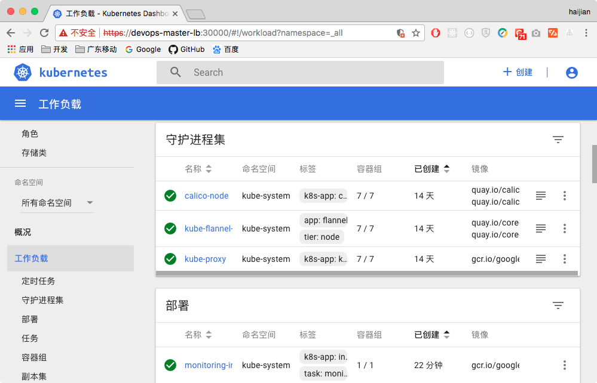
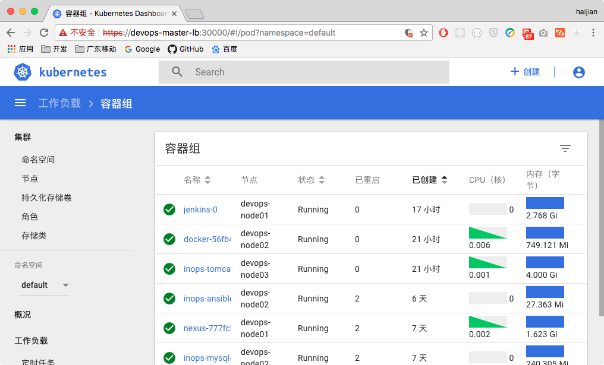

# kubeadm-highavailiability - kubernetes high availiability deployment based on kubeadm, for Kubernetes version 1.7.x/1.6.x


- [中文文档(for v1.7.x版本)](README_CN.md)
- [English document(for v1.7.x version)](README.md)
- [中文文档(for v1.6.x版本)](README_v1.6.x_CN.md)
- [English document(for v1.6.x version)](README_v1.6.x.md)

---

- [GitHub project URL](https://github.com/cookeem/kubeadm-ha/)
- [OSChina project URL](https://git.oschina.net/cookeem/kubeadm-ha/)

---

- This operation instruction is for version v1.6.x kubernetes cluster

### category

1. [deployment architecture](#deployment-architecture)
    1. [deployment architecture summary](#deployment-architecture-summary)
    1. [detail deployment architecture](#detail-deployment-architecture)
    1. [hosts list](#hosts-list)
1. [prerequisites](#prerequisites)
    1. [version info](#version-info)
    1. [required docker images](#required-docker-images)
    1. [system configuration](#system-configuration)
1. [kubernetes installation](#kubernetes-installation)
    1. [kubernetes and related services installation](#kubernetes-and-related-services-installation)
    1. [load docker images](#load-docker-images)
1. [use kubeadm to init first master](#use-kubeadm-to-init-first-master)
    1. [deploy independent etcd tls cluster](#deploy-independent-etcd-tls-cluster)
    1. [kubeadm init](#kubeadm-init)
    1. [install flannel networks addon](#install-flannel-networks-addon)
    1. [install dashboard addon](#install-dashboard-addon)
    1. [install heapster addon](#install-heapster-addon)
1. [kubernetes masters high avialiability configuration](#kubernetes-masters-high-avialiability-configuration)
    1. [copy configuration files](#copy-configuration-files)
    1. [edit configuration files](#edit-configuration-files)
    1. [verify master high avialiability](#verify-master-high-avialiability)
    1. [keepalived installation](#keepalived-installation)
    1. [nginx load balancer configuration](#nginx-load-balancer-configuration)
    1. [kube-proxy configuration](#kube-proxy-configuration)
    1. [verfify master high avialiability with keepalived](#verfify-master-high-avialiability-with-keepalived)
1. [k8s-nodes join the kubernetes cluster](#k8s-nodes-join-the-kubernetes-cluster)
    1. [use kubeadm to join the cluster](#use-kubeadm-to-join-the-cluster)
    1. [deploy nginx application to verify installation](#deploy-nginx-application-to-verify-installation)
    

### deployment architecture

#### deployment architecture summary


---
[category](#category)

#### detail deployment architecture


* kubernetes components:

> kube-apiserver: exposes the Kubernetes API. It is the front-end for the Kubernetes control plane. It is designed to scale horizontally – that is, it scales by deploying more instances.

> etcd: is used as Kubernetes’ backing store. All cluster data is stored here. Always have a backup plan for etcd’s data for your Kubernetes cluster.


> kube-scheduler: watches newly created pods that have no node assigned, and selects a node for them to run on.


> kube-controller-manager: runs controllers, which are the background threads that handle routine tasks in the cluster. Logically, each controller is a separate process, but to reduce complexity, they are all compiled into a single binary and run in a single process.

> kubelet: is the primary node agent. It watches for pods that have been assigned to its node (either by apiserver or via local configuration file)

> kube-proxy: enables the Kubernetes service abstraction by maintaining network rules on the host and performing connection forwarding.


* load balancer

> keepalived cluster config a virtual IP address (192.168.60.80), this virtual IP address point to k8s-master1, k8s-master2, k8s-master3. 

> nginx service as the load balancer of k8s-master1, k8s-master2, k8s-master3's apiserver. The other nodes kubernetes services connect the keepalived virtual ip address (192.168.60.80) and nginx exposed port (8443) to communicate with the master cluster's apiservers. 

---
[category](#category)

#### hosts list

 HostName | IPAddress | Notes | Components 
 :--- | :--- | :--- | :---
 k8s-master1 | 192.168.60.71 | master node 1 | keepalived, nginx, etcd, kubelet, kube-apiserver, kube-scheduler, kube-proxy, kube-dashboard, heapster
 k8s-master2 | 192.168.60.72 | master node 2 | keepalived, nginx, etcd, kubelet, kube-apiserver, kube-scheduler, kube-proxy, kube-dashboard, heapster
 k8s-master3 | 192.168.60.73 | master node 3 | keepalived, nginx, etcd, kubelet, kube-apiserver, kube-scheduler, kube-proxy, kube-dashboard, heapster
 N/A | 192.168.60.80 | keepalived virtual IP | N/A
 k8s-node1 ~ 8 | 192.168.60.81 ~ 88 | 8 worker nodes | kubelet, kube-proxy

---
[category](#category)

### prerequisites

#### version info

* Linux version: CentOS 7.3.1611

```
cat /etc/redhat-release 
CentOS Linux release 7.3.1611 (Core) 
```

* docker version: 1.12.6

```
$ docker version
Client:
 Version:      1.12.6
 API version:  1.24
 Go version:   go1.6.4
 Git commit:   78d1802
 Built:        Tue Jan 10 20:20:01 2017
 OS/Arch:      linux/amd64

Server:
 Version:      1.12.6
 API version:  1.24
 Go version:   go1.6.4
 Git commit:   78d1802
 Built:        Tue Jan 10 20:20:01 2017
 OS/Arch:      linux/amd64
```

* kubeadm version: v1.7.0

```
$ kubeadm version
kubeadm version: &version.Info{Major:"1", Minor:"7", GitVersion:"v1.7.0", GitCommit:"d3ada0119e776222f11ec7945e6d860061339aad", GitTreeState:"clean", BuildDate:"2017-06-29T22:55:19Z", GoVersion:"go1.8.3", Compiler:"gc", Platform:"linux/amd64"}
```

* kubelet version: v1.7.0

```
$ kubelet --version
Kubernetes v1.7.0
```

---

[category](#category)

#### required docker images

* on your local laptop MacOSX: pull related docker images

```
$ docker pull gcr.io/google_containers/kube-proxy-amd64:v1.7.0
$ docker pull gcr.io/google_containers/kube-apiserver-amd64:v1.7.0
$ docker pull gcr.io/google_containers/kube-controller-manager-amd64:v1.7.0
$ docker pull gcr.io/google_containers/kube-scheduler-amd64:v1.7.0
$ docker pull gcr.io/google_containers/k8s-dns-sidecar-amd64:1.14.4
$ docker pull gcr.io/google_containers/k8s-dns-kube-dns-amd64:1.14.4
$ docker pull gcr.io/google_containers/k8s-dns-dnsmasq-nanny-amd64:1.14.4
$ docker pull nginx:latest
$ docker pull gcr.io/google_containers/kubernetes-dashboard-amd64:v1.6.1
$ docker pull quay.io/coreos/flannel:v0.7.1-amd64
$ docker pull gcr.io/google_containers/heapster-amd64:v1.3.0
$ docker pull gcr.io/google_containers/etcd-amd64:3.0.17
$ docker pull gcr.io/google_containers/heapster-grafana-amd64:v4.0.2
$ docker pull gcr.io/google_containers/heapster-influxdb-amd64:v1.1.1
$ docker pull gcr.io/google_containers/pause-amd64:3.0
```

* on your local laptop MacOSX: clone codes from git and change working directory in codes

```
$ git clone https://github.com/cookeem/kubeadm-ha
$ cd kubeadm-ha
```

* on your local laptop MacOSX: save related docker images in docker-images directory

```
$ mkdir -p docker-images
$ docker save -o docker-images/kube-proxy-amd64  gcr.io/google_containers/kube-proxy-amd64:v1.7.0
$ docker save -o docker-images/kube-apiserver-amd64  gcr.io/google_containers/kube-apiserver-amd64:v1.7.0
$ docker save -o docker-images/kube-controller-manager-amd64  gcr.io/google_containers/kube-controller-manager-amd64:v1.7.0
$ docker save -o docker-images/kube-scheduler-amd64  gcr.io/google_containers/kube-scheduler-amd64:v1.7.0
$ docker save -o docker-images/k8s-dns-sidecar-amd64  gcr.io/google_containers/k8s-dns-sidecar-amd64:1.14.4
$ docker save -o docker-images/k8s-dns-kube-dns-amd64  gcr.io/google_containers/k8s-dns-kube-dns-amd64:1.14.4
$ docker save -o docker-images/k8s-dns-dnsmasq-nanny-amd64  gcr.io/google_containers/k8s-dns-dnsmasq-nanny-amd64:1.14.4
$ docker save -o docker-images/heapster-grafana-amd64  gcr.io/google_containers/heapster-grafana-amd64:v4.2.0
$ docker save -o docker-images/nginx  nginx:latest
$ docker save -o docker-images/kubernetes-dashboard-amd64  gcr.io/google_containers/kubernetes-dashboard-amd64:v1.6.1
$ docker save -o docker-images/flannel  quay.io/coreos/flannel:v0.7.1-amd64
$ docker save -o docker-images/heapster-amd64  gcr.io/google_containers/heapster-amd64:v1.3.0
$ docker save -o docker-images/etcd-amd64  gcr.io/google_containers/etcd-amd64:3.0.17
$ docker save -o docker-images/heapster-grafana-amd64  gcr.io/google_containers/heapster-grafana-amd64:v4.0.2
$ docker save -o docker-images/heapster-influxdb-amd64  gcr.io/google_containers/heapster-influxdb-amd64:v1.1.1
$ docker save -o docker-images/pause-amd64  gcr.io/google_containers/pause-amd64:3.0
```

* on your local laptop MacOSX: copy all codes and docker images directory to all kubernetes nodes

```
$ scp -r * root@k8s-master1:/root/kubeadm-ha
$ scp -r * root@k8s-master2:/root/kubeadm-ha
$ scp -r * root@k8s-master3:/root/kubeadm-ha
$ scp -r * root@k8s-node1:/root/kubeadm-ha
$ scp -r * root@k8s-node2:/root/kubeadm-ha
$ scp -r * root@k8s-node3:/root/kubeadm-ha
$ scp -r * root@k8s-node4:/root/kubeadm-ha
$ scp -r * root@k8s-node5:/root/kubeadm-ha
$ scp -r * root@k8s-node6:/root/kubeadm-ha
$ scp -r * root@k8s-node7:/root/kubeadm-ha
$ scp -r * root@k8s-node8:/root/kubeadm-ha
```

---
[category](#category)

#### system configuration

* on all kubernetes nodes: add kubernetes' repository 

```
$ cat <<EOF > /etc/yum.repos.d/kubernetes.repo
[kubernetes]
name=Kubernetes
baseurl=https://packages.cloud.google.com/yum/repos/kubernetes-el7-x86_64
enabled=1
gpgcheck=1
repo_gpgcheck=1
gpgkey=https://packages.cloud.google.com/yum/doc/yum-key.gpg
        https://packages.cloud.google.com/yum/doc/rpm-package-key.gpg
EOF
```

* on all kubernetes nodes: use yum to update system

```
$ yum update -y
```

* on all kubernetes nodes: turn off firewalld service

```
$ systemctl disable firewalld && systemctl stop firewalld && systemctl status firewalld
```

* on all kubernetes nodes: set SELINUX to permissive mode

```
$ vi /etc/selinux/config
SELINUX=permissive
```

* on all kubernetes nodes: set iptables parameters

```
$ vi /etc/sysctl.d/k8s.conf
net.bridge.bridge-nf-call-iptables = 1
net.bridge.bridge-nf-call-ip6tables = 1
```

* on all kubernetes nodes: reboot host

```
$ reboot
```

---
[category](#category)

### kubernetes installation

#### kubernetes and related services installation

* on all kubernetes nodes: check SELINUX mode must set as permissive mode

```
$ getenforce
Permissive
```

* on all kubernetes nodes: install kubernetes and related services, then start up kubelet and docker daemon

```
$ yum search docker --showduplicates
$ yum install docker-1.12.6-16.el7.centos.x86_64

$ yum search kubelet --showduplicates
$ yum install kubelet-1.7.0-0.x86_64

$ yum search kubeadm --showduplicates
$ yum install kubeadm-1.7.0-0.x86_64

$ yum search kubernetes-cni --showduplicates
$ yum install kubernetes-cni-0.5.1-0.x86_64

$ systemctl enable docker && systemctl start docker
$ systemctl enable kubelet && systemctl start kubelet
```

---
[category](#category)

#### load docker images

* on all kubernetes nodes: load docker images

```
$ docker load -i /root/kubeadm-ha/docker-images/etcd-amd64
$ docker load -i /root/kubeadm-ha/docker-images/flannel
$ docker load -i /root/kubeadm-ha/docker-images/heapster-amd64
$ docker load -i /root/kubeadm-ha/docker-images/heapster-grafana-amd64
$ docker load -i /root/kubeadm-ha/docker-images/heapster-influxdb-amd64
$ docker load -i /root/kubeadm-ha/docker-images/k8s-dns-dnsmasq-nanny-amd64
$ docker load -i /root/kubeadm-ha/docker-images/k8s-dns-kube-dns-amd64
$ docker load -i /root/kubeadm-ha/docker-images/k8s-dns-sidecar-amd64
$ docker load -i /root/kubeadm-ha/docker-images/kube-apiserver-amd64
$ docker load -i /root/kubeadm-ha/docker-images/kube-controller-manager-amd64
$ docker load -i /root/kubeadm-ha/docker-images/kube-proxy-amd64
$ docker load -i /root/kubeadm-ha/docker-images/kubernetes-dashboard-amd64
$ docker load -i /root/kubeadm-ha/docker-images/kube-scheduler-amd64
$ docker load -i /root/kubeadm-ha/docker-images/pause-amd64
$ docker load -i /root/kubeadm-ha/docker-images/nginx

$ docker images
REPOSITORY                                               TAG                 IMAGE ID            CREATED             SIZE
gcr.io/google_containers/kube-proxy-amd64                v1.7.0              d2d44013d0f8        4 days ago          114.7 MB
gcr.io/google_containers/kube-apiserver-amd64            v1.7.0              f0d4b746fb2b        4 days ago          185.2 MB
gcr.io/google_containers/kube-controller-manager-amd64   v1.7.0              36bf73ed0632        4 days ago          137 MB
gcr.io/google_containers/kube-scheduler-amd64            v1.7.0              5c9a7f60a95c        4 days ago          77.16 MB
gcr.io/google_containers/k8s-dns-sidecar-amd64           1.14.4              38bac66034a6        7 days ago          41.81 MB
gcr.io/google_containers/k8s-dns-kube-dns-amd64          1.14.4              a8e00546bcf3        7 days ago          49.38 MB
gcr.io/google_containers/k8s-dns-dnsmasq-nanny-amd64     1.14.4              f7f45b9cb733        7 days ago          41.41 MB
nginx                                                    latest              958a7ae9e569        4 weeks ago         109.4 MB
gcr.io/google_containers/kubernetes-dashboard-amd64      v1.6.1              71dfe833ce74        6 weeks ago         134.4 MB
quay.io/coreos/flannel                                   v0.7.1-amd64        cd4ae0be5e1b        10 weeks ago        77.76 MB
gcr.io/google_containers/heapster-amd64                  v1.3.0              f9d33bedfed3        3 months ago        68.11 MB
gcr.io/google_containers/etcd-amd64                      3.0.17              243830dae7dd        4 months ago        168.9 MB
gcr.io/google_containers/heapster-grafana-amd64          v4.0.2              a1956d2a1a16        5 months ago        131.5 MB
gcr.io/google_containers/heapster-influxdb-amd64         v1.1.1              d3fccbedd180        5 months ago        11.59 MB
gcr.io/google_containers/pause-amd64                     3.0                 99e59f495ffa        14 months ago       746.9 kB
```

---
[category](#category)

### use kubeadm to init first master

#### deploy independent etcd tls cluster

* on k8s-master1: use docker to start independent etcd tls cluster

```
$ docker stop etcd && docker rm etcd
$ rm -rf /var/lib/etcd-cluster
$ mkdir -p /var/lib/etcd-cluster
$ docker run -d \
--restart always \
-v /etc/ssl/certs:/etc/ssl/certs \
-v /var/lib/etcd-cluster:/var/lib/etcd \
-p 4001:4001 \
-p 2380:2380 \
-p 2379:2379 \
--name etcd \
gcr.io/google_containers/etcd-amd64:3.0.17 \
etcd --name=etcd0 \
--advertise-client-urls=http://192.168.60.71:2379,http://192.168.60.71:4001 \
--listen-client-urls=http://0.0.0.0:2379,http://0.0.0.0:4001 \
--initial-advertise-peer-urls=http://192.168.60.71:2380 \
--listen-peer-urls=http://0.0.0.0:2380 \
--initial-cluster-token=9477af68bbee1b9ae037d6fd9e7efefd \
--initial-cluster=etcd0=http://192.168.60.71:2380,etcd1=http://192.168.60.72:2380,etcd2=http://192.168.60.73:2380 \
--initial-cluster-state=new \
--auto-tls \
--peer-auto-tls \
--data-dir=/var/lib/etcd
```

* on k8s-master2: use docker to start independent etcd tls cluster

```
$ docker stop etcd && docker rm etcd
$ rm -rf /var/lib/etcd-cluster
$ mkdir -p /var/lib/etcd-cluster
$ docker run -d \
--restart always \
-v /etc/ssl/certs:/etc/ssl/certs \
-v /var/lib/etcd-cluster:/var/lib/etcd \
-p 4001:4001 \
-p 2380:2380 \
-p 2379:2379 \
--name etcd \
gcr.io/google_containers/etcd-amd64:3.0.17 \
etcd --name=etcd1 \
--advertise-client-urls=http://192.168.60.72:2379,http://192.168.60.72:4001 \
--listen-client-urls=http://0.0.0.0:2379,http://0.0.0.0:4001 \
--initial-advertise-peer-urls=http://192.168.60.72:2380 \
--listen-peer-urls=http://0.0.0.0:2380 \
--initial-cluster-token=9477af68bbee1b9ae037d6fd9e7efefd \
--initial-cluster=etcd0=http://192.168.60.71:2380,etcd1=http://192.168.60.72:2380,etcd2=http://192.168.60.73:2380 \
--initial-cluster-state=new \
--auto-tls \
--peer-auto-tls \
--data-dir=/var/lib/etcd
```

* on k8s-master3: use docker to start independent etcd tls cluster

```
$ docker stop etcd && docker rm etcd
$ rm -rf /var/lib/etcd-cluster
$ mkdir -p /var/lib/etcd-cluster
$ docker run -d \
--restart always \
-v /etc/ssl/certs:/etc/ssl/certs \
-v /var/lib/etcd-cluster:/var/lib/etcd \
-p 4001:4001 \
-p 2380:2380 \
-p 2379:2379 \
--name etcd \
gcr.io/google_containers/etcd-amd64:3.0.17 \
etcd --name=etcd2 \
--advertise-client-urls=http://192.168.60.73:2379,http://192.168.60.73:4001 \
--listen-client-urls=http://0.0.0.0:2379,http://0.0.0.0:4001 \
--initial-advertise-peer-urls=http://192.168.60.73:2380 \
--listen-peer-urls=http://0.0.0.0:2380 \
--initial-cluster-token=9477af68bbee1b9ae037d6fd9e7efefd \
--initial-cluster=etcd0=http://192.168.60.71:2380,etcd1=http://192.168.60.72:2380,etcd2=http://192.168.60.73:2380 \
--initial-cluster-state=new \
--auto-tls \
--peer-auto-tls \
--data-dir=/var/lib/etcd
```

* on k8s-master1, k8s-master2, k8s-master3: check etcd cluster health

```
$ docker exec -ti etcd ash

$ etcdctl member list
1a32c2d3f1abcad0: name=etcd2 peerURLs=http://192.168.60.73:2380 clientURLs=http://192.168.60.73:2379,http://192.168.60.73:4001 isLeader=false
1da4f4e8b839cb79: name=etcd1 peerURLs=http://192.168.60.72:2380 clientURLs=http://192.168.60.72:2379,http://192.168.60.72:4001 isLeader=false
4238bcb92d7f2617: name=etcd0 peerURLs=http://192.168.60.71:2380 clientURLs=http://192.168.60.71:2379,http://192.168.60.71:4001 isLeader=true

$ etcdctl cluster-health
member 1a32c2d3f1abcad0 is healthy: got healthy result from http://192.168.60.73:2379
member 1da4f4e8b839cb79 is healthy: got healthy result from http://192.168.60.72:2379
member 4238bcb92d7f2617 is healthy: got healthy result from http://192.168.60.71:2379
cluster is healthy

$ exit
```

---
[category](#category)

#### kubeadm init

* on k8s-master1: edit kubeadm-init-v1.7.x.yaml file, set etcd.endpoints.${HOST_IP} to k8s-master1, k8s-master2, k8s-master3's IP address. Set apiServerCertSANs.${HOST_IP} to k8s-master1, k8s-master2, k8s-master3's IP address. Set apiServerCertSANs.${HOST_NAME} to k8s-master1, k8s-master2, k8s-master3. Set apiServerCertSANs.${VIRTUAL_IP} to keepalived's virtual IP address

```
$ vi /root/kubeadm-ha/kubeadm-init-v1.7.x.yaml 
apiVersion: kubeadm.k8s.io/v1alpha1
kind: MasterConfiguration
kubernetesVersion: v1.7.0
networking:
  podSubnet: 10.244.0.0/16
apiServerCertSANs:
- k8s-master1
- k8s-master2
- k8s-master3
- 192.168.60.71
- 192.168.60.72
- 192.168.60.73
- 192.168.60.80
etcd:
  endpoints:
  - http://192.168.60.71:2379
  - http://192.168.60.72:2379
  - http://192.168.60.73:2379
```

* if kubeadm init stuck at tips below, that may because cgroup-driver parameters different with your docker service's setting
* [apiclient] Created API client, waiting for the control plane to become ready
* use "journalctl -t kubelet -S '2017-06-08'" to check logs, and you will find error below:
* error: failed to run Kubelet: failed to create kubelet: misconfiguration: kubelet cgroup driver: "systemd"
* you must change "KUBELET_CGROUP_ARGS=--cgroup-driver=systemd" to "KUBELET_CGROUP_ARGS=--cgroup-driver=cgroupfs"

```
$ vi /etc/systemd/system/kubelet.service.d/10-kubeadm.conf
#Environment="KUBELET_CGROUP_ARGS=--cgroup-driver=systemd"
Environment="KUBELET_CGROUP_ARGS=--cgroup-driver=cgroupfs"

$ systemctl daemon-reload && systemctl restart kubelet
```

* on k8s-master1: use kubeadm to init kubernetes cluster and connect external etcd cluster

```
$ kubeadm init --config=/root/kubeadm-ha/kubeadm-init-v1.7.x.yaml
```

* on k8s-master1: edit kube-apiserver.yaml file's admission-control settings, v1.7.0 use NodeRestriction admission control will prevent other master join the cluster, please reset it to v1.6.x recommended config.

```
$ vi /etc/kubernetes/manifests/kube-apiserver.yaml
#    - --admission-control=Initializers,NamespaceLifecycle,LimitRanger,ServiceAccount,PersistentVolumeLabel,DefaultStorageClass,DefaultTolerationSeconds,NodeRestriction,ResourceQuota
    - --admission-control=NamespaceLifecycle,LimitRanger,ServiceAccount,PersistentVolumeLabel,DefaultStorageClass,ResourceQuota,DefaultTolerationSeconds
```

* on k8s-master1: restart docker and kubelet services

```
$ systemctl restart docker kubelet
```

* on k8s-master1: set environment variables $KUBECONFIG, make kubectl connect kubelet

```
$ vi ~/.bashrc
export KUBECONFIG=/etc/kubernetes/admin.conf

$ source ~/.bashrc
```

---
[category](#category)

#### install flannel networks addon

* on k8s-master1: install flannel networks addon, otherwise kube-dns pod will keep status at ContainerCreating

```
$ kubectl create -f /root/kubeadm-ha/kube-flannel
clusterrole "flannel" created
clusterrolebinding "flannel" created
serviceaccount "flannel" created
configmap "kube-flannel-cfg" created
daemonset "kube-flannel-ds" created
```

* on k8s-master1: after flannel networks addon installed, wait about 3 minutes, then all pods status are Running

```
$ kubectl get pods --all-namespaces -o wide
NAMESPACE     NAME                                 READY     STATUS    RESTARTS   AGE       IP              NODE
kube-system   kube-apiserver-k8s-master1           1/1       Running   0          3m        192.168.60.71   k8s-master1
kube-system   kube-controller-manager-k8s-master1  1/1       Running   0          3m        192.168.60.71   k8s-master1
kube-system   kube-dns-3913472980-k9mt6            3/3       Running   0          4m        10.244.0.104    k8s-master1
kube-system   kube-flannel-ds-3hhjd                2/2       Running   0          1m        192.168.60.71   k8s-master1
kube-system   kube-proxy-rzq3t                     1/1       Running   0          4m        192.168.60.71   k8s-master1
kube-system   kube-scheduler-k8s-master1           1/1       Running   0          3m        192.168.60.71   k8s-master1
```

---
[category](#category)

#### install dashboard addon

* on k8s-master1: install dashboard webUI addon

```
$ kubectl create -f /root/kubeadm-ha/kube-dashboard/
serviceaccount "kubernetes-dashboard" created
clusterrolebinding "kubernetes-dashboard" created
deployment "kubernetes-dashboard" created
service "kubernetes-dashboard" created
```

* on k8s-master1: start up proxy

```
$ kubectl proxy --address='0.0.0.0' &
```

* on your local laptop MacOSX: use browser to check dashboard work correctly

```
http://k8s-master1:30000
```



---
[category](#category)

#### install heapster addon

* on k8s-master1: make master be able to schedule pods

```
$ kubectl taint nodes --all node-role.kubernetes.io/master-
node "k8s-master1" tainted
```

* on k8s-master1: install heapster addon, the performance monitor addon

```
$ kubectl create -f /root/kubeadm-ha/kube-heapster
```

* on k8s-master1: restart docker and kubelet service, to make heapster work immediately

```
$ systemctl restart docker kubelet
```

* on k8s-master1: check pods status

```
$ kubectl get all --all-namespaces -o wide
NAMESPACE     NAME                                    READY     STATUS    RESTARTS   AGE       IP              NODE
kube-system   heapster-783524908-kn6jd                1/1       Running   1          9m        10.244.0.111    k8s-master1
kube-system   kube-apiserver-k8s-master1              1/1       Running   1          15m       192.168.60.71   k8s-master1
kube-system   kube-controller-manager-k8s-master1     1/1       Running   1          15m       192.168.60.71   k8s-master1
kube-system   kube-dns-3913472980-k9mt6               3/3       Running   3          16m       10.244.0.110    k8s-master1
kube-system   kube-flannel-ds-3hhjd                   2/2       Running   3          13m       192.168.60.71   k8s-master1
kube-system   kube-proxy-rzq3t                        1/1       Running   1          16m       192.168.60.71   k8s-master1
kube-system   kube-scheduler-k8s-master1              1/1       Running   1          15m       192.168.60.71   k8s-master1
kube-system   kubernetes-dashboard-2039414953-d46vw   1/1       Running   1          11m       10.244.0.109    k8s-master1
kube-system   monitoring-grafana-3975459543-8l94z     1/1       Running   1          9m        10.244.0.112    k8s-master1
kube-system   monitoring-influxdb-3480804314-72ltf    1/1       Running   1          9m        10.244.0.113    k8s-master1
```

* on your local laptop MacOSX: use browser to check dashboard, if it show CPU and Memory Usage info, then heapster work!

```
http://k8s-master1:30000
```



* now we finish the first kubernetes master installation, and flannel dashboard heapster work on master correctly

---
[category](#category)

### kubernetes masters high avialiability configuration

#### copy configuration files

* on k8s-master1: copy /etc/kubernetes/ directory to k8s-master2 and k8s-master3

```
scp -r /etc/kubernetes/ k8s-master2:/etc/
scp -r /etc/kubernetes/ k8s-master3:/etc/
```

* on k8s-master2, k8s-master3: restart kubelet service, and make sure kubelet status is active (running)

```
$ systemctl daemon-reload && systemctl restart kubelet

$ systemctl status kubelet
● kubelet.service - kubelet: The Kubernetes Node Agent
   Loaded: loaded (/etc/systemd/system/kubelet.service; enabled; vendor preset: disabled)
  Drop-In: /etc/systemd/system/kubelet.service.d
           └─10-kubeadm.conf
   Active: active (running) since Tue 2017-06-27 16:24:22 CST; 1 day 17h ago
     Docs: http://kubernetes.io/docs/
 Main PID: 2780 (kubelet)
   Memory: 92.9M
   CGroup: /system.slice/kubelet.service
           ├─2780 /usr/bin/kubelet --kubeconfig=/etc/kubernetes/kubelet.conf --require-...
           └─2811 journalctl -k -f
```

* on k8s-master2, k8s-master3: set environment variables $KUBECONFIG, make kubectl connect kubelet

```
$ vi ~/.bashrc
export KUBECONFIG=/etc/kubernetes/admin.conf

$ source ~/.bashrc
```

* on k8s-master2, k8s-master3: check nodes status, you will found that k8s-master2 and k8s-master3 are joined

```
$ kubectl get nodes -o wide
NAME          STATUS    AGE       VERSION   EXTERNAL-IP   OS-IMAGE                KERNEL-VERSION
k8s-master1   Ready     26m       v1.7.0    <none>        CentOS Linux 7 (Core)   3.10.0-514.6.1.el7.x86_64
k8s-master2   Ready     2m        v1.7.0    <none>        CentOS Linux 7 (Core)   3.10.0-514.21.1.el7.x86_64
k8s-master3   Ready     2m        v1.7.0    <none>        CentOS Linux 7 (Core)   3.10.0-514.21.1.el7.x86_64
```

---
[category](#category)

#### edit configuration files

* on k8s-master2, k8s-master3: edit kube-apiserver.yaml file, replace ${HOST_IP} to current host's IP address

```
$ vi /etc/kubernetes/manifests/kube-apiserver.yaml
    - --advertise-address=${HOST_IP}
```

* on k8s-master2, k8s-master3: edit kubelet.conf file, replace ${HOST_IP} to current host's IP address

```
$ vi /etc/kubernetes/kubelet.conf
server: https://${HOST_IP}:6443
```

* on k8s-master2, k8s-master3: edit admin.conf file, replace ${HOST_IP} to current host's IP address

```
$ vi /etc/kubernetes/admin.conf
    server: https://${HOST_IP}:6443
```

* on k8s-master2, k8s-master3: edit controller-manager.conf file, replace ${HOST_IP} to current host's IP address

```
$ vi /etc/kubernetes/controller-manager.conf
    server: https://${HOST_IP}:6443
```

* on k8s-master2, k8s-master3: edit scheduler.conf file, replace ${HOST_IP} to current host's IP address

```
$ vi /etc/kubernetes/scheduler.conf
    server: https://${HOST_IP}:6443
```

* on k8s-master1, k8s-master2, k8s-master3: restart docker and kubelet services

```
$ systemctl daemon-reload && systemctl restart docker kubelet
```

---
[category](#category)

#### verify master high avialiability

* on k8s-master1 or k8s-master2 or k8s-master3: check all master nodes pods startup status. apiserver controller-manager kube-scheduler proxy flannel running at k8s-master1, k8s-master2, k8s-master3 successfully.

```
$ kubectl get pod --all-namespaces -o wide | grep k8s-master2
kube-system   kube-apiserver-k8s-master2              1/1       Running   1          55s       192.168.60.72   k8s-master2
kube-system   kube-controller-manager-k8s-master2     1/1       Running   2          18m       192.168.60.72   k8s-master2
kube-system   kube-flannel-ds-t8gkh                   2/2       Running   4          18m       192.168.60.72   k8s-master2
kube-system   kube-proxy-bpgqw                        1/1       Running   1          18m       192.168.60.72   k8s-master2
kube-system   kube-scheduler-k8s-master2              1/1       Running   2          18m       192.168.60.72   k8s-master2

$ kubectl get pod --all-namespaces -o wide | grep k8s-master3
kube-system   kube-apiserver-k8s-master3              1/1       Running   1          1m        192.168.60.73   k8s-master3
kube-system   kube-controller-manager-k8s-master3     1/1       Running   2          18m       192.168.60.73   k8s-master3
kube-system   kube-flannel-ds-tmqmx                   2/2       Running   4          18m       192.168.60.73   k8s-master3
kube-system   kube-proxy-4stg3                        1/1       Running   1          18m       192.168.60.73   k8s-master3
kube-system   kube-scheduler-k8s-master3              1/1       Running   2          18m       192.168.60.73   k8s-master3
```

* on k8s-master1 or k8s-master2 or k8s-master3: use kubectl logs to check controller-manager and scheduler's leader election result, only one is working

```
$ kubectl logs -n kube-system kube-controller-manager-k8s-master1
$ kubectl logs -n kube-system kube-controller-manager-k8s-master2
$ kubectl logs -n kube-system kube-controller-manager-k8s-master3

$ kubectl logs -n kube-system kube-scheduler-k8s-master1
$ kubectl logs -n kube-system kube-scheduler-k8s-master2
$ kubectl logs -n kube-system kube-scheduler-k8s-master3
```

* on k8s-master1 or k8s-master2 or k8s-master3: check deployment

```
$ kubectl get deploy --all-namespaces
NAMESPACE     NAME                   DESIRED   CURRENT   UP-TO-DATE   AVAILABLE   AGE
kube-system   heapster               1         1         1            1           41m
kube-system   kube-dns               1         1         1            1           48m
kube-system   kubernetes-dashboard   1         1         1            1           43m
kube-system   monitoring-grafana     1         1         1            1           41m
kube-system   monitoring-influxdb    1         1         1            1           41m
```

* on k8s-master1 or k8s-master2 or k8s-master3: scale up kubernetes-dashboard and kube-dns replicas to 3, make all master running kubernetes-dashboard and kube-dns

```
$ kubectl scale --replicas=3 -n kube-system deployment/kube-dns
$ kubectl get pods --all-namespaces -o wide| grep kube-dns

$ kubectl scale --replicas=3 -n kube-system deployment/kubernetes-dashboard
$ kubectl get pods --all-namespaces -o wide| grep kubernetes-dashboard

$ kubectl scale --replicas=3 -n kube-system deployment/heapster
$ kubectl get pods --all-namespaces -o wide| grep heapster

$ kubectl scale --replicas=3 -n kube-system deployment/monitoring-grafana
$ kubectl get pods --all-namespaces -o wide| grep monitoring-grafana

$ kubectl scale --replicas=3 -n kube-system deployment/monitoring-influxdb
$ kubectl get pods --all-namespaces -o wide| grep monitoring-influxdb
```

---
[category](#category)

#### keepalived installation

* on k8s-master1, k8s-master2, k8s-master3: install keepalived service

```
$ yum install -y keepalived

$ systemctl enable keepalived && systemctl restart keepalived
```

* on k8s-master1, k8s-master2, k8s-master3: backup keepalived config file

```
$ mv /etc/keepalived/keepalived.conf /etc/keepalived/keepalived.conf.bak
```

* on k8s-master1, k8s-master2, k8s-master3: create apiserver monitoring script, when apiserver failed keepalived will stop and virtual IP address will transfer to the other node

```
$ vi /etc/keepalived/check_apiserver.sh
#!/bin/bash
err=0
for k in $( seq 1 10 )
do
    check_code=$(ps -ef|grep kube-apiserver | wc -l)
    if [ "$check_code" = "1" ]; then
        err=$(expr $err + 1)
        sleep 5
        continue
    else
        err=0
        break
    fi
done
if [ "$err" != "0" ]; then
    echo "systemctl stop keepalived"
    /usr/bin/systemctl stop keepalived
    exit 1
else
    exit 0
fi

chmod a+x /etc/keepalived/check_apiserver.sh
```

* on k8s-master1, k8s-master2, k8s-master3: check the network interface name

```
$ ip a | grep 192.168.60
```

* on k8s-master1, k8s-master2, k8s-master3: edit keepalived settings:
* state ${STATE}: is MASTER or BACKUP, only one node can set to MASTER
* interface ${INTERFACE_NAME}: which network interfaces will virtual IP address bind on
* mcast_src_ip ${HOST_IP}: current host IP address
* priority ${PRIORITY}: for example (102 or 101 or 100)
* ${VIRTUAL_IP}: the virtual IP address, here we set to 192.168.60.80

```
$ vi /etc/keepalived/keepalived.conf
! Configuration File for keepalived
global_defs {
    router_id LVS_DEVEL
}
vrrp_script chk_apiserver {
    script "/etc/keepalived/check_apiserver.sh"
    interval 2
    weight -5
    fall 3  
    rise 2
}
vrrp_instance VI_1 {
    state ${STATE}
    interface ${INTERFACE_NAME}
    mcast_src_ip ${HOST_IP}
    virtual_router_id 51
    priority ${PRIORITY}
    advert_int 2
    authentication {
        auth_type PASS
        auth_pass 4be37dc3b4c90194d1600c483e10ad1d
    }
    virtual_ipaddress {
        ${VIRTUAL_IP}
    }
    track_script {
       chk_apiserver
    }
}
```

* on k8s-master1, k8s-master2, k8s-master3: reboot keepalived service, and check virtual IP address work or not

```
$ systemctl restart keepalived
$ ping 192.168.60.80
```

---
[category](#category)

#### nginx load balancer configuration

* on k8s-master1, k8s-master2, k8s-master3: edit nginx-default.conf settings, replace ${HOST_IP} with k8s-master1, k8s-master2, k8s-master3's IP address. 

```
$ vi /root/kubeadm-ha/nginx-default.conf
stream {
    upstream apiserver {
        server ${HOST_IP}:6443 weight=5 max_fails=3 fail_timeout=30s;
        server ${HOST_IP}:6443 weight=5 max_fails=3 fail_timeout=30s;
        server ${HOST_IP}:6443 weight=5 max_fails=3 fail_timeout=30s;
    }

    server {
        listen 8443;
        proxy_connect_timeout 1s;
        proxy_timeout 3s;
        proxy_pass apiserver;
    }
}
```

* on k8s-master1, k8s-master2, k8s-master3: use docker to start up nginx

```
$ docker run -d -p 8443:8443 \
--name nginx-lb \
--restart always \
-v /root/kubeadm-ha/nginx-default.conf:/etc/nginx/nginx.conf \
nginx
```

* on k8s-master1, k8s-master2, k8s-master3: check keepalived and nginx

```
$ curl -L 192.168.60.80:8443 | wc -l
  % Total    % Received % Xferd  Average Speed   Time    Time     Time  Current
                                 Dload  Upload   Total   Spent    Left  Speed
100    14    0    14    0     0  18324      0 --:--:-- --:--:-- --:--:-- 14000
1
```

* on k8s-master1, k8s-master2, k8s-master3: check keeplived logs, if it show logs below it means that virtual IP address bind on this host

```
$ systemctl status keepalived -l
VRRP_Instance(VI_1) Sending gratuitous ARPs on ens160 for 192.168.60.80
```

---
[category](#category)

#### kube-proxy configuration

* on k8s-master1: edit kube-proxy settings to use keepalived virtual IP address

```
$ kubectl get -n kube-system configmap
NAME                                 DATA      AGE
extension-apiserver-authentication   6         4h
kube-flannel-cfg                     2         4h
kube-proxy                           1         4h
```

* on k8s-master1: edit configmap/kube-proxy settings, replaces the IP address to keepalived's virtual IP address

```
$ kubectl edit -n kube-system configmap/kube-proxy
        server: https://192.168.60.80:8443
```

* on k8s-master1: check configmap/kube-proxy settings

```
$ kubectl get -n kube-system configmap/kube-proxy -o yaml
```

* on k8s-master1: delete all kube-proxy pods, kube-proxy pods will re-create automatically

```
kubectl get pods --all-namespaces -o wide | grep proxy
```

* on k8s-master1, k8s-master2, k8s-master3: restart docker kubelet keepalived services

```
$ systemctl restart docker kubelet keepalived
```

---
[category](#category)

#### verfify master high avialiability with keepalived

* on k8s-master1: check each master nodes pods status

```
$ kubectl get pods --all-namespaces -o wide | grep k8s-master1

$ kubectl get pods --all-namespaces -o wide | grep k8s-master2

$ kubectl get pods --all-namespaces -o wide | grep k8s-master3
```

---
[category](#category)

### k8s-nodes join the kubernetes cluster

#### use kubeadm to join the cluster
* on k8s-master1: make master nodes scheduling pods disabled

```
$ kubectl patch node k8s-master1 -p '{"spec":{"unschedulable":true}}'

$ kubectl patch node k8s-master2 -p '{"spec":{"unschedulable":true}}'

$ kubectl patch node k8s-master3 -p '{"spec":{"unschedulable":true}}'
```

* on k8s-master1: list kubeadm token

```
$ kubeadm token list
TOKEN           TTL         EXPIRES   USAGES                   DESCRIPTION
xxxxxx.yyyyyy   <forever>   <never>   authentication,signing   The default bootstrap token generated by 'kubeadm init'
```

* on k8s-node1 ~ k8s-node8: use kubeadm to join the kubernetes cluster,  replace ${TOKEN} with token show ahead, replace ${VIRTUAL_IP} with keepalived's virtual IP address (192.168.60.80)

```
$ kubeadm join --token ${TOKEN} ${VIRTUAL_IP}:8443
```

---
[category](#category)

#### deploy nginx application to verify installation

* on k8s-node1 ~ k8s-node8: check kubelet status

```
$ systemctl status kubelet
● kubelet.service - kubelet: The Kubernetes Node Agent
   Loaded: loaded (/etc/systemd/system/kubelet.service; enabled; vendor preset: disabled)
  Drop-In: /etc/systemd/system/kubelet.service.d
           └─10-kubeadm.conf
   Active: active (running) since Tue 2017-06-27 16:23:43 CST; 1 day 18h ago
     Docs: http://kubernetes.io/docs/
 Main PID: 1146 (kubelet)
   Memory: 204.9M
   CGroup: /system.slice/kubelet.service
           ├─ 1146 /usr/bin/kubelet --kubeconfig=/etc/kubernetes/kubelet.conf --require...
           ├─ 2553 journalctl -k -f
           ├─ 4988 /usr/sbin/glusterfs --log-level=ERROR --log-file=/var/lib/kubelet/pl...
           └─14720 /usr/sbin/glusterfs --log-level=ERROR --log-file=/var/lib/kubelet/pl...
```

* on k8s-master1: list nodes status

```
$ kubectl get nodes -o wide
NAME          STATUS                     AGE       VERSION
k8s-master1   Ready,SchedulingDisabled   5h        v1.7.0
k8s-master2   Ready,SchedulingDisabled   4h        v1.7.0
k8s-master3   Ready,SchedulingDisabled   4h        v1.7.0
k8s-node1     Ready                      6m        v1.7.0
k8s-node2     Ready                      4m        v1.7.0
k8s-node3     Ready                      4m        v1.7.0
k8s-node4     Ready                      3m        v1.7.0
k8s-node5     Ready                      3m        v1.7.0
k8s-node6     Ready                      3m        v1.7.0
k8s-node7     Ready                      3m        v1.7.0
k8s-node8     Ready                      3m        v1.7.0
```

* on k8s-master1: deploy nginx service on kubernetes, it show that nginx service deploy on k8s-node5

```
$ kubectl run nginx --image=nginx --port=80
deployment "nginx" created

$ kubectl get pod -o wide -l=run=nginx
NAME                     READY     STATUS    RESTARTS   AGE       IP           NODE
nginx-2662403697-pbmwt   1/1       Running   0          5m        10.244.7.6   k8s-node5
```

* on k8s-master1: expose nginx services port

```
$ kubectl expose deployment nginx --port=80 --target-port=80 --type=NodePort
service "nginx" exposed

$ kubectl get svc -l=run=nginx
NAME      CLUSTER-IP      EXTERNAL-IP   PORT(S)        AGE
nginx     10.105.151.69   <nodes>       80:31639/TCP   43s

$ curl k8s-master2:31639
<!DOCTYPE html>
<html>
<head>
<title>Welcome to nginx!</title>
<style>
    body {
        width: 35em;
        margin: 0 auto;
        font-family: Tahoma, Verdana, Arial, sans-serif;
    }
</style>
</head>
<body>
<h1>Welcome to nginx!</h1>
<p>If you see this page, the nginx web server is successfully installed and
working. Further configuration is required.</p>

<p>For online documentation and support please refer to
<a href="http://nginx.org/">nginx.org</a>.<br/>
Commercial support is available at
<a href="http://nginx.com/">nginx.com</a>.</p>

<p><em>Thank you for using nginx.</em></p>
</body>
</html>

```

* congratulation! kubernetes high availiability cluster deploy successfully 😀
---
[category](#category)

