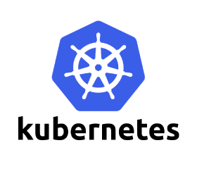

# kubeadm-highavailiability - 基于kubeadm的kubernetes高可用集群部署，支持v1.9.x和v1.7.x版本以及v1.6.x版本



- [中文文档(for v1.9.x版本)](README_CN.md)
- [English document(for v1.9.x version)](README.md)
- [中文文档(for v1.7.x版本)](v1.6-v1.7/README_CN.md)
- [English document(for v1.7.x version)](v1.6-v1.7/README.md)
- [中文文档(for v1.6.x版本)](v1.6-v1.7/README_v1.6.x_CN.md)
- [English document(for v1.6.x version)](v1.6-v1.7/README_v1.6.x.md)

---

- [GitHub项目地址](https://github.com/cookeem/kubeadm-ha/)
- [OSChina项目地址](https://git.oschina.net/cookeem/kubeadm-ha/)

---

- 该指引适用于v1.9.x版本的kubernetes集群

> v1.9.0以前的版本kubeadm还不支持高可用部署，因此不推荐作为生产环境的部署方式。从v1.9.x版本开始，kubeadm官方正式支持高可用集群的部署，安装kubeadm务必保证版本至少为1.9.0。

### 目录

1. [部署架构](#部署架构)
    1. [概要部署架构](#概要部署架构)
    1. [详细部署架构](#详细部署架构)
    1. [主机节点清单](#主机节点清单)
    1. [部署步骤概要](#部署步骤概要)
1. [安装前准备](#安装前准备)
    1. [版本信息](#版本信息)
    1. [所需docker镜像](#所需docker镜像)
    1. [系统设置](#系统设置)
1. [kubernetes安装](#kubernetes安装)
    1. [kubernetes相关服务安装](#kubernetes相关服务安装)
    1. [docker镜像导入](#docker镜像导入)
1. [第一台master初始化](#第一台master初始化)
    1. [独立etcd集群部署](#独立etcd集群部署)
    1. [kubeadm初始化](#kubeadm初始化)
    1. [flannel网络组件安装](#flannel网络组件安装)
    1. [dashboard组件安装](#dashboard组件安装)
    1. [heapster组件安装](#heapster组件安装)
1. [master集群高可用设置](#master集群高可用设置)
    1. [复制配置](#复制配置)
    1. [修改配置](#修改配置)
    1. [验证高可用安装](#验证高可用安装)
    1. [keepalived安装配置](#keepalived安装配置)
    1. [nginx负载均衡配置](#nginx负载均衡配置)
    1. [kube-proxy配置](#kube-proxy配置)
    1. [验证master集群高可用](#验证master集群高可用)
1. [node节点加入高可用集群设置](#node节点加入高可用集群设置)
    1. [kubeadm加入高可用集群](#kubeadm加入高可用集群)
    1. [部署应用验证集群](#部署应用验证集群)
    

### 部署架构

#### 概要部署架构


* kubernetes高可用的核心架构是master的高可用，kubectl、客户端以及nodes访问load balancer实现高可用。

---
[返回目录](#目录)

#### 详细部署架构


* kubernetes组件说明

> kube-apiserver：集群核心，集群API接口、集群各个组件通信的中枢；集群安全控制；

> etcd：集群的数据中心，用于存放集群的配置以及状态信息，非常重要，如果数据丢失那么集群将无法恢复；因此高可用集群部署首先就是etcd是高可用集群；

> kube-scheduler：集群Pod的调度中心；默认kubeadm安装情况下--leader-elect参数已经设置为true，保证master集群中只有一个kube-scheduler处于活跃状态；

> kube-controller-manager：集群状态管理器，当集群状态与期望不同时，kcm会努力让集群恢复期望状态，比如：当一个pod死掉，kcm会努力新建一个pod来恢复对应replicas set期望的状态；默认kubeadm安装情况下--leader-elect参数已经设置为true，保证master集群中只有一个kube-controller-manager处于活跃状态；

> kubelet: kubernetes node agent，负责与node上的docker engine打交道；

> kube-proxy: 每个node上一个，负责service vip到endpoint pod的流量转发，当前主要通过设置iptables规则实现。

* 负载均衡

> keepalived集群设置一个虚拟ip地址，虚拟ip地址指向k8s-master1、k8s-master2、k8s-master3。

> nginx用于k8s-master1、k8s-master2、k8s-master3的apiserver的负载均衡。外部kubectl以及nodes访问apiserver的时候就可以用过keepalived的虚拟ip(192.168.60.80)以及nginx端口(8443)访问master集群的apiserver。

---
[返回目录](#目录)


- 所有节点禁用并且关闭firewalld，由于kubernetes的网络组件会使用iptables进行网络策略设置，为了避免firewalld干扰该项设置

```
$ systemctl disable firewalld && systemctl stop firewalld
```

- 所有节点设置selinux的enforce为permissive

```
$ vi /etc/selinux/config
SELINUX=permissive

$ setenforce 0

$ getenforce
Permissive
```

- 所有节点设置sysctl

```
cat <<EOF >  /etc/sysctl.d/k8s.conf
net.bridge.bridge-nf-call-ip6tables = 1
net.bridge.bridge-nf-call-iptables = 1
net.ipv4.ip_forward = 1
EOF

sysctl --system
```

- 所有节点安装并启动组件

```
yum install -y docker-ce
yum install -y docker-compose
systemctl enable docker && systemctl start docker

yum install -y kubelet kubeadm kubectl
systemctl enable kubelet && systemctl start kubelet
```

- 在master节点安装并启动keepalived

```
yum install -y keepalived
systemctl enable keepalived && systemctl restart keepalived
```

- 所有节点加载相关docker images

```
docker load -i /root/kube-images/etcd-amd64-3.1.10
docker load -i /root/kube-images/flannel-v0.9.1-amd64
docker load -i /root/kube-images/heapster-amd64-v1.4.2
docker load -i /root/kube-images/heapster-grafana-amd64-v4.4.3
docker load -i /root/kube-images/heapster-influxdb-amd64-v1.3.3
docker load -i /root/kube-images/k8s-dns-dnsmasq-nanny-amd64-1.14.7
docker load -i /root/kube-images/k8s-dns-kube-dns-amd64-1.14.7
docker load -i /root/kube-images/k8s-dns-sidecar-amd64-1.14.7
docker load -i /root/kube-images/kube-apiserver-amd64-v1.9.1
docker load -i /root/kube-images/kube-controller-manager-amd64-v1.9.1
docker load -i /root/kube-images/kube-proxy-amd64-v1.9.1
docker load -i /root/kube-images/kubernetes-dashboard-amd64-v1.8.1
docker load -i /root/kube-images/kube-scheduler-amd64-v1.9.1
docker load -i /root/kube-images/pause-amd64-3.0
docker load -i /root/kube-images/nginx

docker tag k8s.gcr.io/kube-apiserver-amd64:v1.9.1 gcr.io/google_containers/kube-apiserver-amd64:v1.9.1
docker tag k8s.gcr.io/kube-scheduler-amd64:v1.9.1 gcr.io/google_containers/kube-scheduler-amd64:v1.9.1
docker tag k8s.gcr.io/kube-proxy-amd64:v1.9.1 gcr.io/google_containers/kube-proxy-amd64:v1.9.1
docker tag k8s.gcr.io/kube-controller-manager-amd64:v1.9.1 gcr.io/google_containers/kube-controller-manager-amd64:v1.9.1
docker tag k8s.gcr.io/kubernetes-dashboard-amd64:v1.8.1 gcr.io/google_containers/kubernetes-dashboard-amd64:v1.8.1
docker tag k8s.gcr.io/k8s-dns-sidecar-amd64:1.14.7 gcr.io/google_containers/k8s-dns-sidecar-amd64:1.14.7
docker tag k8s.gcr.io/k8s-dns-kube-dns-amd64:1.14.7 gcr.io/google_containers/k8s-dns-kube-dns-amd64:1.14.7
docker tag k8s.gcr.io/k8s-dns-dnsmasq-nanny-amd64:1.14.7 gcr.io/google_containers/k8s-dns-dnsmasq-nanny-amd64:1.14.7
docker tag k8s.gcr.io/etcd-amd64:3.1.10 gcr.io/google_containers/etcd-amd64:3.1.10
docker tag k8s.gcr.io/heapster-influxdb-amd64:v1.3.3 gcr.io/google_containers/heapster-influxdb-amd64:v1.3.3
docker tag k8s.gcr.io/heapster-grafana-amd64:v4.4.3 gcr.io/google_containers/heapster-grafana-amd64:v4.4.3
docker tag k8s.gcr.io/heapster-amd64:v1.4.2 gcr.io/google_containers/heapster-amd64:v1.4.2
docker tag k8s.gcr.io/pause-amd64:3.0 gcr.io/google_containers/pause-amd64:3.0

docker rmi k8s.gcr.io/kube-apiserver-amd64:v1.9.1 
docker rmi k8s.gcr.io/kube-scheduler-amd64:v1.9.1 
docker rmi k8s.gcr.io/kube-proxy-amd64:v1.9.1 
docker rmi k8s.gcr.io/kube-controller-manager-amd64:v1.9.1 
docker rmi k8s.gcr.io/kubernetes-dashboard-amd64:v1.8.1 
docker rmi k8s.gcr.io/k8s-dns-sidecar-amd64:1.14.7 
docker rmi k8s.gcr.io/k8s-dns-kube-dns-amd64:1.14.7 
docker rmi k8s.gcr.io/k8s-dns-dnsmasq-nanny-amd64:1.14.7 
docker rmi k8s.gcr.io/etcd-amd64:3.1.10 
docker rmi k8s.gcr.io/heapster-influxdb-amd64:v1.3.3 
docker rmi k8s.gcr.io/heapster-grafana-amd64:v4.4.3 
docker rmi k8s.gcr.io/heapster-amd64:v1.4.2 
docker rmi k8s.gcr.io/pause-amd64:3.0 

docker images
```

- 所有节点禁用swap

```
swapoff -a

vi /etc/fstab
#/dev/mapper/centos-swap swap                    swap    defaults        0 0

cat /proc/swaps
```

- 所有节点设置kubeadm使用cgroupfs

```
$ vi /etc/systemd/system/kubelet.service.d/10-kubeadm.conf
#Environment="KUBELET_CGROUP_ARGS=--cgroup-driver=systemd"
Environment="KUBELET_CGROUP_ARGS=--cgroup-driver=cgroupfs"

$ systemctl daemon-reload && systemctl restart kubelet
```

- 在master节点设置/root/kubeadm-ha/create-config.sh文件，用于初始化配置文件

```
vi /root/kubeadm-ha/create-config.sh

# local machine ip address
export K8SHA_IPLOCAL=192.168.20.27

# local machine etcd name, options: etcd1, etcd2, etcd3
export K8SHA_ETCDNAME=etcd1

# local machine keepalived state config, options: MASTER, BACKUP. One keepalived cluster only one MASTER, other's are BACKUP
export K8SHA_KA_STATE=MASTER

# local machine keepalived priority config, options: 102, 101, 100. MASTER must 102
export K8SHA_KA_PRIO=102

# local machine keepalived network interface name config, for example: eth0
export K8SHA_KA_INTF=nm-bond

#######################################
# all masters settings below must be same
#######################################

# master keepalived virtual ip address
export K8SHA_IPVIRTUAL=192.168.20.10

# master01 ip address
export K8SHA_IP1=192.168.20.27

# master02 ip address
export K8SHA_IP2=192.168.20.28

# master03 ip address
export K8SHA_IP3=192.168.20.29

# master01 hostname
export K8SHA_HOSTNAME1=devops-master01

# master02 hostname
export K8SHA_HOSTNAME2=devops-master02

# master03 hostname
export K8SHA_HOSTNAME3=devops-master03

# keepalived auth_pass config, all masters must be same
export K8SHA_KA_AUTH=4cdf7dc3b4c90194d1600c483e10ad1d

# kubernetes cluster token, you can use 'kubeadm token generate' to get a new one
export K8SHA_TOKEN=7f276c.0741d82a5337f526

# kubernetes CIDR pod subnet, if CIDR pod subnet is "10.244.0.0/16" please set to "10.244.0.0\\/16"
export K8SHA_CIDR=10.244.0.0\\/16

# calico network settings, set a reachable ip address for the cluster network interface, for example you can use the gateway ip address
export K8SHA_CALICO_REACHABLE_IP=192.168.20.1
```

```
cd /root/kubeadm-ha/

./create-config.sh
etcd config success: etcd/docker-compose.yaml
keepalived config success: /etc/keepalived/keepalived.conf
nginx load balance config success: nginx-lb/nginx-lb.conf
kubeadm init config success: kubeadm-init.yaml
calico config success: kube-calico/calico.yaml
```

- 在devops-master01、devops-master02、devops-master03上启动etcd

```
kubeadm reset
cd /root/kubeadm-ha/etcd
rm -rf /var/lib/etcd-cluster
docker-compose stop && docker-compose rm -f
docker-compose up -d
```

- 在devops-master01、devops-master02、devops-master03上检查etcd集群状态

```
docker exec -ti etcd etcdctl cluster-health

docker exec -ti etcd etcdctl member list
```

- 在devops-master01、devops-master02、devops-master03上重置网络

```
systemctl stop kubelet
systemctl stop docker
rm -rf /var/lib/cni/
rm -rf /var/lib/kubelet/*
rm -rf /etc/cni/

ip a | grep -E 'docker|flannel|cni'
ip link del docker0
ip link del flannel.1
ip link del cni0

systemctl restart docker && systemctl restart kubelet
ip a | grep -E 'docker|flannel|cni'
```

- 在devops-master01进行初始化

```
cd /root/kubeadm-ha/
kubeadm init --config=/root/kubeadm-ha/kubeadm-init.yaml
...
  kubeadm join --token 7f276c.0741d82a5337f526 192.168.20.27:6443 --discovery-token-ca-cert-hash sha256:a4a1eaf725a0fc67c3028b3063b92e6af7f2eb0f4ae028f12b3415a6fd2d2a5e
```

- 在所有节点上设置kubectl客户端连接

```
$ vi ~/.bashrc
export KUBECONFIG=/etc/kubernetes/admin.conf

$ source ~/.bashrc
```

- 在devops-master01上启动flannel网络、calico网络、dashboard以及heapster

```
kubectl apply -f /root/kubeadm-ha/kube-flannel/

# 等待所有pods正常
kubectl get pods --all-namespaces -w

# 等待master为Ready状态
kubectl get nodes

kubectl taint nodes --all node-role.kubernetes.io/master-

kubectl apply -f /root/kubeadm-ha/kube-calico/
configmap "calico-config" created
secret "calico-etcd-secrets" created
daemonset "calico-node" created
deployment "calico-kube-controllers" created
serviceaccount "calico-kube-controllers" created
serviceaccount "calico-node" created
clusterrole "calico-kube-controllers" created
clusterrolebinding "calico-kube-controllers" created
clusterrole "calico-node" created
clusterrolebinding "calico-node" created

kubectl get pods --all-namespaces -w
NAMESPACE     NAME                                      READY     STATUS    RESTARTS   AGE
kube-system   calico-kube-controllers-d987c6db5-vzfvr   1/1       Running   0          4m
kube-system   calico-node-rwt78                         2/2       Running   0          1m
kube-system   kube-apiserver-devops-master01            1/1       Running   0          6m
kube-system   kube-controller-manager-devops-master01   1/1       Running   0          6m
kube-system   kube-dns-6f4fd4bdf-x9pvq                  3/3       Running   0          7m
kube-system   kube-flannel-ds-g4qcj                     1/1       Running   0          3m
kube-system   kube-proxy-tn9nq                          1/1       Running   0          7m
kube-system   kube-scheduler-devops-master01            1/1       Running   0          6m

kubectl apply -f /root/kubeadm-ha/kube-dashboard/
serviceaccount "admin-user" created
clusterrolebinding "admin-user" created
secret "kubernetes-dashboard-certs" created
serviceaccount "kubernetes-dashboard" created
role "kubernetes-dashboard-minimal" created
rolebinding "kubernetes-dashboard-minimal" created
deployment "kubernetes-dashboard" created
service "kubernetes-dashboard" created

kubectl get pods --all-namespaces
NAMESPACE     NAME                                      READY     STATUS    RESTARTS   AGE
kube-system   calico-kube-controllers-d987c6db5-tncpw   1/1       Running   0          2m
kube-system   calico-node-tfxkx                         2/2       Running   0          2m
kube-system   kube-apiserver-devops-master01            1/1       Running   0          4m
kube-system   kube-controller-manager-devops-master01   1/1       Running   0          4m
kube-system   kube-dns-6f4fd4bdf-wtr46                  3/3       Running   0          5m
kube-system   kube-flannel-ds-rx4tp                     1/1       Running   0          4m
kube-system   kube-proxy-cgdsn                          1/1       Running   0          5m
kube-system   kube-scheduler-devops-master01            1/1       Running   0          4m
kube-system   kubernetes-dashboard-7b7b5cd79b-lktn5     1/1       Running   0          2m
```

- 访问dashboard地址
https://devops-master01:30000/#!/login

- 获取token，把token粘贴到login页面的token中，即可进入dashboard

```
kubectl -n kube-system describe secret $(kubectl -n kube-system get secret | grep admin-user | awk '{print $1}')
```

- 创建heapster

```
kubectl apply -f /root/kubeadm-ha/kube-heapster/influxdb/

kubectl apply -f /root/kubeadm-ha/kube-heapster/rbac/

kubectl get pods --all-namespaces 
NAMESPACE     NAME                                      READY     STATUS    RESTARTS   AGE
kube-system   calico-etcd-87fbn                         1/1       Running   1          8m
kube-system   calico-kube-controllers-d669cc78f-4fvkh   1/1       Running   1          8m
kube-system   calico-node-dd67w                         2/2       Running   2          8m
kube-system   heapster-dfd674df9-brt5x                  1/1       Running   1          3m
kube-system   kube-apiserver-devops-master01            1/1       Running   1          8m
kube-system   kube-controller-manager-devops-master01   1/1       Running   1          8m
kube-system   kube-dns-6f4fd4bdf-j47pk                  3/3       Running   3          9m
kube-system   kube-proxy-8wl95                          1/1       Running   1          9m
kube-system   kube-scheduler-devops-master01            1/1       Running   1          8m
kube-system   kubernetes-dashboard-7b7b5cd79b-qnwrr     1/1       Running   1          6m
kube-system   monitoring-grafana-76848b566c-zdmm7       1/1       Running   1          3m
kube-system   monitoring-influxdb-6c4b84d695-5zrmf      1/1       Running   1          3m

systemctl restart docker && systemctl restart kubelet

# 等待5分钟

kubectl top pod --all-namespaces
NAMESPACE     NAME                                      CPU(cores)   MEMORY(bytes)   
kube-system   calico-kube-controllers-d987c6db5-zjxnv   0m           20Mi            
kube-system   calico-node-hmdlg                         16m          83Mi            
kube-system   heapster-dfd674df9-hct67                  1m           24Mi            
kube-system   kube-apiserver-devops-master01            24m          240Mi           
kube-system   kube-controller-manager-devops-master01   14m          50Mi            
kube-system   kube-dns-6f4fd4bdf-zg66x                  1m           49Mi            
kube-system   kube-flannel-ds-h7ng4                     6m           33Mi            
kube-system   kube-proxy-mxcwz                          2m           29Mi            
kube-system   kube-scheduler-devops-master01            5m           22Mi            
kube-system   kubernetes-dashboard-7b7b5cd79b-6ldfn     0m           20Mi            
kube-system   monitoring-grafana-76848b566c-h5998       0m           28Mi            
kube-system   monitoring-influxdb-6c4b84d695-whzmp      1m           24Mi            
```

- 访问dashboard地址，等10分钟，就会显示性能数据
https://devops-master01:30000/#!/login

- 在devops-master01上复制/etc/kubernetes/pki到devops-master02、devops-master03

```
scp -r /etc/kubernetes/pki devops-master02:/etc/kubernetes/

scp -r /etc/kubernetes/pki devops-master03:/etc/kubernetes/
```

- 在devops-master02进行初始化

```
cd /root/kubeadm-ha/
kubeadm init --config=/root/kubeadm-ha/kubeadm-init.yaml
...
  kubeadm join --token 7f276c.0741d82a5337f526 192.168.20.28:6443 --discovery-token-ca-cert-hash sha256:a4a1eaf725a0fc67c3028b3063b92e6af7f2eb0f4ae028f12b3415a6fd2d2a5e

kubectl get pods --all-namespaces -o wide | grep master02
```

- 在devops-master03进行初始化

```
cd /root/kubeadm-ha/
kubeadm init --config=/root/kubeadm-ha/kubeadm-init.yaml
...
  kubeadm join --token 7f276c.0741d82a5337f526 192.168.20.29:6443 --discovery-token-ca-cert-hash sha256:a4a1eaf725a0fc67c3028b3063b92e6af7f2eb0f4ae028f12b3415a6fd2d2a5e

kubectl get pods --all-namespaces -o wide | grep master03
```

- 在devops-master01上检查nodes加入情况

```
kubectl get nodes
NAME              STATUS    ROLES     AGE       VERSION
devops-master01   Ready     master    19m       v1.9.1
devops-master02   Ready     master    4m        v1.9.1
devops-master03   Ready     master    4m        v1.9.1
```

- 在所有master上增加apiserver的apiserver-count设置

```
vi /etc/kubernetes/manifests/kube-apiserver.yaml
    - --apiserver-count=3

systemctl restart docker && systemctl restart kubelet
```

- 在devops-master01上检查高可用状态

```
kubectl get pods --all-namespaces -o wide
NAMESPACE     NAME                                      READY     STATUS    RESTARTS   AGE       IP              NODE
kube-system   calico-kube-controllers-d987c6db5-zjxnv   1/1       Running   2          14m       192.168.20.27   devops-master01
kube-system   calico-node-dldxz                         2/2       Running   2          3m        192.168.20.29   devops-master03
kube-system   calico-node-hmdlg                         2/2       Running   4          14m       192.168.20.27   devops-master01
kube-system   calico-node-tkbbx                         2/2       Running   2          3m        192.168.20.28   devops-master02
kube-system   heapster-dfd674df9-hct67                  1/1       Running   2          11m       10.244.172.11   devops-master01
kube-system   kube-apiserver-devops-master01            1/1       Running   1          2m        192.168.20.27   devops-master01
kube-system   kube-apiserver-devops-master02            1/1       Running   1          2m        192.168.20.28   devops-master02
kube-system   kube-apiserver-devops-master03            1/1       Running   0          24s       192.168.20.29   devops-master03
kube-system   kube-controller-manager-devops-master01   1/1       Running   2          15m       192.168.20.27   devops-master01
kube-system   kube-controller-manager-devops-master02   1/1       Running   1          2m        192.168.20.28   devops-master02
kube-system   kube-controller-manager-devops-master03   1/1       Running   1          2m        192.168.20.29   devops-master03
kube-system   kube-dns-6f4fd4bdf-zg66x                  3/3       Running   6          16m       10.244.172.13   devops-master01
kube-system   kube-flannel-ds-6njgf                     1/1       Running   1          3m        192.168.20.29   devops-master03
kube-system   kube-flannel-ds-g24ww                     1/1       Running   1          3m        192.168.20.28   devops-master02
kube-system   kube-flannel-ds-h7ng4                     1/1       Running   2          16m       192.168.20.27   devops-master01
kube-system   kube-proxy-2kk8s                          1/1       Running   1          3m        192.168.20.28   devops-master02
kube-system   kube-proxy-mxcwz                          1/1       Running   2          16m       192.168.20.27   devops-master01
kube-system   kube-proxy-vz7nf                          1/1       Running   1          3m        192.168.20.29   devops-master03
kube-system   kube-scheduler-devops-master01            1/1       Running   2          16m       192.168.20.27   devops-master01
kube-system   kube-scheduler-devops-master02            1/1       Running   1          2m        192.168.20.28   devops-master02
kube-system   kube-scheduler-devops-master03            1/1       Running   1          2m        192.168.20.29   devops-master03
kube-system   kubernetes-dashboard-7b7b5cd79b-6ldfn     1/1       Running   3          12m       10.244.172.12   devops-master01
kube-system   monitoring-grafana-76848b566c-h5998       1/1       Running   2          11m       10.244.172.14   devops-master01
kube-system   monitoring-influxdb-6c4b84d695-whzmp      1/1       Running   2          11m       10.244.172.10   devops-master01
```

```
kubectl taint nodes --all node-role.kubernetes.io/master-
node "devops-master02" untainted
node "devops-master03" untainted
```

- 注意，kubernetes-dashboard在scale的过程中经常会出现Error或者CrashLoopBackOff，需要耐心等待
```
kubectl get deploy -n kube-system

kubectl scale --replicas=3 -n kube-system deployment/calico-kube-controllers
kubectl get pods --all-namespaces -o wide| grep calico-kube-controllers

kubectl scale --replicas=3 -n kube-system deployment/kube-dns
kubectl get pods --all-namespaces -o wide| grep kube-dns

kubectl scale --replicas=3 -n kube-system deployment/kubernetes-dashboard
kubectl get pods --all-namespaces -o wide| grep kubernetes-dashboard

# heapster启动多个就会出现问题，请不要启动多个
# kubectl scale --replicas=1 -n kube-system deployment/heapster
# kubectl get pods --all-namespaces -o wide| grep heapster
# 
# kubectl scale --replicas=1 -n kube-system deployment/monitoring-grafana
# kubectl get pods --all-namespaces -o wide| grep monitoring-grafana
# 
# kubectl scale --replicas=1 -n kube-system deployment/monitoring-influxdb
# kubectl get pods --all-namespaces -o wide| grep monitoring-influxdb
```

- 检查所有pods的运行状态，所有节点都有运行以下pods，其中heapster相关的pod整个集群只能够启动一个，总共30个pods:
```
kube-apiserver
kube-controller-manager
kube-proxy
kube-scheduler
kube-dns

kube-flannel-ds

calico-kube-controllers
calico-node

kubernetes-dashboard
```

```
kubectl get pods --all-namespaces -o wide
NAMESPACE     NAME                                      READY     STATUS    RESTARTS   AGE       IP               NODE
kube-system   calico-kube-controllers-d987c6db5-5mdp9   1/1       Running   0          1m        192.168.20.28    devops-master02
kube-system   calico-kube-controllers-d987c6db5-pbgg5   1/1       Running   0          1m        192.168.20.29    devops-master03
kube-system   calico-kube-controllers-d987c6db5-v9k5x   1/1       Running   2          14m       192.168.20.27    devops-master01
kube-system   calico-node-59kcc                         2/2       Running   2          6m        192.168.20.29    devops-master03
kube-system   calico-node-6gc8k                         2/2       Running   2          9m        192.168.20.28    devops-master02
kube-system   calico-node-7qc5h                         2/2       Running   4          14m       192.168.20.27    devops-master01
kube-system   heapster-dfd674df9-2qhlf                  1/1       Running   2          12m       10.244.172.10    devops-master01
kube-system   kube-apiserver-devops-master01            1/1       Running   0          1m        192.168.20.27    devops-master01
kube-system   kube-apiserver-devops-master02            1/1       Running   1          3m        192.168.20.28    devops-master02
kube-system   kube-apiserver-devops-master03            1/1       Running   0          1m        192.168.20.29    devops-master03
kube-system   kube-controller-manager-devops-master01   1/1       Running   2          15m       192.168.20.27    devops-master01
kube-system   kube-controller-manager-devops-master02   1/1       Running   1          8m        192.168.20.28    devops-master02
kube-system   kube-controller-manager-devops-master03   1/1       Running   1          4m        192.168.20.29    devops-master03
kube-system   kube-dns-6f4fd4bdf-7vb8x                  3/3       Running   6          15m       10.244.172.11    devops-master01
kube-system   kube-dns-6f4fd4bdf-nqg8s                  3/3       Running   0          1m        10.244.250.129   devops-master02
kube-system   kube-dns-6f4fd4bdf-vftk9                  3/3       Running   0          1m        10.244.211.129   devops-master03
kube-system   kube-flannel-ds-jhdhw                     1/1       Running   1          9m        192.168.20.28    devops-master02
kube-system   kube-flannel-ds-mkcn4                     1/1       Running   1          6m        192.168.20.29    devops-master03
kube-system   kube-flannel-ds-qs9ht                     1/1       Running   2          15m       192.168.20.27    devops-master01
kube-system   kube-proxy-44npj                          1/1       Running   2          15m       192.168.20.27    devops-master01
kube-system   kube-proxy-6lgws                          1/1       Running   1          6m        192.168.20.29    devops-master03
kube-system   kube-proxy-gn6hk                          1/1       Running   1          9m        192.168.20.28    devops-master02
kube-system   kube-scheduler-devops-master01            1/1       Running   2          15m       192.168.20.27    devops-master01
kube-system   kube-scheduler-devops-master02            1/1       Running   1          8m        192.168.20.28    devops-master02
kube-system   kube-scheduler-devops-master03            1/1       Running   1          5m        192.168.20.29    devops-master03
kube-system   kubernetes-dashboard-7b7b5cd79b-8gw4f     1/1       Running   4          14m       10.244.172.13    devops-master01
kube-system   kubernetes-dashboard-7b7b5cd79b-fhtvl     1/1       Running   0          55s       10.244.211.130   devops-master03
kube-system   kubernetes-dashboard-7b7b5cd79b-vwkxs     1/1       Running   0          55s       10.244.250.130   devops-master02
kube-system   monitoring-grafana-76848b566c-hzwwk       1/1       Running   2          12m       10.244.172.14    devops-master01
kube-system   monitoring-influxdb-6c4b84d695-hmktb      1/1       Running   2          12m       10.244.172.12    devops-master01
```

```
kubectl get nodes
NAME              STATUS    ROLES     AGE       VERSION
devops-master01   Ready     master    38m       v1.9.1
devops-master02   Ready     master    25m       v1.9.1
devops-master03   Ready     master    25m       v1.9.1
```

- 在master上安装keepalived

```
cp /root/kubeadm-ha/keepalived/check_apiserver.sh /etc/keepalived/

ll /etc/keepalived/

systemctl restart keepalived

ping 192.168.20.10
```

- 在master上安装并启动nginx作为负载均衡

```
cd /root/kubeadm-ha/nginx-lb

docker-compose up -d
```

- 在master上验证负载均衡和keepalived是否成功

```
curl -k 192.168.20.10:16443 | wc -l
  % Total    % Received % Xferd  Average Speed   Time    Time     Time  Current
                                 Dload  Upload   Total   Spent    Left  Speed
100    14    0    14    0     0   3958      0 --:--:-- --:--:-- --:--:-- 14000
1
```

- 在devops-master01上设置proxy高可用

```
kubectl edit -n kube-system configmap/kube-proxy
        server: https://192.168.20.10:16443
```

- 在master上重启proxy

```
kubectl get pods --all-namespaces -o wide | grep proxy

kubectl delete pod -n kube-system kube-proxy-XXX
```

- 在workers上加入kubernetes集群

```
kubeadm join --token 7f276c.0741d82a5337f526 192.168.20.10:16443 --discovery-token-ca-cert-hash sha256:a4a1eaf725a0fc67c3028b3063b92e6af7f2eb0f4ae028f12b3415a6fd2d2a5e
```

```
kubectl get nodes
NAME              STATUS    ROLES     AGE       VERSION
devops-master01   Ready     master    46m       v1.9.1
devops-master02   Ready     master    44m       v1.9.1
devops-master03   Ready     master    44m       v1.9.1
devops-node01     Ready     <none>    50s       v1.9.1
devops-node02     Ready     <none>    26s       v1.9.1
devops-node03     Ready     <none>    22s       v1.9.1
devops-node04     Ready     <none>    17s       v1.9.1
```

- 设置workers的节点标签

```
kubectl label nodes devops-node01 role=worker
kubectl label nodes devops-node02 role=worker
kubectl label nodes devops-node03 role=worker
kubectl label nodes devops-node04 role=worker
```

- 使用calicoctl查看node的情况

```
kubectl apply -f /root/kubeadm-ha/kube-calico/calicoctl/

kubectl get pods --all-namespaces -o wide | grep ctl
kube-system   calicoctl                                 1/1       Running            0          33s       192.168.20.27    devops-master01

kubectl exec -ti -n kube-system calicoctl -- calicoctl get nodes -o wide
NAME              ASN         IPV4               IPV6   
devops-master01   (unknown)   192.168.20.27/24          
devops-master02   (unknown)   192.168.20.28/24          
devops-master03   (unknown)   192.168.20.29/24          
devops-node01     (unknown)   192.168.20.17/24          
devops-node02     (unknown)   192.168.20.18/24          
devops-node03     (unknown)   192.168.20.19/24          
devops-node04     (unknown)   192.168.20.20/24          
```

