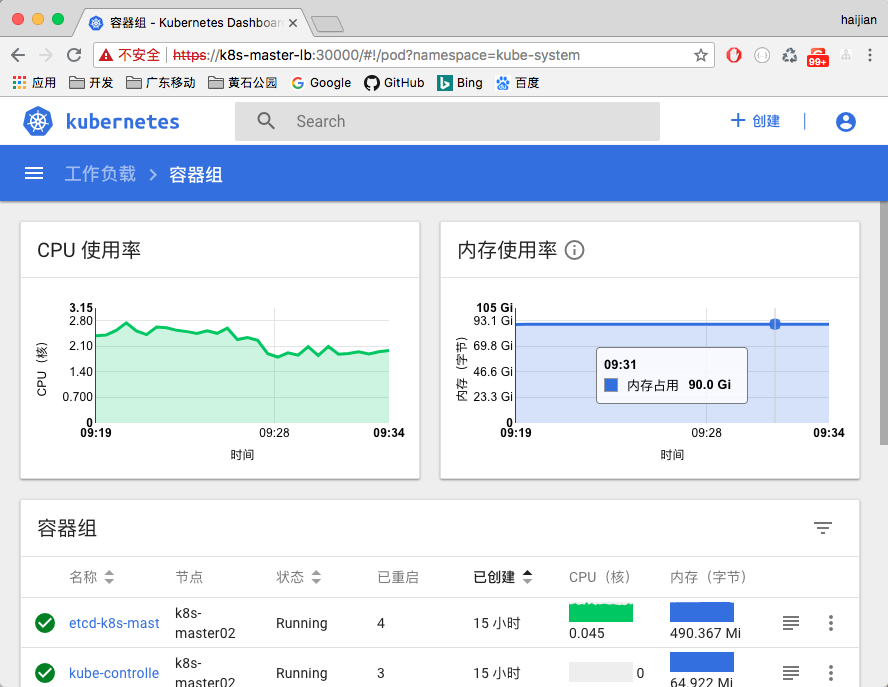

# kubeadm-highavailiability (English / 中文) - kubernetes high availiability deployment based on kubeadm, for Kubernetes version v1.11.x/v1.9.x/v1.7.x/v1.6.x


- [中文文档(for v1.11.x版本)](README_CN.md)
- [English document(for v1.11.x version)](README.md)
- [中文文档(for v1.9.x版本)](v1.9/README_CN.md)
- [English document(for v1.9.x version)](v1.9/README.md)
- [中文文档(for v1.7.x版本)](v1.7/README_CN.md)
- [English document(for v1.7.x version)](v1.7/README.md)
- [中文文档(for v1.6.x版本)](v1.6/README_CN.md)
- [English document(for v1.6.x version)](v1.6/README.md)

---

- [GitHub project URL](https://github.com/cookeem/kubeadm-ha/)
- [OSChina project URL](https://git.oschina.net/cookeem/kubeadm-ha/)

---

- This operation instruction is for version v1.11.x kubernetes cluster

> v1.11.x version now support deploy tls etcd cluster in control plane

### category

1. [deployment architecture](#deployment-architecture)
    1. [deployment architecture summary](#deployment-architecture-summary)
    1. [detail deployment architecture](#detail-deployment-architecture)
    1. [hosts list](#hosts-list)
1. [prerequisites](#prerequisites)
    1. [version info](#version-info)
    1. [required docker images](#required-docker-images)
    1. [system configuration](#system-configuration)
1. [kubernetes installation](#kubernetes-installation)
    1. [firewalld and iptables settings](#firewalld-and-iptables-settings)
    1. [kubernetes and related services installation](#kubernetes-and-related-services-installation)
    1. [master hosts mutual trust](#master-hosts-mutual-trust)
1. [masters high availiability installation](#masters-high-availiability-installation)
    1. [create configuration files](#create-configuration-files)
    1. [kubeadm initialization](#kubeadm-initialization)
    1. [high availiability configuration](#high-availiability-configuration)
1. [masters load balance settings](#masters-load-balance-settings)
    1. [keepalived installation](#keepalived-installation)
    1. [nginx load balance settings](#nginx-load-balance-settings)
    1. [kube-proxy HA settings](#kube-proxy-ha-settings)
    1. [high availiability verify](#high-availiability-verify)
    1. [kubernetes addons installation](#kubernetes-addons-installation)
1. [workers join kubernetes cluster](#workers-join-kubernetes-cluster)
    1. [workers join HA cluster](#workers-join-ha-cluster)
1. [verify kubernetes cluster installation](#verify-kubernetes-cluster-installation)
    1. [verify kubernetes cluster high availiablity installation](#verify-kubernetes-cluster-high-availiablity-installation)
1. [cluster upgrade](#cluster-upgrade)
    1. [kubernetes cluster upgrade from v1.11.1 to v1.11.5](#kubernetes-cluster-upgrade-from-v1-11-1-to-v1-11-5)

### deployment architecture

#### deployment architecture summary


---
[category](#category)

#### detail deployment architecture


- kubernetes components:

> kube-apiserver: exposes the Kubernetes API. It is the front-end for the Kubernetes control plane. It is designed to scale horizontally – that is, it scales by deploying more instances.

> etcd: is used as Kubernetes’ backing store. All cluster data is stored here. Always have a backup plan for etcd’s data for your Kubernetes cluster.

> kube-scheduler: watches newly created pods that have no node assigned, and selects a node for them to run on.

> kube-controller-manager: runs controllers, which are the background threads that handle routine tasks in the cluster. Logically, each controller is a separate process, but to reduce complexity, they are all compiled into a single binary and run in a single process.

> kubelet: is the primary node agent. It watches for pods that have been assigned to its node (either by apiserver or via local configuration file)

> kube-proxy: enables the Kubernetes service abstraction by maintaining network rules on the host and performing connection forwarding.

- load balancer

> keepalived cluster config a virtual IP address (192.168.20.10), this virtual IP address point to k8s-master01, k8s-master02, k8s-master03.

> nginx service as the load balancer of k8s-master01, k8s-master02, k8s-master03's apiserver. The other nodes kubernetes services connect the keepalived virtual ip address (192.168.20.10) and nginx exposed port (16443) to communicate with the master cluster's apiservers.

---

[category](#category)

#### hosts list

HostName | IPAddress | Notes | Components
:--- | :--- | :--- | :---
k8s-master01 ~ 03 | 192.168.20.20 ~ 22 | master nodes * 3 | keepalived, nginx, etcd, kubelet, kube-apiserver
k8s-master-lb     | 192.168.20.10 | keepalived virtual IP | N/A
k8s-node01 ~ 08   | 192.168.20.30 ~ 37 | worker nodes * 8 | kubelet

---

[category](#category)

### prerequisites

#### version info

- Linux version: CentOS 7.4.1708

- Core version: 4.6.4-1.el7.elrepo.x86_64

```sh
$ cat /etc/redhat-release
CentOS Linux release 7.4.1708 (Core)

$ uname -r
4.6.4-1.el7.elrepo.x86_64
```

- docker version: 17.12.0-ce-rc2

```sh
$ docker version
Client:
 Version:	17.12.0-ce-rc2
 API version:	1.35
 Go version:	go1.9.2
 Git commit:	f9cde63
 Built:	Tue Dec 12 06:42:20 2017
 OS/Arch:	linux/amd64

Server:
 Engine:
  Version:	17.12.0-ce-rc2
  API version:	1.35 (minimum version 1.12)
  Go version:	go1.9.2
  Git commit:	f9cde63
  Built:	Tue Dec 12 06:44:50 2017
  OS/Arch:	linux/amd64
  Experimental:	false
```

- kubeadm version: v1.11.1

```sh
$ kubeadm version
kubeadm version: &version.Info{Major:"1", Minor:"11", GitVersion:"v1.11.1", GitCommit:"b1b29978270dc22fecc592ac55d903350454310a", GitTreeState:"clean", BuildDate:"2018-07-17T18:50:16Z", GoVersion:"go1.10.3", Compiler:"gc", Platform:"linux/amd64"}
```

- kubelet version: v1.11.1

```sh
$ kubelet --version
Kubernetes v1.11.1
```

- networks addons

> calico

---

[category](#category)

#### required docker images

- required docker images and tags

```sh
# kuberentes basic components

# use kubeadm to list all required docker images
$ kubeadm config images list --kubernetes-version=v1.11.1
k8s.gcr.io/kube-apiserver-amd64:v1.11.1
k8s.gcr.io/kube-controller-manager-amd64:v1.11.1
k8s.gcr.io/kube-scheduler-amd64:v1.11.1
k8s.gcr.io/kube-proxy-amd64:v1.11.1
k8s.gcr.io/pause:3.1
k8s.gcr.io/etcd-amd64:3.2.18
k8s.gcr.io/coredns:1.1.3

# use kubeadm to pull all required docker images
$ kubeadm config images pull --kubernetes-version=v1.11.1

# kubernetes networks addons
$ docker pull quay.io/calico/typha:v0.7.4
$ docker pull quay.io/calico/node:v3.1.3
$ docker pull quay.io/calico/cni:v3.1.3

# kubernetes metrics server
$ docker pull gcr.io/google_containers/metrics-server-amd64:v0.2.1

# kubernetes dashboard
$ docker pull gcr.io/google_containers/kubernetes-dashboard-amd64:v1.8.3

# kubernetes heapster
$ docker pull k8s.gcr.io/heapster-amd64:v1.5.4
$ docker pull k8s.gcr.io/heapster-influxdb-amd64:v1.5.2
$ docker pull k8s.gcr.io/heapster-grafana-amd64:v5.0.4

# kubernetes apiserver load balancer
$ docker pull nginx:latest

# prometheus
$ docker pull prom/prometheus:v2.3.1

# traefik
$ docker pull traefik:v1.6.3

# istio
$ docker pull docker.io/jaegertracing/all-in-one:1.5
$ docker pull docker.io/prom/prometheus:v2.3.1
$ docker pull docker.io/prom/statsd-exporter:v0.6.0
$ docker pull gcr.io/istio-release/citadel:1.0.0
$ docker pull gcr.io/istio-release/galley:1.0.0
$ docker pull gcr.io/istio-release/grafana:1.0.0
$ docker pull gcr.io/istio-release/mixer:1.0.0
$ docker pull gcr.io/istio-release/pilot:1.0.0
$ docker pull gcr.io/istio-release/proxy_init:1.0.0
$ docker pull gcr.io/istio-release/proxyv2:1.0.0
$ docker pull gcr.io/istio-release/servicegraph:1.0.0
$ docker pull gcr.io/istio-release/sidecar_injector:1.0.0
$ docker pull quay.io/coreos/hyperkube:v1.7.6_coreos.0
```

---

[category](#category)

#### system configuration

- on all kubernetes nodes: add kubernetes' repository

```sh
$ cat <<EOF > /etc/yum.repos.d/kubernetes.repo
[kubernetes]
name=Kubernetes
baseurl=https://packages.cloud.google.com/yum/repos/kubernetes-el7-x86_64
enabled=1
gpgcheck=1
repo_gpgcheck=1
gpgkey=https://packages.cloud.google.com/yum/doc/yum-key.gpg https://packages.cloud.google.com/yum/doc/rpm-package-key.gpg
exclude=kube*
EOF
```

- on all kubernetes nodes: update system

```sh
$ yum update -y
```

- on all kubernetes nodes: set SELINUX to permissive mode

```sh
$ vi /etc/selinux/config
SELINUX=permissive

$ setenforce 0
```

- on all kubernetes nodes: set iptables parameters

```sh
$ cat <<EOF >  /etc/sysctl.d/k8s.conf
net.bridge.bridge-nf-call-ip6tables = 1
net.bridge.bridge-nf-call-iptables = 1
net.ipv4.ip_forward = 1
EOF

$ sysctl --system
```

- on all kubernetes nodes: disable swap

```sh
$ swapoff -a

# disable swap mount point in /etc/fstab
$ vi /etc/fstab
#/dev/mapper/centos-swap swap                    swap    defaults        0 0

# check swap is disabled
$ cat /proc/swaps
Filename                Type        Size    Used    Priority
```

- on all kubernetes nodes: reboot hosts

```sh
# reboot hosts
$ reboot
```

---

[category](#category)

### kubernetes installation

#### firewalld and iptables settings

- on all kubernetes nodes: enable firewalld

```sh
# restart firewalld service
$ systemctl enable firewalld
$ systemctl restart firewalld
$ systemctl status firewalld
```

- master ports list

Protocol | Direction | Port | Comment
:--- | :--- | :--- | :---
TCP | Inbound | 16443*    | Load balancer Kubernetes API server port
TCP | Inbound | 6443*     | Kubernetes API server
TCP | Inbound | 4001      | etcd listen client port
TCP | Inbound | 2379-2380 | etcd server client API
TCP | Inbound | 10250     | Kubelet API
TCP | Inbound | 10251     | kube-scheduler
TCP | Inbound | 10252     | kube-controller-manager
TCP | Inbound | 10255     | Read-only Kubelet API (Deprecated)
TCP | Inbound | 30000-32767 | NodePort Services

- on all master nodes: set firewalld policy

```sh
$ firewall-cmd --zone=public --add-port=16443/tcp --permanent
$ firewall-cmd --zone=public --add-port=6443/tcp --permanent
$ firewall-cmd --zone=public --add-port=4001/tcp --permanent
$ firewall-cmd --zone=public --add-port=2379-2380/tcp --permanent
$ firewall-cmd --zone=public --add-port=10250/tcp --permanent
$ firewall-cmd --zone=public --add-port=10251/tcp --permanent
$ firewall-cmd --zone=public --add-port=10252/tcp --permanent
$ firewall-cmd --zone=public --add-port=30000-32767/tcp --permanent

$ firewall-cmd --reload

$ firewall-cmd --list-all --zone=public
public (active)
  target: default
  icmp-block-inversion: no
  interfaces: ens2f1 ens1f0 nm-bond
  sources:
  services: ssh dhcpv6-client
  ports: 4001/tcp 6443/tcp 2379-2380/tcp 10250/tcp 10251/tcp 10252/tcp 30000-32767/tcp
  protocols:
  masquerade: no
  forward-ports:
  source-ports:
  icmp-blocks:
  rich rules:
```

- worker ports list

Protocol | Direction | Port | Comment
:--- | :--- | :--- | :---
TCP | Inbound | 10250       | Kubelet API
TCP | Inbound | 30000-32767 | NodePort Services

- on all worker nodes: set firewalld policy

```sh
$ firewall-cmd --zone=public --add-port=10250/tcp --permanent
$ firewall-cmd --zone=public --add-port=30000-32767/tcp --permanent

$ firewall-cmd --reload

$ firewall-cmd --list-all --zone=public
public (active)
  target: default
  icmp-block-inversion: no
  interfaces: ens2f1 ens1f0 nm-bond
  sources:
  services: ssh dhcpv6-client
  ports: 10250/tcp 30000-32767/tcp
  protocols:
  masquerade: no
  forward-ports:
  source-ports:
  icmp-blocks:
  rich rules:
```

- on all kubernetes nodes: set firewalld to enable kube-proxy port forward

```sh
$ firewall-cmd --permanent --direct --add-rule ipv4 filter INPUT 1 -i docker0 -j ACCEPT -m comment --comment "kube-proxy redirects"
$ firewall-cmd --permanent --direct --add-rule ipv4 filter FORWARD 1 -o docker0 -j ACCEPT -m comment --comment "docker subnet"
$ firewall-cmd --reload

$ firewall-cmd --direct --get-all-rules
ipv4 filter INPUT 1 -i docker0 -j ACCEPT -m comment --comment 'kube-proxy redirects'
ipv4 filter FORWARD 1 -o docker0 -j ACCEPT -m comment --comment 'docker subnet'

# restart firewalld service
$ systemctl restart firewalld
```

- on all kubernetes nodes: remove this iptables chains, this settings will prevent kube-proxy node port forward. ( Notice: please run this command each time you restart firewalld ) Let's set the crontab.

```sh
$ crontab -e
0,5,10,15,20,25,30,35,40,45,50,55 * * * * /usr/sbin/iptables -D INPUT -j REJECT --reject-with icmp-host-prohibited
```

---

[category](#category)

#### kubernetes and related services installation

- on all kubernetes nodes: install kubernetes and related services, then start up kubelet and docker daemon

```sh
$ yum install -y docker-ce-17.12.0.ce-0.2.rc2.el7.centos.x86_64
$ yum install -y docker-compose-1.9.0-5.el7.noarch
$ systemctl enable docker && systemctl start docker

$ yum install -y kubelet-1.11.1-0.x86_64 kubeadm-1.11.1-0.x86_64 kubectl-1.11.1-0.x86_64
$ systemctl enable kubelet && systemctl start kubelet
```

- on all master nodes: install and start keepalived service

```sh
$ yum install -y keepalived
$ systemctl enable keepalived && systemctl restart keepalived
```

#### master hosts mutual trust

- on k8s-master01: set hosts mutual trust

```sh
$ rm -rf /root/.ssh/*
$ ssh k8s-master01 pwd
$ ssh k8s-master02 rm -rf /root/.ssh/*
$ ssh k8s-master03 rm -rf /root/.ssh/*
$ ssh k8s-master02 mkdir -p /root/.ssh/
$ ssh k8s-master03 mkdir -p /root/.ssh/

$ scp /root/.ssh/known_hosts root@k8s-master02:/root/.ssh/
$ scp /root/.ssh/known_hosts root@k8s-master03:/root/.ssh/

$ ssh-keygen -t rsa -P '' -f /root/.ssh/id_rsa
$ cat /root/.ssh/id_rsa.pub >> /root/.ssh/authorized_keys
$ scp /root/.ssh/authorized_keys root@k8s-master02:/root/.ssh/
```

- on k8s-master02: set hosts mutual trust

```sh
$ ssh-keygen -t rsa -P '' -f /root/.ssh/id_rsa
$ cat /root/.ssh/id_rsa.pub >> /root/.ssh/authorized_keys
$ scp /root/.ssh/authorized_keys root@k8s-master03:/root/.ssh/
```

- on k8s-master03: set hosts mutual trust

```sh
$ ssh-keygen -t rsa -P '' -f /root/.ssh/id_rsa
$ cat /root/.ssh/id_rsa.pub >> /root/.ssh/authorized_keys
$ scp /root/.ssh/authorized_keys root@k8s-master01:/root/.ssh/
$ scp /root/.ssh/authorized_keys root@k8s-master02:/root/.ssh/
```

---

[category](#category)

### masters high availiability installation

#### create configuration files

- on k8s-master01: clone kubeadm-ha project source code

```sh
$ git clone https://github.com/cookeem/kubeadm-ha
```

- on k8s-master01: use `create-config.sh` to create relative config files, this script will create all configuration files, follow the setting comment and make sure you set the parameters correctly.

```sh
$ cd kubeadm-ha

$ vi create-config.sh
# master keepalived virtual ip address
export K8SHA_VIP=192.168.60.79
# master01 ip address
export K8SHA_IP1=192.168.60.72
# master02 ip address
export K8SHA_IP2=192.168.60.77
# master03 ip address
export K8SHA_IP3=192.168.60.78
# master keepalived virtual ip hostname
export K8SHA_VHOST=k8s-master-lb
# master01 hostname
export K8SHA_HOST1=k8s-master01
# master02 hostname
export K8SHA_HOST2=k8s-master02
# master03 hostname
export K8SHA_HOST3=k8s-master03
# master01 network interface name
export K8SHA_NETINF1=nm-bond
# master02 network interface name
export K8SHA_NETINF2=nm-bond
# master03 network interface name
export K8SHA_NETINF3=nm-bond
# keepalived auth_pass config
export K8SHA_KEEPALIVED_AUTH=412f7dc3bfed32194d1600c483e10ad1d
# calico reachable ip address
export K8SHA_CALICO_REACHABLE_IP=192.168.60.1
# kubernetes CIDR pod subnet, if CIDR pod subnet is "172.168.0.0/16" please set to "172.168.0.0"
export K8SHA_CIDR=172.168.0.0

# run the shell, it will create 3 masters' kubeadm config files, keepalived config files, nginx load balance config files, and calico config files.
$ ./create-config.sh
create kubeadm-config.yaml files success. config/k8s-master01/kubeadm-config.yaml
create kubeadm-config.yaml files success. config/k8s-master02/kubeadm-config.yaml
create kubeadm-config.yaml files success. config/k8s-master03/kubeadm-config.yaml
create keepalived files success. config/k8s-master01/keepalived/
create keepalived files success. config/k8s-master02/keepalived/
create keepalived files success. config/k8s-master03/keepalived/
create nginx-lb files success. config/k8s-master01/nginx-lb/
create nginx-lb files success. config/k8s-master02/nginx-lb/
create nginx-lb files success. config/k8s-master03/nginx-lb/
create calico.yaml file success. calico/calico.yaml

# set hostname environment variables
$ export HOST1=k8s-master01
$ export HOST2=k8s-master02
$ export HOST3=k8s-master03

# copy kubeadm config files to all master nodes, path is /root/
$ scp -r config/$HOST1/kubeadm-config.yaml $HOST1:/root/
$ scp -r config/$HOST2/kubeadm-config.yaml $HOST2:/root/
$ scp -r config/$HOST3/kubeadm-config.yaml $HOST3:/root/

# copy keepalived config files to all master nodes, path is /etc/keepalived/
$ scp -r config/$HOST1/keepalived/* $HOST1:/etc/keepalived/
$ scp -r config/$HOST2/keepalived/* $HOST2:/etc/keepalived/
$ scp -r config/$HOST3/keepalived/* $HOST3:/etc/keepalived/

# copy nginx load balance config files to all master nodes, path is /etc/kubernetes/
$ scp -r config/$HOST1/nginx-lb/nginx-lb.conf $HOST1:/etc/kubernetes/
$ scp -r config/$HOST2/nginx-lb/nginx-lb.conf $HOST2:/etc/kubernetes/
$ scp -r config/$HOST3/nginx-lb/nginx-lb.conf $HOST3:/etc/kubernetes/

# copy nginx load balance deployment files to all master nodes, path is /etc/kubernetes/manifests/
$ scp -r config/$HOST1/nginx-lb/nginx-lb.yaml $HOST1:/etc/kubernetes/manifests/
$ scp -r config/$HOST2/nginx-lb/nginx-lb.yaml $HOST2:/etc/kubernetes/manifests/
$ scp -r config/$HOST3/nginx-lb/nginx-lb.yaml $HOST3:/etc/kubernetes/manifests/
```

---

[category](#category)

#### kubeadm initialization

- on k8s-master01: use kubeadm to init a kubernetes cluster

```sh
# notice: you must save the following output message: kubeadm join --token ${YOUR_TOKEN} --discovery-token-ca-cert-hash ${YOUR_DISCOVERY_TOKEN_CA_CERT_HASH} , this command will use lately.
$ kubeadm init --config /root/kubeadm-config.yaml
kubeadm join 192.168.20.20:6443 --token ${YOUR_TOKEN} --discovery-token-ca-cert-hash sha256:${YOUR_DISCOVERY_TOKEN_CA_CERT_HASH}
```

- on all master nodes: set kubectl client environment variable

```sh
$ cat <<EOF >> ~/.bashrc
export KUBECONFIG=/etc/kubernetes/admin.conf
EOF

$ source ~/.bashrc

# kubectl now can connect the kubernetes cluster
$ kubectl get nodes
```

- on k8s-master01: wait until etcd, kube-apiserver, kube-controller-manager, kube-scheduler startup

```sh
$ kubectl get pods -n kube-system -o wide
NAME                                   READY     STATUS    RESTARTS   AGE       IP              NODE
...
etcd-k8s-master01                      1/1       Running   0          18m       192.168.20.20   k8s-master01
kube-apiserver-k8s-master01            1/1       Running   0          18m       192.168.20.20   k8s-master01
kube-controller-manager-k8s-master01   1/1       Running   0          18m       192.168.20.20   k8s-master01
kube-scheduler-k8s-master01            1/1       Running   1          18m       192.168.20.20   k8s-master01
...
```

---

[category](#category)

#### high availiability configuration

- on k8s-master01: copy certificates to other master nodes

```sh
# set master nodes hostname
$ export CONTROL_PLANE_IPS="k8s-master02 k8s-master03"

# copy certificates to other master nodes
$ for host in ${CONTROL_PLANE_IPS}; do
  scp /etc/kubernetes/pki/ca.crt $host:/etc/kubernetes/pki/ca.crt
  scp /etc/kubernetes/pki/ca.key $host:/etc/kubernetes/pki/ca.key
  scp /etc/kubernetes/pki/sa.key $host:/etc/kubernetes/pki/sa.key
  scp /etc/kubernetes/pki/sa.pub $host:/etc/kubernetes/pki/sa.pub
  scp /etc/kubernetes/pki/front-proxy-ca.crt $host:/etc/kubernetes/pki/front-proxy-ca.crt
  scp /etc/kubernetes/pki/front-proxy-ca.key $host:/etc/kubernetes/pki/front-proxy-ca.key
  scp /etc/kubernetes/pki/etcd/ca.crt $host:/etc/kubernetes/pki/etcd/ca.crt
  scp /etc/kubernetes/pki/etcd/ca.key $host:/etc/kubernetes/pki/etcd/ca.key
  scp /etc/kubernetes/admin.conf $host:/etc/kubernetes/admin.conf
done
```

- on k8s-master02: master node join the cluster

```sh
# create all certificates and kubelet config files
$ kubeadm alpha phase certs all --config /root/kubeadm-config.yaml
$ kubeadm alpha phase kubeconfig controller-manager --config /root/kubeadm-config.yaml
$ kubeadm alpha phase kubeconfig scheduler --config /root/kubeadm-config.yaml
$ kubeadm alpha phase kubelet config write-to-disk --config /root/kubeadm-config.yaml
$ kubeadm alpha phase kubelet write-env-file --config /root/kubeadm-config.yaml
$ kubeadm alpha phase kubeconfig kubelet --config /root/kubeadm-config.yaml
$ systemctl restart kubelet

# set k8s-master01 and k8s-master02 HOSTNAME and ip address
$ export CP0_IP=192.168.20.20
$ export CP0_HOSTNAME=k8s-master01
$ export CP1_IP=192.168.20.21
$ export CP1_HOSTNAME=k8s-master02

# add etcd member to the cluster
$ kubectl exec -n kube-system etcd-${CP0_HOSTNAME} -- etcdctl --ca-file /etc/kubernetes/pki/etcd/ca.crt --cert-file /etc/kubernetes/pki/etcd/peer.crt --key-file /etc/kubernetes/pki/etcd/peer.key --endpoints=https://${CP0_IP}:2379 member add ${CP1_HOSTNAME} https://${CP1_IP}:2380
$ kubeadm alpha phase etcd local --config /root/kubeadm-config.yaml

# prepare to start master
$ kubeadm alpha phase kubeconfig all --config /root/kubeadm-config.yaml
$ kubeadm alpha phase controlplane all --config /root/kubeadm-config.yaml
$ kubeadm alpha phase mark-master --config /root/kubeadm-config.yaml

# modify /etc/kubernetes/admin.conf server settings
$ sed -i "s/192.168.20.20:6443/192.168.20.21:6443/g" /etc/kubernetes/admin.conf
```

- on k8s-master03: master node join the cluster

```sh
# create all certificates and kubelet config files
$ kubeadm alpha phase certs all --config /root/kubeadm-config.yaml
$ kubeadm alpha phase kubeconfig controller-manager --config /root/kubeadm-config.yaml
$ kubeadm alpha phase kubeconfig scheduler --config /root/kubeadm-config.yaml
$ kubeadm alpha phase kubelet config write-to-disk --config /root/kubeadm-config.yaml
$ kubeadm alpha phase kubelet write-env-file --config /root/kubeadm-config.yaml
$ kubeadm alpha phase kubeconfig kubelet --config /root/kubeadm-config.yaml
$ systemctl restart kubelet

# set k8s-master01 and k8s-master03 HOSTNAME and ip address
$ export CP0_IP=192.168.20.20
$ export CP0_HOSTNAME=k8s-master01
$ export CP2_IP=192.168.20.22
$ export CP2_HOSTNAME=k8s-master03

# add etcd member to the cluster
$ kubectl exec -n kube-system etcd-${CP0_HOSTNAME} -- etcdctl --ca-file /etc/kubernetes/pki/etcd/ca.crt --cert-file /etc/kubernetes/pki/etcd/peer.crt --key-file /etc/kubernetes/pki/etcd/peer.key --endpoints=https://${CP0_IP}:2379 member add ${CP2_HOSTNAME} https://${CP2_IP}:2380
$ kubeadm alpha phase etcd local --config /root/kubeadm-config.yaml

# prepare to start master
$ kubeadm alpha phase kubeconfig all --config /root/kubeadm-config.yaml
$ kubeadm alpha phase controlplane all --config /root/kubeadm-config.yaml
$ kubeadm alpha phase mark-master --config /root/kubeadm-config.yaml

# modify /etc/kubernetes/admin.conf server settings
$ sed -i "s/192.168.20.20:6443/192.168.20.22:6443/g" /etc/kubernetes/admin.conf
```

- on all master nodes: enable hpa to collect performance data form apiserver, add config below in file `/etc/kubernetes/manifests/kube-controller-manager.yaml`

```sh
$ vi /etc/kubernetes/manifests/kube-controller-manager.yaml
    - --horizontal-pod-autoscaler-use-rest-clients=false
```

- on all master nodes: enable istio auto-injection, add config below in file `/etc/kubernetes/manifests/kube-apiserver.yaml`

```sh
$ vi /etc/kubernetes/manifests/kube-apiserver.yaml
    - --enable-admission-plugins=NamespaceLifecycle,LimitRanger,ServiceAccount,DefaultStorageClass,DefaultTolerationSeconds,MutatingAdmissionWebhook,ValidatingAdmissionWebhook,ResourceQuota

# restart kubelet service
systemctl restart kubelet
```

- on any master nodes: install calico network addon, after network addon installed the cluster nodes status will be `READY`

```sh
$ kubectl apply -f calico/
```

---

[category](#category)

### masters load balance settings

#### keepalived installation

- on all master nodes: restart keepalived service

```sh
$ systemctl restart keepalived
$ systemctl status keepalived

# check keepalived vip
$ curl -k https://k8s-master-lb:6443
```

---

[category](#category)

#### nginx load balance settings

- nginx load balancer is self-hosted by kubelet

# check nginx load balance
$ curl -k https://k8s-master-lb:16443
```

---

[category](#category)

#### kube-proxy HA settings

- on any master nodes: set kube-proxy server settings, make sure this settings use the keepalived virtual IP and nginx load balancer port (here is: https://192.168.20.10:16443)

```sh
$ kubectl edit -n kube-system configmap/kube-proxy
    server: https://192.168.20.10:16443
```

- on any master nodes: restart kube-proxy pods

```sh
# find all kube-proxy pods
$ kubectl get pods --all-namespaces -o wide | grep proxy

# delete and restart all kube-proxy pods
$ kubectl delete pod -n kube-system kube-proxy-XXX
```

---

[category](#category)

#### high availiability verify

- on any master nodes: check cluster running status

```sh
# check kubernetes nodes status
$ kubectl get nodes
NAME           STATUS    ROLES     AGE       VERSION
k8s-master01   Ready     master    1h        v1.11.1
k8s-master02   Ready     master    58m       v1.11.1
k8s-master03   Ready     master    55m       v1.11.1

# check kube-system pods running status
$ kubectl get pods -n kube-system -o wide
NAME                                   READY     STATUS    RESTARTS   AGE       IP              NODE
calico-node-nxskr                      2/2       Running   0          46m       192.168.20.22   k8s-master03
calico-node-xv5xt                      2/2       Running   0          46m       192.168.20.20   k8s-master01
calico-node-zsmgp                      2/2       Running   0          46m       192.168.20.21   k8s-master02
coredns-78fcdf6894-kfzc7               1/1       Running   0          1h        172.168.2.3     k8s-master03
coredns-78fcdf6894-t957l               1/1       Running   0          46m       172.168.1.2     k8s-master02
etcd-k8s-master01                      1/1       Running   0          1h        192.168.20.20   k8s-master01
etcd-k8s-master02                      1/1       Running   0          58m       192.168.20.21   k8s-master02
etcd-k8s-master03                      1/1       Running   0          54m       192.168.20.22   k8s-master03
kube-apiserver-k8s-master01            1/1       Running   0          52m       192.168.20.20   k8s-master01
kube-apiserver-k8s-master02            1/1       Running   0          52m       192.168.20.21   k8s-master02
kube-apiserver-k8s-master03            1/1       Running   0          51m       192.168.20.22   k8s-master03
kube-controller-manager-k8s-master01   1/1       Running   0          34m       192.168.20.20   k8s-master01
kube-controller-manager-k8s-master02   1/1       Running   0          33m       192.168.20.21   k8s-master02
kube-controller-manager-k8s-master03   1/1       Running   0          33m       192.168.20.22   k8s-master03
kube-proxy-g9749                       1/1       Running   0          36m       192.168.20.22   k8s-master03
kube-proxy-lhzhb                       1/1       Running   0          35m       192.168.20.20   k8s-master01
kube-proxy-x8jwt                       1/1       Running   0          36m       192.168.20.21   k8s-master02
kube-scheduler-k8s-master01            1/1       Running   1          1h        192.168.20.20   k8s-master01
kube-scheduler-k8s-master02            1/1       Running   0          57m       192.168.20.21   k8s-master02
kube-scheduler-k8s-master03            1/1       Running   1          54m       192.168.20.22   k8s-master03
```

---

[category](#category)

#### kubernetes addons installation

- on any master nodes: enable master node pod schedulable

```sh
$ kubectl taint nodes --all node-role.kubernetes.io/master-
```

- on any master nodes: install metrics-server, after v1.11.0 heapster is deprecated for performance data collection, it use metrics-server

```sh
$ kubectl apply -f metrics-server/

# wait for 5 minutes, use kubectl top to check the pod performance usage
$ kubectl top pods -n kube-system
NAME                                    CPU(cores)   MEMORY(bytes)
calico-node-wkstv                       47m          113Mi
calico-node-x2sn5                       36m          104Mi
calico-node-xnh6s                       32m          106Mi
coredns-78fcdf6894-2xc6s                14m          30Mi
coredns-78fcdf6894-rk6ch                10m          22Mi
kube-apiserver-k8s-master01             163m         816Mi
kube-apiserver-k8s-master02             79m          617Mi
kube-apiserver-k8s-master03             73m          614Mi
kube-controller-manager-k8s-master01    52m          141Mi
kube-controller-manager-k8s-master02    0m           14Mi
kube-controller-manager-k8s-master03    0m           13Mi
kube-proxy-269t2                        4m           21Mi
kube-proxy-6jc8n                        9m           37Mi
kube-proxy-7n8xb                        9m           39Mi
kube-scheduler-k8s-master01             20m          25Mi
kube-scheduler-k8s-master02             15m          19Mi
kube-scheduler-k8s-master03             15m          19Mi
metrics-server-77b77f5fc6-jm8t6         3m           43Mi
```

- on any master nodes: install heapster, after v1.11.0 heapster is deprecated for performance data collection, it use metrics-server. But kube-dashboard use heapster to display performance info, so we install it.

```sh
# install heapster, wait for 5 minutes
$ kubectl apply -f heapster/
```

- on any master nodes: install kube-dashboard

```sh
# install kube-dashboard
$ kubectl apply -f dashboard/
```

> after install, open kube-dashboard in web browser, it need to login with token: https://k8s-master-lb:30000/


- on any master nodes: get kube-dashboard login token

```sh
# get kube-dashboard login token
$ kubectl -n kube-system describe secret $(kubectl -n kube-system get secret | grep admin-user | awk '{print $1}')
```

> login to kube-dashboard, you can see all pods performance metrics



- on any master nodes: install traefik

```sh
# create k8s-master-lb domain certificate
$ openssl req -x509 -nodes -days 365 -newkey rsa:2048 -keyout tls.key -out tls.crt -subj "/CN=k8s-master-lb"

# create kubernetes secret
kubectl -n kube-system create secret generic traefik-cert --from-file=tls.key --from-file=tls.crt

# install traefik
$ kubectl apply -f traefik/
```

> after install use web browser to open traefik admin webUI: http://k8s-master-lb:30011/


- on any master nodes: install istio

```sh
# install istio
$ kubectl apply -f istio/

# check all istio pods
$ kubectl get pods -n istio-system
NAME                                        READY     STATUS      RESTARTS   AGE
grafana-69c856fc69-jbx49                    1/1       Running     1          21m
istio-citadel-7c4fc8957b-vdbhp              1/1       Running     1          21m
istio-cleanup-secrets-5g95n                 0/1       Completed   0          21m
istio-egressgateway-64674bd988-44fg8        1/1       Running     0          18m
istio-egressgateway-64674bd988-dgvfm        1/1       Running     1          16m
istio-egressgateway-64674bd988-fprtc        1/1       Running     0          18m
istio-egressgateway-64674bd988-kl6pw        1/1       Running     3          16m
istio-egressgateway-64674bd988-nphpk        1/1       Running     3          16m
istio-galley-595b94cddf-c5ctw               1/1       Running     70         21m
istio-grafana-post-install-nhs47            0/1       Completed   0          21m
istio-ingressgateway-4vtk5                  1/1       Running     2          21m
istio-ingressgateway-5rscp                  1/1       Running     3          21m
istio-ingressgateway-6z95f                  1/1       Running     3          21m
istio-policy-589977bff5-jx5fd               2/2       Running     3          21m
istio-policy-589977bff5-n74q8               2/2       Running     3          21m
istio-sidecar-injector-86c4d57d56-mfnbp     1/1       Running     39         21m
istio-statsd-prom-bridge-5698d5798c-xdpp6   1/1       Running     1          21m
istio-telemetry-85d6475bfd-8lvsm            2/2       Running     2          21m
istio-telemetry-85d6475bfd-bfjsn            2/2       Running     2          21m
istio-telemetry-85d6475bfd-d9ld9            2/2       Running     2          21m
istio-tracing-bd5765b5b-cmszp               1/1       Running     1          21m
prometheus-77c5fc7cd-zf7zr                  1/1       Running     1          21m
servicegraph-6b99c87849-l6zm6               1/1       Running     1          21m
```

- on any master nodes: install prometheus

```sh
# install prometheus
$ kubectl apply -f prometheus/
```

> after install, open prometheus admin webUI: http://k8s-master-lb:30013/


> open grafana admin webUI (user and password is`admin`): http://k8s-master-lb:30006/
> after login, add prometheus datasource: http://k8s-master-lb:30006/datasources


> import dashboard: http://k8s-master-lb:30006/dashboard/import import all files under `heapster/grafana-dashboard` directory, dashboard `Kubernetes App Metrics`, `Kubernetes cluster monitoring (via Prometheus)`


> dashboard you imported:


---

[category](#category)

### workers join kubernetes cluster

#### workers join HA cluster

- on all worker nodes: join kubernetes cluster

```sh
$ kubeadm reset

# use kubeadm to join the cluster, here we use the k8s-master01 apiserver address and port.
$ kubeadm join 192.168.20.20:6443 --token ${YOUR_TOKEN} --discovery-token-ca-cert-hash sha256:${YOUR_DISCOVERY_TOKEN_CA_CERT_HASH}


# set the `/etc/kubernetes/*.conf` server settings, make sure this settings use the keepalived virtual IP and nginx load balancer port (here is: https://192.168.20.10:16443)
$ sed -i "s/192.168.20.20:6443/192.168.20.10:16443/g" /etc/kubernetes/bootstrap-kubelet.conf
$ sed -i "s/192.168.20.20:6443/192.168.20.10:16443/g" /etc/kubernetes/kubelet.conf

# restart docker and kubelet service
$ systemctl restart docker kubelet
```

- on any master nodes: check all nodes status

```sh
$ kubectl get nodes
NAME           STATUS    ROLES     AGE       VERSION
k8s-master01   Ready     master    1h        v1.11.1
k8s-master02   Ready     master    58m       v1.11.1
k8s-master03   Ready     master    55m       v1.11.1
k8s-node01     Ready     <none>    30m       v1.11.1
k8s-node02     Ready     <none>    24m       v1.11.1
k8s-node03     Ready     <none>    22m       v1.11.1
k8s-node04     Ready     <none>    22m       v1.11.1
k8s-node05     Ready     <none>    16m       v1.11.1
k8s-node06     Ready     <none>    13m       v1.11.1
k8s-node07     Ready     <none>    11m       v1.11.1
k8s-node08     Ready     <none>    10m       v1.11.1
```

---

[category](#category)

### verify kubernetes cluster installation

#### verify kubernetes cluster high availiablity installation

- NodePort testing

```sh
# create a nginx deployment, replicas=3
$ kubectl run nginx --image=nginx --replicas=3 --port=80
deployment "nginx" created

# check nginx pods status
$ kubectl get pods -l=run=nginx -o wide
NAME                     READY     STATUS    RESTARTS   AGE       IP             NODE
nginx-58b94844fd-jvlqh   1/1       Running   0          9s        172.168.7.2    k8s-node05
nginx-58b94844fd-mkt72   1/1       Running   0          9s        172.168.9.2    k8s-node07
nginx-58b94844fd-xhb8x   1/1       Running   0          9s        172.168.11.2   k8s-node09

# create nginx NodePort service
$ kubectl expose deployment nginx --type=NodePort --port=80
service "nginx" exposed

# check nginx service status
$ kubectl get svc -l=run=nginx -o wide
NAME      TYPE       CLUSTER-IP       EXTERNAL-IP   PORT(S)        AGE       SELECTOR
nginx     NodePort   10.106.129.121   <none>        80:31443/TCP   7s        run=nginx

# check nginx NodePort service accessibility
$ curl k8s-master-lb:31443
<!DOCTYPE html>
<html>
<head>
<title>Welcome to nginx!</title>
<style>
    body {
        width: 35em;
        margin: 0 auto;
        font-family: Tahoma, Verdana, Arial, sans-serif;
    }
</style>
</head>
<body>
<h1>Welcome to nginx!</h1>
<p>If you see this page, the nginx web server is successfully installed and
working. Further configuration is required.</p>

<p>For online documentation and support please refer to
<a href="http://nginx.org/">nginx.org</a>.<br/>
Commercial support is available at
<a href="http://nginx.com/">nginx.com</a>.</p>

<p><em>Thank you for using nginx.</em></p>
</body>
</html>
```

- pods connectivity testing

```sh
kubectl run nginx-client -ti --rm --image=alpine -- ash
/ # wget -O - nginx
Connecting to nginx (10.102.101.78:80)
index.html           100% |*****************************************|   612   0:00:00 ETA

<!DOCTYPE html>
<html>
<head>
<title>Welcome to nginx!</title>
<style>
    body {
        width: 35em;
        margin: 0 auto;
        font-family: Tahoma, Verdana, Arial, sans-serif;
    }
</style>
</head>
<body>
<h1>Welcome to nginx!</h1>
<p>If you see this page, the nginx web server is successfully installed and
working. Further configuration is required.</p>

<p>For online documentation and support please refer to
<a href="http://nginx.org/">nginx.org</a>.<br/>
Commercial support is available at
<a href="http://nginx.com/">nginx.com</a>.</p>

<p><em>Thank you for using nginx.</em></p>
</body>
</html>

# remove all test nginx deployment and service
kubectl delete deploy,svc nginx
```

- HPA testing

```sh
# create test nginx-server
kubectl run nginx-server --requests=cpu=10m --image=nginx --port=80
kubectl expose deployment nginx-server --port=80

# create hpa
kubectl autoscale deployment nginx-server --cpu-percent=10 --min=1 --max=10
kubectl get hpa
kubectl describe hpa nginx-server

# increase nginx-server load
kubectl run -ti --rm load-generator --image=busybox -- ash
wget -q -O- http://nginx-server.default.svc.cluster.local > /dev/null
while true; do wget -q -O- http://nginx-server.default.svc.cluster.local > /dev/null; done

# it may take a few minutes to stabilize the number of replicas. Since the amount of load is not controlled in any way it may happen that the final number of replicas will differ from this example.

kubectl get hpa -w

# remove all test deployment service and HPA
kubectl delete deploy,svc,hpa nginx-server
```

---

[category](#category)

- now kubernetes high availiability cluster setup successfully 😃

### cluster upgrade

#### kubernetes cluster upgrade from v1.11.1 to v1.11.5

- Kubernetes has received fixes for one of the most serious vulnerabilities ever found in the project to date. If left unpatched, the flaw could allow attackers to take over entire compute nodes. for detail: https://thenewstack.io/critical-vulnerability-allows-kubernetes-node-hacking/

- on all kubernetes nodes: upgrade kubelet and kubeadm from v1.11.1 to v1.11.5

```
# upgrade kubelet and kubeadm to v1.11.5
$ yum -y update kubeadm-1.11.5-0.x86_64 kubelet-1.11.5-0.x86_64

# restart service
$ systemctl daemon-reload
$ systemctl restart kubelet
```

- on all kubernetes nodes: pull v1.11.5 kubernetes images

```
$ docker pull k8s.gcr.io/kube-controller-manager-amd64:v1.11.5
$ docker pull k8s.gcr.io/kube-scheduler-amd64:v1.11.5
$ docker pull k8s.gcr.io/kube-apiserver-amd64:v1.11.5
$ docker pull k8s.gcr.io/kube-proxy-amd64:v1.11.5
```

- on all master nodes: upgrade cluster

```
# check kubernetes upgrade plan
$ kubeadm upgrade plan
Upgrade to the latest stable version:

COMPONENT            CURRENT   AVAILABLE
API Server           v1.11.1   v1.11.5
Controller Manager   v1.11.1   v1.11.5
Scheduler            v1.11.1   v1.11.5
Kube Proxy           v1.11.1   v1.11.5
CoreDNS              1.1.3     1.1.3
Etcd                 3.2.18    3.2.18

You can now apply the upgrade by executing the following command:

        kubeadm upgrade apply v1.11.5

# upgrade your kubernetes cluster, here's the output:
$ kubeadm upgrade apply v1.11.5
[preflight] Running pre-flight checks.
[upgrade] Making sure the cluster is healthy:
[upgrade/config] Making sure the configuration is correct:
[upgrade/config] Reading configuration from the cluster...
[upgrade/config] FYI: You can look at this config file with 'kubectl -n kube-system get cm kubeadm-config -oyaml'
[upgrade/apply] Respecting the --cri-socket flag that is set with higher priority than the config file.
[upgrade/version] You have chosen to change the cluster version to "v1.11.5"
[upgrade/versions] Cluster version: v1.11.1
[upgrade/versions] kubeadm version: v1.11.5
[upgrade/confirm] Are you sure you want to proceed with the upgrade? [y/N]: y
[upgrade/prepull] Will prepull images for components [kube-apiserver kube-controller-manager kube-scheduler etcd]
[upgrade/apply] Upgrading your Static Pod-hosted control plane to version "v1.11.5"...
Static pod: kube-apiserver-pro-master01 hash: f8a81b3b047edadfaea2759697caf09e
Static pod: kube-controller-manager-pro-master01 hash: 94369a77f84beef59df8e6c0c075d6eb
Static pod: kube-scheduler-pro-master01 hash: 537879acc30dd5eff5497cb2720a6d64
[upgrade/staticpods] Writing new Static Pod manifests to "/etc/kubernetes/tmp/kubeadm-upgraded-manifests249561254"
[controlplane] wrote Static Pod manifest for component kube-apiserver to "/etc/kubernetes/tmp/kubeadm-upgraded-manifests249561254/kube-apiserver.yaml"
[controlplane] wrote Static Pod manifest for component kube-controller-manager to "/etc/kubernetes/tmp/kubeadm-upgraded-manifests249561254/kube-controller-manager.yaml"
[controlplane] wrote Static Pod manifest for component kube-scheduler to "/etc/kubernetes/tmp/kubeadm-upgraded-manifests249561254/kube-scheduler.yaml"
[certificates] Using the existing etcd/ca certificate and key.
[certificates] Using the existing apiserver-etcd-client certificate and key.
[upgrade/staticpods] Moved new manifest to "/etc/kubernetes/manifests/kube-apiserver.yaml" and backed up old manifest to "/etc/kubernetes/tmp/kubeadm-backup-manifests-2018-12-05-18-26-14/kube-apiserver.yaml"
[upgrade/staticpods] Waiting for the kubelet to restart the component
Static pod: kube-apiserver-pro-master01 hash: f8a81b3b047edadfaea2759697caf09e
Static pod: kube-apiserver-pro-master01 hash: 145a58c8db4210f1eef7891f55dc6db6
[apiclient] Found 3 Pods for label selector component=kube-apiserver
[upgrade/staticpods] Component "kube-apiserver" upgraded successfully!
[upgrade/staticpods] Moved new manifest to "/etc/kubernetes/manifests/kube-controller-manager.yaml" and backed up old manifest to "/etc/kubernetes/tmp/kubeadm-backup-manifests-2018-12-05-18-26-14/kube-controller-manager.yaml"
[upgrade/staticpods] Waiting for the kubelet to restart the component
Static pod: kube-controller-manager-pro-master01 hash: 94369a77f84beef59df8e6c0c075d6eb
Static pod: kube-controller-manager-pro-master01 hash: c0de2763a74e6511dd773bffaec3a971
[apiclient] Found 3 Pods for label selector component=kube-controller-manager
[upgrade/staticpods] Component "kube-controller-manager" upgraded successfully!
[upgrade/staticpods] Moved new manifest to "/etc/kubernetes/manifests/kube-scheduler.yaml" and backed up old manifest to "/etc/kubernetes/tmp/kubeadm-backup-manifests-2018-12-05-18-26-14/kube-scheduler.yaml"
[upgrade/staticpods] Waiting for the kubelet to restart the component
Static pod: kube-scheduler-pro-master01 hash: 537879acc30dd5eff5497cb2720a6d64
Static pod: kube-scheduler-pro-master01 hash: 03ccb6e070f017ec5bf3aea2233e9c9e
[apiclient] Found 3 Pods for label selector component=kube-scheduler
[upgrade/staticpods] Component "kube-scheduler" upgraded successfully!
[uploadconfig] storing the configuration used in ConfigMap "kubeadm-config" in the "kube-system" Namespace
[kubelet] Creating a ConfigMap "kubelet-config-1.11" in namespace kube-system with the configuration for the kubelets in the cluster
[kubelet] Downloading configuration for the kubelet from the "kubelet-config-1.11" ConfigMap in the kube-system namespace
[kubelet] Writing kubelet configuration to file "/var/lib/kubelet/config.yaml"
[patchnode] Uploading the CRI Socket information "/var/run/dockershim.sock" to the Node API object "pro-master01" as an annotation
[bootstraptoken] configured RBAC rules to allow Node Bootstrap tokens to post CSRs in order for nodes to get long term certificate credentials
[bootstraptoken] configured RBAC rules to allow the csrapprover controller automatically approve CSRs from a Node Bootstrap Token
[bootstraptoken] configured RBAC rules to allow certificate rotation for all node client certificates in the cluster
[addons] Applied essential addon: CoreDNS
[addons] Applied essential addon: kube-proxy

[upgrade/successful] SUCCESS! Your cluster was upgraded to "v1.11.5". Enjoy!

[upgrade/kubelet] Now that your control plane is upgraded, please proceed with upgrading your kubelets if you haven't already done so.
```

- check upgrade status

```
# check all nodes VERSION
$ kubectl get no
NAME           STATUS    ROLES     AGE       VERSION
k8s-master01   Ready     master    43d       v1.11.5
k8s-master02   Ready     master    43d       v1.11.5
k8s-master03   Ready     master    43d       v1.11.5
k8s-node01     Ready     <none>    42d       v1.11.5
k8s-node02     Ready     <none>    43d       v1.11.5
k8s-node03     Ready     <none>    43d       v1.11.5
k8s-node04     Ready     <none>    43d       v1.11.5
k8s-node05     Ready     <none>    43d       v1.11.5
k8s-node06     Ready     <none>    43d       v1.11.5
k8s-node07     Ready     <none>    43d       v1.11.5
k8s-node08     Ready     <none>    43d       v1.11.5

# check all pod docker images
$ kubectl get po -n kube-system -o yaml | grep "image:" | grep "kube-"
      image: k8s.gcr.io/kube-apiserver-amd64:v1.11.5
      image: k8s.gcr.io/kube-apiserver-amd64:v1.11.5
      image: k8s.gcr.io/kube-apiserver-amd64:v1.11.5
      image: k8s.gcr.io/kube-controller-manager-amd64:v1.11.5
      image: k8s.gcr.io/kube-controller-manager-amd64:v1.11.5
      image: k8s.gcr.io/kube-controller-manager-amd64:v1.11.5
      image: k8s.gcr.io/kube-proxy-amd64:v1.11.5
      image: k8s.gcr.io/kube-proxy-amd64:v1.11.5
      image: k8s.gcr.io/kube-proxy-amd64:v1.11.5
      image: k8s.gcr.io/kube-proxy-amd64:v1.11.5
      image: k8s.gcr.io/kube-proxy-amd64:v1.11.5
      image: k8s.gcr.io/kube-proxy-amd64:v1.11.5
      image: k8s.gcr.io/kube-proxy-amd64:v1.11.5
      image: k8s.gcr.io/kube-proxy-amd64:v1.11.5
      image: k8s.gcr.io/kube-proxy-amd64:v1.11.5
      image: k8s.gcr.io/kube-proxy-amd64:v1.11.5
      image: k8s.gcr.io/kube-proxy-amd64:v1.11.5
      image: k8s.gcr.io/kube-scheduler-amd64:v1.11.5
      image: k8s.gcr.io/kube-scheduler-amd64:v1.11.5
      image: k8s.gcr.io/kube-scheduler-amd64:v1.11.5
```

- now kubernetes high availiability cluster upgrade to v1.11.5 successfully 😃

[category](#category)

