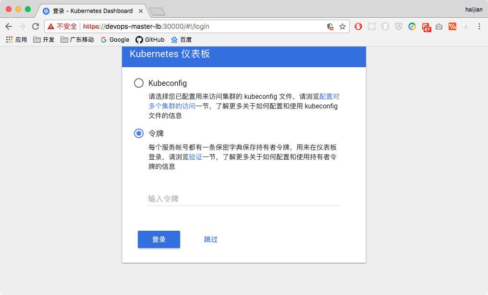
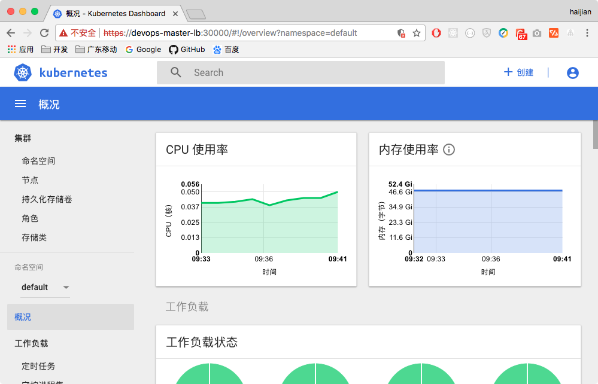

## kubeadm-highavailiability - kubernetes high availiability deployment based on kubeadm, for Kubernetes version 1.9.x/1.7.x/1.6.x


- [中文文档(for v1.9.x版本)](README_CN.md)
- [English document(for v1.9.x version)](README.md)
- [中文文档(for v1.7.x版本)](v1.6-v1.7/README_CN.md)
- [English document(for v1.7.x version)](v1.6-v1.7/README.md)
- [中文文档(for v1.6.x版本)](v1.6-v1.7/README_v1.6.x_CN.md)
- [English document(for v1.6.x version)](v1.6-v1.7/README_v1.6.x.md)

---

- [GitHub project URL](https://github.com/cookeem/kubeadm-ha/)
- [OSChina project URL](https://git.oschina.net/cookeem/kubeadm-ha/)

---

- This operation instruction is for version v1.9.x kubernetes cluster

> Before v1.9.0 kubeadm still not support high availability deployment, so it's not recommend for production usage. But from v1.9.0, kubeadm support high availability deployment officially, this instruction version for at least v1.9.0.

### category

1. [deployment architecture](#deployment-architecture)
    1. [deployment architecture summary](#deployment-architecture-summary)
    1. [detail deployment architecture](#detail-deployment-architecture)
    1. [hosts list](#hosts-list)
1. [prerequisites](#prerequisites)
    1. [version info](#version-info)
    1. [required docker images](#required-docker-images)
    1. [system configuration](#system-configuration)
1. [kubernetes installation](#kubernetes-installation)
    1. [firewalld and iptables settings](#firewalld-and-iptables-settings)
    1. [kubernetes and related services installation](#kubernetes-and-related-services-installation)
1. [configuration files settings](#configuration-files-settings)
    1. [script files settings](#script-files-settings) 
    1. [deploy independent etcd cluster](#deploy-independent-etcd-cluster)
1. [use kubeadm to init first master](#use-kubeadm-to-init-first-master)
    1. [kubeadm init](#kubeadm-init)
    1. [basic components installation](#basic-components-installation)
1. [kubernetes masters high avialiability configuration](#kubernetes-masters-high-avialiability-configuration)
    1. [copy configuration files](#copy-configuration-files)
    1. [other master nodes init](#other-master-nodes-init)
    1. [keepalived installation](#keepalived-installation)
    1. [nginx load balancer configuration](#nginx-load-balancer-configuration)
    1. [kube-proxy configuration](#kube-proxy-configuration)
1. [all nodes join the kubernetes cluster](#all-nodes-join-the-kubernetes-cluster)
    1. [use kubeadm to join the cluster](#use-kubeadm-to-join-the-cluster)
    1. [verify kubernetes cluster high availiablity](#verify-kubernetes-cluster-high-availiablity)
    

### deployment architecture

#### deployment architecture summary


---

[category](#category)

#### detail deployment architecture


* kubernetes components:

> kube-apiserver: exposes the Kubernetes API. It is the front-end for the Kubernetes control plane. It is designed to scale horizontally – that is, it scales by deploying more instances.

> etcd: is used as Kubernetes’ backing store. All cluster data is stored here. Always have a backup plan for etcd’s data for your Kubernetes cluster.


> kube-scheduler: watches newly created pods that have no node assigned, and selects a node for them to run on.


> kube-controller-manager: runs controllers, which are the background threads that handle routine tasks in the cluster. Logically, each controller is a separate process, but to reduce complexity, they are all compiled into a single binary and run in a single process.

> kubelet: is the primary node agent. It watches for pods that have been assigned to its node (either by apiserver or via local configuration file)

> kube-proxy: enables the Kubernetes service abstraction by maintaining network rules on the host and performing connection forwarding.


* load balancer

> keepalived cluster config a virtual IP address (192.168.20.10), this virtual IP address point to devops-master01, devops-master02, devops-master03. 

> nginx service as the load balancer of devops-master01, devops-master02, devops-master03's apiserver. The other nodes kubernetes services connect the keepalived virtual ip address (192.168.20.10) and nginx exposed port (16443) to communicate with the master cluster's apiservers. 

---

[category](#category)

#### hosts list

HostName | IPAddress | Notes | Components 
:--- | :--- | :--- | :---
devops-master01 ~ 03 | 192.168.20.27 ~ 29 | master nodes * 3 | keepalived, nginx, etcd, kubelet, kube-apiserver, kube-scheduler, kube-proxy, kube-dashboard, heapster, calico
N/A | 192.168.20.10 | keepalived virtual IP | N/A
devops-node01 ~ 04 | 192.168.20.17 ~ 20 | worker nodes * 4 | kubelet, kube-proxy

---

[category](#category)

### prerequisites

#### version info

* Linux version: CentOS 7.4.1708
* Core version: 4.6.4-1.el7.elrepo.x86_64

```
$ cat /etc/redhat-release 
CentOS Linux release 7.4.1708 (Core) 

$ uname -r
4.6.4-1.el7.elrepo.x86_64
```

* docker version: 17.12.0-ce-rc2

```
$ docker version
Client:
 Version:   17.12.0-ce-rc2
 API version:   1.35
 Go version:    go1.9.2
 Git commit:    f9cde63
 Built: Tue Dec 12 06:42:20 2017
 OS/Arch:   linux/amd64

Server:
 Engine:
  Version:  17.12.0-ce-rc2
  API version:  1.35 (minimum version 1.12)
  Go version:   go1.9.2
  Git commit:   f9cde63
  Built:    Tue Dec 12 06:44:50 2017
  OS/Arch:  linux/amd64
  Experimental: false
```

* kubeadm version: v1.9.3

```
$ kubeadm version
kubeadm version: &version.Info{Major:"1", Minor:"9", GitVersion:"v1.9.3", GitCommit:"d2835416544f298c919e2ead3be3d0864b52323b", GitTreeState:"clean", BuildDate:"2018-02-07T11:55:20Z", GoVersion:"go1.9.2", Compiler:"gc", Platform:"linux/amd64"}
```

* kubelet version: v1.9.3

```
$ kubelet --version
Kubernetes v1.9.3
```

* networks add-ons

> canal (flannel + calico)

---

[category](#category)

#### required docker images

```
# kuberentes basic components
docker pull gcr.io/google_containers/kube-apiserver-amd64:v1.9.3
docker pull gcr.io/google_containers/kube-proxy-amd64:v1.9.3
docker pull gcr.io/google_containers/kube-scheduler-amd64:v1.9.3
docker pull gcr.io/google_containers/kube-controller-manager-amd64:v1.9.3
docker pull gcr.io/google_containers/k8s-dns-sidecar-amd64:1.14.7
docker pull gcr.io/google_containers/k8s-dns-kube-dns-amd64:1.14.7
docker pull gcr.io/google_containers/k8s-dns-dnsmasq-nanny-amd64:1.14.7
docker pull gcr.io/google_containers/etcd-amd64:3.1.10
docker pull gcr.io/google_containers/pause-amd64:3.0

# kubernetes networks add ons
docker pull quay.io/coreos/flannel:v0.9.1-amd64
docker pull quay.io/calico/node:v3.0.3
docker pull quay.io/calico/kube-controllers:v2.0.1
docker pull quay.io/calico/cni:v2.0.1

# kubernetes dashboard
docker pull gcr.io/google_containers/kubernetes-dashboard-amd64:v1.8.3

# kubernetes heapster
docker pull gcr.io/google_containers/heapster-influxdb-amd64:v1.3.3
docker pull gcr.io/google_containers/heapster-grafana-amd64:v4.4.3
docker pull gcr.io/google_containers/heapster-amd64:v1.4.2

# kubernetes apiserver load balancer
docker pull nginx:latest
```

---

[category](#category)

#### system configuration

* on all kubernetes nodes: add kubernetes' repository

```
$ cat <<EOF > /etc/yum.repos.d/kubernetes.repo
[kubernetes]
name=Kubernetes
baseurl=https://packages.cloud.google.com/yum/repos/kubernetes-el7-x86_64
enabled=1
gpgcheck=1
repo_gpgcheck=1
gpgkey=https://packages.cloud.google.com/yum/doc/yum-key.gpg https://packages.cloud.google.com/yum/doc/rpm-package-key.gpg
EOF
```

* on all kubernetes nodes: use yum to update system

```
$ yum update -y
```

* on all kubernetes nodes: set SELINUX to permissive mode

```
$ vi /etc/selinux/config
SELINUX=permissive

$ setenforce 0
```

* on all kubernetes nodes: set iptables parameters

```
$ cat <<EOF >  /etc/sysctl.d/k8s.conf
net.bridge.bridge-nf-call-ip6tables = 1
net.bridge.bridge-nf-call-iptables = 1
net.ipv4.ip_forward = 1
EOF

sysctl --system
```

* on all kubernetes nodes: disable swap

```
$ swapoff -a

# disable swap mount point in /etc/fstab
$ vi /etc/fstab
#/dev/mapper/centos-swap swap                    swap    defaults        0 0

# check swap is disabled
$ cat /proc/swaps
Filename                Type        Size    Used    Priority
```

* on all kubernetes nodes: reboot host

```
$ reboot
```

---

[category](#category)

### kubernetes installation

#### firewalld and iptables settings

- master ports list

Protocol | Direction | Port | Comment
:--- | :--- | :--- | :---
TCP | Inbound | 16443*    | Load balancer Kubernetes API server port
TCP | Inbound | 6443*     | Kubernetes API server
TCP | Inbound | 4001      | etcd listen client port
TCP | Inbound | 2379-2380 | etcd server client API
TCP | Inbound | 10250     | Kubelet API
TCP | Inbound | 10251     | kube-scheduler
TCP | Inbound | 10252     | kube-controller-manager
TCP | Inbound | 10255     | Read-only Kubelet API
TCP | Inbound | 30000-32767 | NodePort Services

- on all kubernetes master nodes: enable relative ports on firewalld (because all these services are deploy by docker, if your docker version is 17.x, is not necessary to set firewalld by commands below, because docker will set iptables automatically and enable relative ports)

```
$ systemctl status firewalld

$ firewall-cmd --zone=public --add-port=16443/tcp --permanent
$ firewall-cmd --zone=public --add-port=6443/tcp --permanent
$ firewall-cmd --zone=public --add-port=4001/tcp --permanent
$ firewall-cmd --zone=public --add-port=2379-2380/tcp --permanent
$ firewall-cmd --zone=public --add-port=10250/tcp --permanent
$ firewall-cmd --zone=public --add-port=10251/tcp --permanent
$ firewall-cmd --zone=public --add-port=10252/tcp --permanent
$ firewall-cmd --zone=public --add-port=10255/tcp --permanent
$ firewall-cmd --zone=public --add-port=30000-32767/tcp --permanent

$ firewall-cmd --reload

$ firewall-cmd --list-all --zone=public
public (active)
  target: default
  icmp-block-inversion: no
  interfaces: ens2f1 ens1f0 nm-bond
  sources: 
  services: ssh dhcpv6-client
  ports: 4001/tcp 6443/tcp 2379-2380/tcp 10250/tcp 10251/tcp 10252/tcp 10255/tcp 30000-32767/tcp
  protocols: 
  masquerade: no
  forward-ports: 
  source-ports: 
  icmp-blocks: 
  rich rules: 
```

- worker ports list

Protocol | Direction | Port | Comment
:--- | :--- | :--- | :---
TCP | Inbound | 10250       | Kubelet API
TCP | Inbound | 10255       | Read-only Kubelet API
TCP | Inbound | 30000-32767 | NodePort Services**

- on all kubernetes worker nodes: enable relative ports on firewalld (because all these services are deploy by docker, if your docker version is 17.x, is not necessary to set firewalld by commands below, because docker will set iptables automatically and enable relative ports)

```
$ systemctl status firewalld

$ firewall-cmd --zone=public --add-port=10250/tcp --permanent
$ firewall-cmd --zone=public --add-port=10255/tcp --permanent
$ firewall-cmd --zone=public --add-port=30000-32767/tcp --permanent

$ firewall-cmd --reload

$ firewall-cmd --list-all --zone=public
public (active)
  target: default
  icmp-block-inversion: no
  interfaces: ens2f1 ens1f0 nm-bond
  sources: 
  services: ssh dhcpv6-client
  ports: 10250/tcp 10255/tcp 30000-32767/tcp
  protocols: 
  masquerade: no
  forward-ports: 
  source-ports: 
  icmp-blocks: 
  rich rules: 
```

* on all kubernetes nodes: set firewalld to enable kube-proxy port forward

```
$ firewall-cmd --permanent --direct --add-rule ipv4 filter INPUT 1 -i docker0 -j ACCEPT -m comment --comment "kube-proxy redirects"
$ firewall-cmd --permanent --direct --add-rule ipv4 filter FORWARD 1 -o docker0 -j ACCEPT -m comment --comment "docker subnet"
$ firewall-cmd --permanent --direct --add-rule ipv4 filter FORWARD 1 -i flannel.1 -j ACCEPT -m comment --comment "flannel subnet"
$ firewall-cmd --permanent --direct --add-rule ipv4 filter FORWARD 1 -o flannel.1 -j ACCEPT -m comment --comment "flannel subnet"
$ firewall-cmd --reload

$ firewall-cmd --direct --get-all-rules
ipv4 filter INPUT 1 -i docker0 -j ACCEPT -m comment --comment 'kube-proxy redirects'
ipv4 filter FORWARD 1 -o docker0 -j ACCEPT -m comment --comment 'docker subnet'
ipv4 filter FORWARD 1 -i flannel.1 -j ACCEPT -m comment --comment 'flannel subnet'
ipv4 filter FORWARD 1 -o flannel.1 -j ACCEPT -m comment --comment 'flannel subnet'
```

- on all kubernetes nodes: remove this iptables chains, this settings will prevent kube-proxy node port forward. ( Notice: please run this command each time you restart firewalld )

```
iptables -D INPUT -j REJECT --reject-with icmp-host-prohibited
```

---

[category](#category)

#### kubernetes and related services installation

* on all kubernetes nodes: check SELINUX mode, it must be permissive mode

```
$ getenforce
Permissive
```

* on all kubernetes nodes: install kubernetes and related services, then start up kubelet and docker daemon

```
$ yum install -y docker-ce-17.12.0.ce-0.2.rc2.el7.centos.x86_64
$ yum install -y docker-compose-1.9.0-5.el7.noarch
$ systemctl enable docker && systemctl start docker

$ yum install -y kubelet-1.9.3-0.x86_64 kubeadm-1.9.3-0.x86_64 kubectl-1.9.3-0.x86_64
$ systemctl enable kubelet && systemctl start kubelet
```

* on all kubernetes nodes: set kubelet KUBELET_CGROUP_ARGS parameter the same as docker daemon's settings, here docker daemon and kubelet use cgroupfs as cgroup-driver.

```
# by default kubelet use cgroup-driver=systemd, modify it as cgroup-driver=cgroupfs
$ vi /etc/systemd/system/kubelet.service.d/10-kubeadm.conf
#Environment="KUBELET_CGROUP_ARGS=--cgroup-driver=systemd"
Environment="KUBELET_CGROUP_ARGS=--cgroup-driver=cgroupfs"

# reload then restart kubelet service
$ systemctl daemon-reload && systemctl restart kubelet
```

* on all kubernetes nodes: install and start keepalived service

```
$ yum install -y keepalived
$ systemctl enable keepalived && systemctl restart keepalived
```

---

[category](#category)

### configuration files settings

#### script files settings

* on all kubernetes master nodes: get the source code, and change the working directory to the source code directory

```
$ git clone https://github.com/cookeem/kubeadm-ha

$ cd kubeadm-ha
```

* on all kubernetes master nodes: set the `create-config.sh` file, this script will create all configuration files, follow the setting comment and make sure you set the parameters correctly.

```
$ vi create-config.sh

# local machine ip address
export K8SHA_IPLOCAL=192.168.20.27

# local machine etcd name, options: etcd1, etcd2, etcd3
export K8SHA_ETCDNAME=etcd1

# local machine keepalived state config, options: MASTER, BACKUP. One keepalived cluster only one MASTER, other's are BACKUP
export K8SHA_KA_STATE=MASTER

# local machine keepalived priority config, options: 102, 101, 100. MASTER must 102
export K8SHA_KA_PRIO=102

# local machine keepalived network interface name config, for example: eth0
export K8SHA_KA_INTF=nm-bond

#######################################
# all masters settings below must be same
#######################################

# master keepalived virtual ip address
export K8SHA_IPVIRTUAL=192.168.20.10

# master01 ip address
export K8SHA_IP1=192.168.20.27

# master02 ip address
export K8SHA_IP2=192.168.20.28

# master03 ip address
export K8SHA_IP3=192.168.20.29

# master01 hostname
export K8SHA_HOSTNAME1=devops-master01

# master02 hostname
export K8SHA_HOSTNAME2=devops-master02

# master03 hostname
export K8SHA_HOSTNAME3=devops-master03

# keepalived auth_pass config, all masters must be same
export K8SHA_KA_AUTH=4cdf7dc3b4c90194d1600c483e10ad1d

# kubernetes cluster token, you can use 'kubeadm token generate' to get a new one
export K8SHA_TOKEN=7f276c.0741d82a5337f526

# kubernetes CIDR pod subnet, if CIDR pod subnet is "10.244.0.0/16" please set to "10.244.0.0\\/16"
export K8SHA_CIDR=10.244.0.0\\/16

# kubernetes CIDR service subnet, if CIDR service subnet is "10.96.0.0/12" please set to "10.96.0.0\\/12"
export K8SHA_SVC_CIDR=10.96.0.0\\/12

# calico network settings, set a reachable ip address for the cluster network interface, for example you can use the gateway ip address
export K8SHA_CALICO_REACHABLE_IP=192.168.20.1
```

* on all kubernetes master nodes: run the `create-config.sh` script file and create related configuration files:

> etcd cluster docker-compose.yaml file

> keepalived configuration file

> nginx load balancer docker-compose.yaml file

> kubeadm init configuration file

> canal configuration file

```
$ ./create-config.sh
set etcd cluster docker-compose.yaml file success: etcd/docker-compose.yaml
set keepalived config file success: /etc/keepalived/keepalived.conf
set nginx load balancer config file success: nginx-lb/nginx-lb.conf
set kubeadm init config file success: kubeadm-init.yaml
set canal deployment config file success: kube-canal/canal.yaml
```

---

[category](#category)

#### deploy independent etcd cluster

* on all kubernetes master nodes: deploy independent etcd cluster (non-TLS mode)

```
# reset kubernetes cluster
$ kubeadm reset

# clear etcd cluster data
$ rm -rf /var/lib/etcd-cluster

# reset and start etcd cluster
$ docker-compose --file etcd/docker-compose.yaml stop
$ docker-compose --file etcd/docker-compose.yaml rm -f
$ docker-compose --file etcd/docker-compose.yaml up -d

# check etcd cluster status
$ docker exec -ti etcd etcdctl cluster-health
member 531504c79088f553 is healthy: got healthy result from http://192.168.20.29:2379
member 56c53113d5e1cfa3 is healthy: got healthy result from http://192.168.20.27:2379
member 7026e604579e4d64 is healthy: got healthy result from http://192.168.20.28:2379
cluster is healthy

$ docker exec -ti etcd etcdctl member list
531504c79088f553: name=etcd3 peerURLs=http://192.168.20.29:2380 clientURLs=http://192.168.20.29:2379,http://192.168.20.29:4001 isLeader=false
56c53113d5e1cfa3: name=etcd1 peerURLs=http://192.168.20.27:2380 clientURLs=http://192.168.20.27:2379,http://192.168.20.27:4001 isLeader=false
7026e604579e4d64: name=etcd2 peerURLs=http://192.168.20.28:2380 clientURLs=http://192.168.20.28:2379,http://192.168.20.28:4001 isLeader=true
```

---

[category](#category)

### use kubeadm to init first master

#### kubeadm init

* on all kubernetes master nodes: reset cni and docker network

```
$ systemctl stop kubelet
$ systemctl stop docker
$ rm -rf /var/lib/cni/
$ rm -rf /var/lib/kubelet/*
$ rm -rf /etc/cni/

$ ip a | grep -E 'docker|flannel|cni'
$ ip link del docker0
$ ip link del flannel.1
$ ip link del cni0

$ systemctl restart docker && systemctl restart kubelet
$ ip a | grep -E 'docker|flannel|cni'
```

* on devops-master01: use kubeadm to init a kubernetes cluster, notice: you must save the following message: kubeadm join --token XXX --discovery-token-ca-cert-hash YYY , this command will use lately.

```
$ kubeadm init --config=kubeadm-init.yaml
...
  kubeadm join --token 7f276c.0741d82a5337f526 192.168.20.27:6443 --discovery-token-ca-cert-hash sha256:a4a1eaf725a0fc67c3028b3063b92e6af7f2eb0f4ae028f12b3415a6fd2d2a5e
```

* on all kubernetes master nodes: set kubectl client environment variable

```
$ vi ~/.bashrc
export KUBECONFIG=/etc/kubernetes/admin.conf

$ source ~/.bashrc
```

#### basic components installation

* on devops-master01: install flannel network add-ons

```
# master may not work if no network add-ons
$ kubectl get node
NAME              STATUS    ROLES     AGE       VERSION
devops-master01   NotReady  master    14s       v1.9.3

# install canal add-ons
$ kubectl apply -f kube-canal/
configmap "canal-config" created
daemonset "canal" created
customresourcedefinition "felixconfigurations.crd.projectcalico.org" created
customresourcedefinition "bgpconfigurations.crd.projectcalico.org" created
customresourcedefinition "ippools.crd.projectcalico.org" created
customresourcedefinition "clusterinformations.crd.projectcalico.org" created
customresourcedefinition "globalnetworkpolicies.crd.projectcalico.org" created
customresourcedefinition "networkpolicies.crd.projectcalico.org" created
serviceaccount "canal" created
clusterrole "calico" created
clusterrole "flannel" created
clusterrolebinding "canal-flannel" created
clusterrolebinding "canal-calico" created

# waiting for all pods to be normal status
$ kubectl get pods --all-namespaces -o wide
NAMESPACE     NAME                                      READY     STATUS    RESTARTS   AGE       IP              NODE
kube-system   canal-hpn82                               3/3       Running   0          1m        192.168.20.27   devops-master01
kube-system   kube-apiserver-devops-master01            1/1       Running   0          1m        192.168.20.27   devops-master01
kube-system   kube-controller-manager-devops-master01   1/1       Running   0          50s       192.168.20.27   devops-master01
kube-system   kube-dns-6f4fd4bdf-vwbk8                  3/3       Running   0          1m        10.244.0.2      devops-master01
kube-system   kube-proxy-mr6l8                          1/1       Running   0          1m        192.168.20.27   devops-master01
kube-system   kube-scheduler-devops-master01            1/1       Running   0          57s       192.168.20.27   devops-master01
```

* on devops-master01: install dashboard

```
# set master node as schedulable
$ kubectl taint nodes --all node-role.kubernetes.io/master-

$ kubectl apply -f kube-dashboard/
serviceaccount "admin-user" created
clusterrolebinding "admin-user" created
secret "kubernetes-dashboard-certs" created
serviceaccount "kubernetes-dashboard" created
role "kubernetes-dashboard-minimal" created
rolebinding "kubernetes-dashboard-minimal" created
deployment "kubernetes-dashboard" created
service "kubernetes-dashboard" created
```

* use browser to access dashboard

> https://devops-master01:30000/#!/login

* dashboard login interface



* use command below to get token, copy and paste the token on login interface 

```
$ kubectl -n kube-system describe secret $(kubectl -n kube-system get secret | grep admin-user | awk '{print $1}')
```


* on devops-master01: install heapster

```
$ kubectl apply -f kube-heapster/influxdb/
service "monitoring-grafana" created
serviceaccount "heapster" created
deployment "heapster" created
service "heapster" created
deployment "monitoring-influxdb" created
service "monitoring-influxdb" created

$ kubectl apply -f kube-heapster/rbac/
clusterrolebinding "heapster" created

$ kubectl get pods --all-namespaces 
NAMESPACE     NAME                                      READY     STATUS    RESTARTS   AGE
kube-system   canal-hpn82                               3/3       Running   0          6m
kube-system   heapster-65c5499476-gg2tk                 1/1       Running   0          2m
kube-system   kube-apiserver-devops-master01            1/1       Running   0          6m
kube-system   kube-controller-manager-devops-master01   1/1       Running   0          5m
kube-system   kube-dns-6f4fd4bdf-vwbk8                  3/3       Running   0          6m
kube-system   kube-proxy-mr6l8                          1/1       Running   0          6m
kube-system   kube-scheduler-devops-master01            1/1       Running   0          6m
kube-system   kubernetes-dashboard-7c7bfdd855-2slp2     1/1       Running   0          4m
kube-system   monitoring-grafana-6774f65b56-mwdjv       1/1       Running   0          2m
kube-system   monitoring-influxdb-59d57d4d58-xmrxk      1/1       Running   0          2m


# wait for 5 minutes
$ kubectl top nodes
NAME              CPU(cores)   CPU%      MEMORY(bytes)   MEMORY%   
devops-master01   242m         0%        1690Mi          0%        
```

* heapster performance info will show on dashboard

> https://devops-master01:30000/#!/login




* now canal, dashboard, heapster had installed on the first master node

---

[category](#category)

### kubernetes masters high avialiability configuration

#### copy configuration files

* on devops-master01: copy `category/etc/kubernetes/pki` to devops-master02 and devops-master03

```
scp -r /etc/kubernetes/pki devops-master02:/etc/kubernetes/

scp -r /etc/kubernetes/pki devops-master03:/etc/kubernetes/
```

---
[category](#category)

#### other master nodes init

* on devops-master02: use kubeadm to init master cluster, make sure pod kube-apiserver-{current-node-name} is in running status

```
# you will found that output token and discovery-token-ca-cert-hash are the same with devops-master01
$ kubeadm init --config=kubeadm-init.yaml
...
  kubeadm join --token 7f276c.0741d82a5337f526 192.168.20.28:6443 --discovery-token-ca-cert-hash sha256:a4a1eaf725a0fc67c3028b3063b92e6af7f2eb0f4ae028f12b3415a6fd2d2a5e
```

* on devops-master03: use kubeadm to init master cluster, make sure pod kube-apiserver-{current-node-name} is in running status

```
# you will found that output token and discovery-token-ca-cert-hash are the same with devops-master01
$ kubeadm init --config=kubeadm-init.yaml
...
  kubeadm join --token 7f276c.0741d82a5337f526 192.168.20.29:6443 --discovery-token-ca-cert-hash sha256:a4a1eaf725a0fc67c3028b3063b92e6af7f2eb0f4ae028f12b3415a6fd2d2a5e
```

* on any kubernetes master nodes: check nodes status

```
$ kubectl get nodes
NAME              STATUS    ROLES     AGE       VERSION
devops-master01   Ready     master    19m       v1.9.3
devops-master02   Ready     master    4m        v1.9.3
devops-master03   Ready     master    4m        v1.9.3
```

* on any kubernetes master nodes: check all pod status

```
$ kubectl get pods --all-namespaces -o wide 
NAMESPACE     NAME                                      READY     STATUS    RESTARTS   AGE       IP              NODE
kube-system   canal-cw8tw                               3/3       Running   4          3m        192.168.20.29   devops-master03
kube-system   canal-d54hs                               3/3       Running   3          5m        192.168.20.28   devops-master02
kube-system   canal-hpn82                               3/3       Running   5          17m       192.168.20.27   devops-master01
kube-system   heapster-65c5499476-zwgnh                 1/1       Running   1          8m        10.244.0.7      devops-master01
kube-system   kube-apiserver-devops-master01            1/1       Running   1          2m        192.168.20.27   devops-master01
kube-system   kube-apiserver-devops-master02            1/1       Running   0          11s       192.168.20.28   devops-master02
kube-system   kube-apiserver-devops-master03            1/1       Running   0          12s       192.168.20.29   devops-master03
kube-system   kube-controller-manager-devops-master01   1/1       Running   1          16m       192.168.20.27   devops-master01
kube-system   kube-controller-manager-devops-master02   1/1       Running   1          3m        192.168.20.28   devops-master02
kube-system   kube-controller-manager-devops-master03   1/1       Running   1          2m        192.168.20.29   devops-master03
kube-system   kube-dns-6f4fd4bdf-vwbk8                  3/3       Running   3          17m       10.244.0.2      devops-master01
kube-system   kube-proxy-59pwn                          1/1       Running   1          5m        192.168.20.28   devops-master02
kube-system   kube-proxy-jxt5s                          1/1       Running   1          3m        192.168.20.29   devops-master03
kube-system   kube-proxy-mr6l8                          1/1       Running   1          17m       192.168.20.27   devops-master01
kube-system   kube-scheduler-devops-master01            1/1       Running   1          16m       192.168.20.27   devops-master01
kube-system   kube-scheduler-devops-master02            1/1       Running   1          3m        192.168.20.28   devops-master02
kube-system   kube-scheduler-devops-master03            1/1       Running   1          2m        192.168.20.29   devops-master03
kube-system   kubernetes-dashboard-7c7bfdd855-2slp2     1/1       Running   1          15m       10.244.0.3      devops-master01
kube-system   monitoring-grafana-6774f65b56-mwdjv       1/1       Running   1          13m       10.244.0.4      devops-master01
kube-system   monitoring-influxdb-59d57d4d58-xmrxk      1/1       Running   1          13m       10.244.0.6      devops-master01
```

* on any kubernetes master nodes: set all master nodes scheduable

```
$ kubectl taint nodes --all node-role.kubernetes.io/master-
node "devops-master02" untainted
node "devops-master03" untainted
```

* on any kubernetes master nodes: scale the kube-system deployment to all master nodes

```
$ kubectl get deploy -n kube-system
NAME                   DESIRED   CURRENT   UP-TO-DATE   AVAILABLE   AGE
heapster               1         1         1            1           3d
kube-dns               2         2         2            2           4d
kubernetes-dashboard   1         1         1            1           3d
monitoring-grafana     1         1         1            1           3d
monitoring-influxdb    1         1         1            1           3d

# dns scale to all master nodes
$ kubectl scale --replicas=2 -n kube-system deployment/kube-dns
$ kubectl get pods --all-namespaces -o wide| grep kube-dns
```

---

[category](#category)

#### keepalived installation

* on all kubernetes master nodes: install keepalived service

```
$ systemctl restart keepalived

$ ping 192.168.20.10
```

---

[category](#category)

#### nginx load balancer configuration

* on all kubernetes master nodes: install nginx load balancer

```
$ docker-compose -f nginx-lb/docker-compose.yaml up -d
```

* on all kubernetes master nodes: check nginx load balancer and keepalived

```
curl -k https://192.168.20.10:16443
{
  "kind": "Status",
  "apiVersion": "v1",
  "metadata": {
    
  },
  "status": "Failure",
  "message": "forbidden: User \"system:anonymous\" cannot get path \"/\"",
  "reason": "Forbidden",
  "details": {
    
  },
  "code": 403
}
```

---

[category](#category)

#### kube-proxy configuration

- on any kubernetes master nodes: set kube-proxy server settings, make sure this settings use the keepalived virtual IP and nginx load balancer port (here is: https://192.168.20.10:16443)

```
$ kubectl edit -n kube-system configmap/kube-proxy
        server: https://192.168.20.10:16443
```

- on any kubernetes master nodes: delete all kube-proxy pod to restart it

```
$ kubectl get pods --all-namespaces -o wide | grep proxy

$ kubectl delete pod -n kube-system kube-proxy-XXX
```

---

[category](#category)

### all nodes join the kubernetes cluster

#### use kubeadm to join the cluster

- on all kubernetes worker nodes: use kubeadm to join the cluster, here we use the devops-master01 apiserver address and port.

```
$ kubeadm join --token 7f276c.0741d82a5337f526 192.168.20.27:6443 --discovery-token-ca-cert-hash sha256:a4a1eaf725a0fc67c3028b3063b92e6af7f2eb0f4ae028f12b3415a6fd2d2a5e
```

- on all kubernetes worker nodes: set the `/etc/kubernetes/bootstrap-kubelet.conf` server settings, make sure this settings use the keepalived virtual IP and nginx load balancer port (here is: https://192.168.20.10:16443)

```
$ sed -i "s/192.168.20.27:6443/192.168.20.10:16443/g" /etc/kubernetes/bootstrap-kubelet.conf
$ sed -i "s/192.168.20.28:6443/192.168.20.10:16443/g" /etc/kubernetes/bootstrap-kubelet.conf
$ sed -i "s/192.168.20.29:6443/192.168.20.10:16443/g" /etc/kubernetes/bootstrap-kubelet.conf

$ sed -i "s/192.168.20.27:6443/192.168.20.10:16443/g" /etc/kubernetes/kubelet.conf
$ sed -i "s/192.168.20.28:6443/192.168.20.10:16443/g" /etc/kubernetes/kubelet.conf
$ sed -i "s/192.168.20.29:6443/192.168.20.10:16443/g" /etc/kubernetes/kubelet.conf

$ grep 192.168.20 /etc/kubernetes/*.conf 
/etc/kubernetes/bootstrap-kubelet.conf:    server: https://192.168.20.10:16443
/etc/kubernetes/kubelet.conf:    server: https://192.168.20.10:16443

$ systemctl restart docker kubelet
```


```
kubectl get nodes
NAME              STATUS    ROLES     AGE       VERSION
devops-master01   Ready     master    46m       v1.9.3
devops-master02   Ready     master    44m       v1.9.3
devops-master03   Ready     master    44m       v1.9.3
devops-node01     Ready     <none>    50s       v1.9.3
devops-node02     Ready     <none>    26s       v1.9.3
devops-node03     Ready     <none>    22s       v1.9.3
devops-node04     Ready     <none>    17s       v1.9.3
```

- on any kubernetes master nodes: set the worker nodes labels

```
kubectl label nodes devops-node01 role=worker
kubectl label nodes devops-node02 role=worker
kubectl label nodes devops-node03 role=worker
kubectl label nodes devops-node04 role=worker
```

#### verify kubernetes cluster high availiablity

- NodePort testing

```
# create a nginx deployment, replicas=3
$ kubectl run nginx --image=nginx --replicas=3 --port=80
deployment "nginx" created

# check nginx pod status
$ kubectl get pods -l=run=nginx -o wide
NAME                     READY     STATUS    RESTARTS   AGE       IP              NODE
nginx-6c7c8978f5-558kd   1/1       Running   0          9m        10.244.77.217   devops-node03
nginx-6c7c8978f5-ft2z5   1/1       Running   0          9m        10.244.172.67   devops-master01
nginx-6c7c8978f5-jr29b   1/1       Running   0          9m        10.244.85.165   devops-node04

# create nginx NodePort service
$ kubectl expose deployment nginx --type=NodePort --port=80
service "nginx" exposed

# check nginx service status
$ kubectl get svc -l=run=nginx -o wide
NAME      TYPE       CLUSTER-IP       EXTERNAL-IP   PORT(S)        AGE       SELECTOR
nginx     NodePort   10.101.144.192   <none>        80:30847/TCP   10m       run=nginx

# check nginx NodePort service accessibility
$ curl devops-master01:30847
<!DOCTYPE html>
<html>
<head>
<title>Welcome to nginx!</title>
<style>
    body {
        width: 35em;
        margin: 0 auto;
        font-family: Tahoma, Verdana, Arial, sans-serif;
    }
</style>
</head>
<body>
<h1>Welcome to nginx!</h1>
<p>If you see this page, the nginx web server is successfully installed and
working. Further configuration is required.</p>

<p>For online documentation and support please refer to
<a href="http://nginx.org/">nginx.org</a>.<br/>
Commercial support is available at
<a href="http://nginx.com/">nginx.com</a>.</p>

<p><em>Thank you for using nginx.</em></p>
</body>
</html>
```

- pods connectivity testing

```
$ kubectl run nginx-server --image=nginx --port=80
$ kubectl expose deployment nginx-server --port=80
$ kubectl get pods -o wide -l=run=nginx-server
NAME                            READY     STATUS    RESTARTS   AGE       IP           NODE
nginx-server-6d64689779-lfcxc   1/1       Running   0          2m        10.244.5.7   devops-node03

$ kubectl run nginx-client -ti --rm --image=alpine -- ash
/ # wget nginx-server
Connecting to nginx-server (10.102.101.78:80)
index.html           100% |*****************************************|   612   0:00:00 ETA
/ # cat index.html 
<!DOCTYPE html>
<html>
<head>
<title>Welcome to nginx!</title>
<style>
    body {
        width: 35em;
        margin: 0 auto;
        font-family: Tahoma, Verdana, Arial, sans-serif;
    }
</style>
</head>
<body>
<h1>Welcome to nginx!</h1>
<p>If you see this page, the nginx web server is successfully installed and
working. Further configuration is required.</p>

<p>For online documentation and support please refer to
<a href="http://nginx.org/">nginx.org</a>.<br/>
Commercial support is available at
<a href="http://nginx.com/">nginx.com</a>.</p>

<p><em>Thank you for using nginx.</em></p>
</body>
</html>


$ kubectl delete deploy,svc nginx-server
```

- now kubernetes high availiability cluster setup successfully 😃

